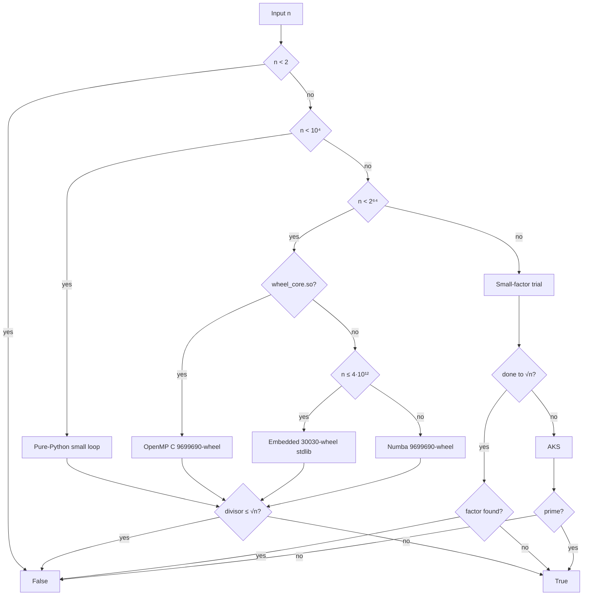

# Best-Prime-Number-Function

> [!WARNING]
> **This repository was created and designed by an AI agent**, including code, tests, docs, benchmarks, and automation. Treat it as **AI-generated work**: review, test, and validate before production or research-critical use.

**Fully deterministic** primality testing for every natural number — from single digits to 100+ digit values — optimized for **end-to-end CLI latency** under strict no-randomness rules.

[](https://www.python.org/downloads/)
[](LICENSE)
[](#design-restrictions)
[](scripts/compile_wheel_core.sh)
[](https://numba.pydata.org/)
[](https://github.com/BurakAhmet/Best-Prime-Number-Function/actions/workflows/ci.yml)
[](https://github.com/BurakAhmet/Best-Prime-Number-Function/pkgs/container/best-prime-number-function)

---

## Quick start

```bash
git clone https://github.com/BurakAhmet/Best-Prime-Number-Function.git
cd Best-Prime-Number-Function
python3 -m venv .venv && source .venv/bin/activate
pip install -r requirements.txt

# Optional but recommended for hard 64-bit primes (needs gcc + OpenMP)
bash scripts/compile_wheel_core.sh

python3 is_prime.py 97
python3 is_prime.py 9223372036854775783
python3 is_prime.py --lab 1000000007
```

```python
from is_prime import is_prime, lab

is_prime(17)                         # True
is_prime(100)                        # False
is_prime(9223372036854775783)        # True
is_prime("9" * 100)                  # False
is_prime(10**9 + 7, parallel=False)  # still deterministic

lab(97)  # path, isqrt, elapsed_ms, e2e_ms, note, …
```

| Exit code | Meaning |
|-----------|---------|
| `0` | prime |
| `1` | not prime |

CLI `TIME` is **end-to-end**: it starts at module import (`t0`) and stops after the answer (imports, table I/O, native load, and the check all count). With no argument, the CLI uses the near-$2^{63}$ prime `9223372036854775783` (best with `wheel_core.so` built).

```text
TEST:    9223372036854775783 (19 chars)
THREADS: 12
RESULT:  prime
TIME:    … ns  (… ms)
```


### Developer loop

Copy-paste checks matching CI:

```bash
bash scripts/compile_wheel_core.sh
python3 scripts/check_restrictions.py
python3 scripts/check_wiki_sync.py
pytest -q -m "not slow"
OMP_NUM_THREADS=2 python3 benchmarks/check_determinism.py
OMP_NUM_THREADS=2 python3 benchmarks/compare_e2e.py --json /tmp/e2e.json
python3 scripts/check_e2e_regression.py \
  --baseline benchmarks/e2e_results.json --candidate /tmp/e2e.json
# Optional hot-loop check (warm engines; secondary metric):
OMP_NUM_THREADS=2 python3 benchmarks/compare_speed.py --json /tmp/hot.json
```

### Supported platforms

| Platform | `wheel_core.so` (OpenMP C) | Fallback |
|----------|----------------------------|----------|
| **Linux x86_64** (CI, Docker) | Built in CI via `scripts/compile_wheel_core.sh`; `lab(n)["path"] == "u64_wheel_c"` is asserted | — |
| **macOS / Windows / other** | Build locally if `gcc`/`clang` + OpenMP are available | Embedded 30030-wheel (stdlib) and/or **Numba** 9699690-wheel |
| **Pure Python env** (no compiler, no Numba wheels) | Unavailable | Stdlib paths only (`n ≤ 4·10¹²` fully covered; harder 64-bit needs Numba or a local `.so`) |

The committed `.so` is a Linux convenience artifact; **source of truth** is `is_prime_data/wheel_core.c` rebuilt in CI.

---

## Why this exists

Many fast prime checks use **Miller–Rabin** with random witnesses. That is fine when a tiny error probability is acceptable. It is **not** a uniform deterministic predicate for **every** natural number unless you restrict to proven finite witness sets (for example 64-bit only).

This project optimizes under harder rules:

| Rule | Meaning |
|------|---------|
| **Deterministic** | Same input → same answer; no RNG |
| **No stochastic MR** | No random-base Miller–Rabin / “probably prime” engines |
| **No prime libraries as the engine** | No primesieve, `sympy.isprime`, etc. |
| **All natural numbers** | `int` or decimal `str`, including values beyond 64 bits |
| **Allowed accelerators** | NumPy / Numba, plus an optional OpenMP C extension we compile ourselves |

---

## How the checker chooses a path

```text
is_prime(n)
  n < 10⁴              →  tiny pure-Python loop
  10⁴ ≤ n < 2⁶⁴
       ├─ wheel_core.so present  →  OpenMP C (9699690-wheel)
       ├─ else n ≤ 4·10¹²        →  embedded 30030-wheel (stdlib only)
       └─ else                   →  lazy NumPy/Numba 9699690-wheel
  n ≥ 2⁶⁴              →  small-factor trial → AKS if needed

  ✗  stochastic Miller–Rabin · prime sieving libraries
  ✓  deterministic for every natural number
```



Exact **trial division** up to $\lfloor\sqrt{n}\rfloor$ on the 64-bit paths (candidates restricted by a primorial wheel). Beyond 64 bits, unfinished trial division falls through to **AKS** (correct, but can be very slow for huge primes with no small factors).

### Build the optional C core

```bash
# requires gcc and OpenMP (libgomp)
bash scripts/compile_wheel_core.sh
```

CI builds this automatically on Linux. Without the `.so`, the library falls back to embedded stdlib wheels and/or Numba. Regenerate table assets with `python scripts/generate_wheel_data.py`.

---

## Performance snapshot

Indicative **end-to-end CLI `TIME`** on a dev machine (`benchmarks/compare_e2e.py`, best of several runs; wall times vary by CPU and whether `wheel_core.so` is present):

| Case | `n` | Typical e2e |
|------|-----:|------------:|
| Small prime | 97 | ~0.4 ms |
| $10^9+7$ | 1000000007 | ~2–3 ms |
| 12-digit prime | 999999999989 | ~20–55 ms |
| Near $2^{63}$ prime | 9223372036854775783 | ~0.4–0.8 s with OpenMP `.so` |
| Mersenne M61 | $2^{61}-1$ | ~0.4 s with OpenMP `.so` |

In-process hot-loop comparisons (warm engines) live in [`benchmarks/compare_speed.py`](benchmarks/compare_speed.py). End-to-end CLI timing: [`benchmarks/compare_e2e.py`](benchmarks/compare_e2e.py). More context: [`benchmarks/README.md`](benchmarks/README.md), [Hall of fame](docs/wiki/Hall-of-fame.md).

| Regime | Behaviour |
|--------|-----------|
| Tiny / moderate $n$ | Sub-millisecond to tens of ms e2e; often no NumPy/Numba |
| Hard 64-bit primes | Sub-second multi-core with `wheel_core.so` |
| Huge composites with a small factor | Near-instant |
| Huge primes via AKS | May take a very long time |

---

## Repository map

Think of four layers. Only the first is the product.

```text
+--------------------------------------------------------------------------+
|  1. CORE                                                                 |
|     is_prime.py          is_prime() / lab() / CLI                        |
|     is_prime_data/       precomputed wheels + optional wheel_core.so     |
|     Rules: deterministic, no stochastic MR, no prime libs as engine      |
+--------------------------------------------------------------------------+
|  2. PROOF & SPEED                                                        |
|     tests/               pytest + Hypothesis (derandomized)              |
|     benchmarks/          in-process speed, e2e CLI TIME, determinism     |
|     scripts/             restriction linter, table/C generators, attest  |
+--------------------------------------------------------------------------+
|  3. GITHUB ACTIONS                                                       |
|     CI, Determinism, performance gate, auto-merge, agents, GHCR, wiki    |
+--------------------------------------------------------------------------+
|  4. DOCS & TRACKING                                                      |
|     README, CONTRIBUTING, docs/wiki, labels / optional Project board     |
+--------------------------------------------------------------------------+
```

| If you want to… | Go here |
|-----------------|--------|
| Use the checker | [Quick start](#quick-start) |
| Understand the math/engines | [How the checker chooses a path](#how-the-checker-chooses-a-path) · [restrictions](#design-restrictions) |
| Run tests / benchmarks | [Testing & quality gates](#testing--quality-gates) · [`benchmarks/`](benchmarks/README.md) |
| See automation | [Automation map](#automation-map) |
| Contribute | [Contributing](#contributing) · [CONTRIBUTING.md](CONTRIBUTING.md) |
| Install a release / container | [Releases & packages](#releases--packages) |
| Board / labels | [Project board & labels](#project-board--labels) · [docs/PROJECT_BOARD.md](docs/PROJECT_BOARD.md) |

```text
Best-Prime-Number-Function/
├── is_prime.py                 # API + CLI
├── is_prime_data/              # wheels, wheel_core.c / .so
├── tests/
├── benchmarks/                 # compare_speed, compare_e2e, determinism
├── scripts/
│   ├── check_restrictions.py
│   ├── compile_wheel_core.sh
│   ├── generate_wheel_data.py
│   ├── write_attestation.py
│   └── design_github_project.py
├── docs/wiki/
├── .github/workflows/
├── Dockerfile
├── pyproject.toml / requirements.txt
├── CONTRIBUTING.md
└── README.md
```

---

## Design restrictions

Enforced by review and `scripts/check_restrictions.py` in CI:

1. **Determinism for every natural number** — threads OK; randomness not OK.
2. **No stochastic Miller–Rabin** / “probably prime” engines.
3. **No dedicated prime libraries** as the implementation core (e.g. primesieve, `sympy.isprime`).
4. **Allowed:** NumPy / Numba, and our own compiled OpenMP helper, to accelerate *our* trial division.

Fixed-base MR is deterministic only on **proven finite ranges**. This repo uses **primorial-wheel trial division** (plus **AKS** for oversized integers) so the API stays correct for all naturals under the restriction set.

---

## Testing & quality gates

See the [Developer loop](#developer-loop) above. Full suite: `pytest -q` (includes `@pytest.mark.slow`).

**Two metrics (do not mix them up):**

| Metric | Script | CI role |
|--------|--------|---------|
| **E2E CLI `TIME`** (primary) | `compare_e2e.py` | Perf gate vs previous commit (`check_e2e_regression.py`, 25% threshold) |
| **In-process hot loop** (secondary) | `compare_speed.py` | Informational artifact only |

Coverage highlights: exhaustive checks on $0\ldots4999$; Hypothesis with `derandomize=True`; C-path serial==parallel and semiprime matrix (`tests/test_c_core.py`); Linux assertion `lab(n)["path"] == "u64_wheel_c"`; wiki sync (`scripts/check_wiki_sync.py`).

| Gate | Workflow | Role |
|------|----------|------|
| Restriction linter | **CI** | Bans MR / primesieve / random engines in implementation paths |
| Wiki sync | **CI** | Key README facts must appear in `docs/wiki/` |
| Fast tests | **CI** | `pytest -m "not slow"` on **3.9 / 3.11 / 3.12** (+ build `.so`, assert C path on Linux) |
| Performance | **CI** | **E2E** candidate vs previous commit / PR base; fail if `e2e_ms` regresses **>25%** on measurable cases |
| Attestation | **CI** | Re-runs lint + tests + determinism; uploads `attestation.json` |
| Determinism | **Determinism** | Repeated serial/parallel trials must agree |

---

## Automation map

Workflows under `.github/workflows/` are optional for *using* `is_prime`; they operate the repo for maintainers and agents.

### Quality & publish

| Workflow | Trigger | What it does |
|----------|---------|----------------|
| [**CI**](.github/workflows/ci.yml) | push / PR → `main` | Build C core, linter, pytest, performance, e2e smoke, attestation |
| [**Determinism**](.github/workflows/determinism.yml) | push / PR → `main` | Repeat trials + `check_determinism.py` |
| [**Auto-merge**](.github/workflows/auto-merge.yml) | PR / check_suite | Squash-merge **same-repo**, non-draft PRs when checks are green (not forks) |
| [**Publish package**](.github/workflows/publish-package.yml) | release / manual | Build & push **GHCR** container |
| [**Publish wiki**](.github/workflows/publish-wiki.yml) | `docs/wiki/**` changes | GitHub Pages from wiki markdown |

### Agents & board

| Workflow | Trigger | What it does |
|----------|---------|----------------|
| [**Issue agent**](.github/workflows/issue-agent.yml) | issue opened / reopened | Keyword answers + restrictions briefing + labels |
| [**PR agent**](.github/workflows/pr-agent.yml) | PR open / sync | Briefing, best-effort Copilot review request, **auto-approve** same-repo PRs |
| [**Project autonomy**](.github/workflows/project-autonomy.yml) | issues / PRs | Moves kanban / agent labels |
| [**Project sync**](.github/workflows/project-sync.yml) | manual / optional | Re-seed GitHub Project if `PROJECT_TOKEN` has `project` scopes |
| [**Prime of the day**](.github/workflows/prime-of-the-day.yml) | daily 12:00 UTC / manual | Deterministic date → `n` → `lab()`; upserts labeled issue |

Agent context: [`.github/copilot-instructions.md`](.github/copilot-instructions.md), [`.github/AGENT_BRIEFING.md`](.github/AGENT_BRIEFING.md).

**Policy:** same-repo PRs may be auto-approved and auto-merged after green **CI** + **Determinism**; **forks are never** auto-approved or auto-merged.

```text
Issue opened ──► Issue agent (answer + labels)
PR opened    ──► PR agent (brief + approve if same-repo)
                 Project autonomy (status/*, agent/*)
                      ▼
            CI + Determinism green
                      ▼
            Auto-merge (squash) ──► status/done
```

---

## Project board & labels

Work is tracked with **labels** so Actions can move items without a human-only column. A GitHub **Project** can mirror Status if configured in the UI (or via `scripts/design_github_project.py` with `project` scopes).

| Track | Labels |
|-------|--------|
| **Kanban** | `status/backlog` → `ready` → `in-progress` → `in-review` → `done` |
| **Agent ops** | `agent/triaged` → `implementing` → `waiting-ci` → `done` |
| **Quality** | `quality/checklist` + `todo` / `partial` / `done` |
| **Area / priority / size** | `area/*`, `priority/p0`…`p3`, `size/S|M|L` |
| **Restriction risk** | `restriction-risk/low` or `high` |

Details: [docs/PROJECT_BOARD.md](docs/PROJECT_BOARD.md).

---

## Wiki & docs site

| Location | Role |
|----------|------|
| [docs/wiki/](docs/wiki/) | Source in git |
| [GitHub Wiki](https://github.com/BurakAhmet/Best-Prime-Number-Function/wiki) | Browsable copy |
| [GitHub Pages](https://burakahmet.github.io/Best-Prime-Number-Function/) | HTML mirror |

Start here: [Project restrictions](docs/wiki/Project-restrictions.md) · [Algorithm overview](docs/wiki/Algorithm-overview.md) · [CI and automation](docs/wiki/CI-and-automation.md) · [Hall of fame](docs/wiki/Hall-of-fame.md) · [Agent briefing](docs/wiki/Agent-briefing.md).

---

## Releases & packages

| Channel | How |
|---------|-----|
| **GitHub Release** | Version tags (e.g. `v1.0.0`) |
| **pip from git** | `pip install "git+https://github.com/BurakAhmet/Best-Prime-Number-Function.git@v1.0.0"` |
| **GHCR container** | Repo **Packages** tab; published by **Publish package** |

```bash
echo $GITHUB_TOKEN | docker login ghcr.io -u USERNAME --password-stdin
docker pull ghcr.io/burakahmet/best-prime-number-function:1.0.0
docker run --rm ghcr.io/burakahmet/best-prime-number-function:1.0.0 17
```

---

## Contributing

Contributions are welcome when they respect the [design restrictions](#design-restrictions). See [CONTRIBUTING.md](CONTRIBUTING.md).

```bash
pip install -r requirements.txt
bash scripts/compile_wheel_core.sh
python3 scripts/check_restrictions.py
pytest -q -m "not slow"
OMP_NUM_THREADS=2 python3 benchmarks/check_determinism.py
python3 is_prime.py --lab 97
```

Open an issue before large designs if you are unsure about the restrictions.

---

## AI authorship

Design, code, tests, benchmarks, docs, and automation in this repository were **generated by an AI agent**. This is not presented as independently human-authored work. Review and verify before production use.

---

## License

MIT — see [LICENSE](LICENSE).
