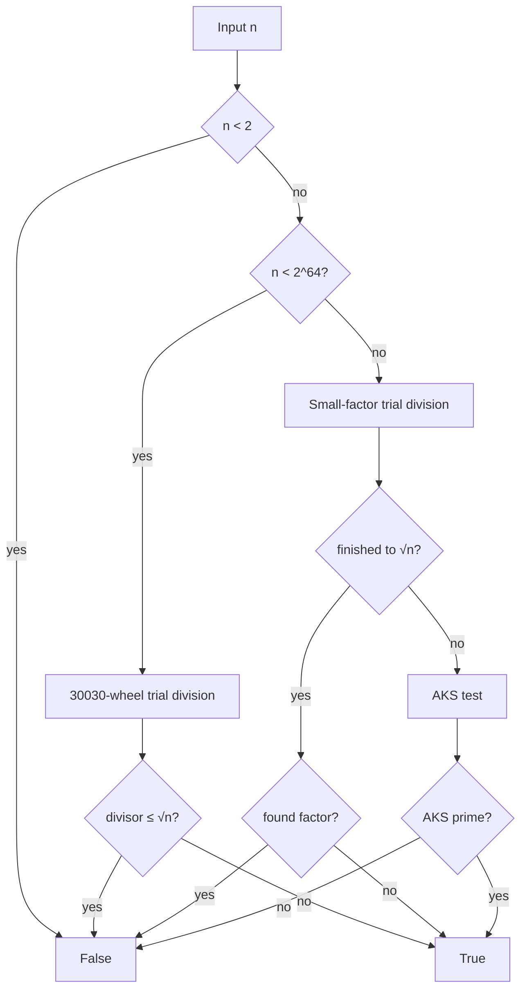

# Best-Prime-Number-Function

> [!WARNING]
> **This entire repository was created and designed by an AI agent**, including the implementation, tests, documentation, benchmarks, and repository structure. Treat it as **AI-generated work**: review the code, run the tests, and validate results for your own use cases before relying on it in production or research-critical settings. Human oversight is recommended.

**Fully deterministic** primality testing for natural numbers — from tiny integers to 100+ digit values — with a high-performance path for 64-bit inputs powered by **Numba**.

```text
┌─────────────────────────────────────────────────────────────┐
│  is_prime(n)                                                │
│                                                             │
│   n < 2⁶⁴  ──►  30030-wheel trial division  (Numba + MT)    │
│   n ≥ 2⁶⁴  ──►  small-factor sieve → AKS if needed          │
│                                                             │
│   ✗  no Miller–Rabin (no random bases)                      │
│   ✗  no probabilistic / stochastic tests                    │
│   ✗  no prime sieving libraries (primesieve, …)             │
│   ✓  deterministic for every natural number                 │
└─────────────────────────────────────────────────────────────┘
```

[](https://www.python.org/downloads/)
[](LICENSE)
[](#design-restrictions)
[](https://numba.pydata.org/)

> **Private repository.** Fast trial division where it matters; unconditional determinism everywhere.

---

## Why this exists

Many “fast prime checks” quietly rely on **Miller–Rabin** with random witnesses. That is excellent engineering for cryptography-sized numbers when a tiny error probability is acceptable — but it is **not** a deterministic predicate for every natural number unless you restrict to proven finite witness sets (which only cover bounded ranges, e.g. 64-bit).

This project optimizes under **strict constraints**:

| Rule | Meaning |
|------|---------|
| **Deterministic** | Same input → same answer, always; no RNG |
| **No stochastic MR** | No “pick random bases” Miller–Rabin |
| **No prime libraries** | Algorithm implemented here (NumPy/Numba only for speed) |
| **All natural numbers** | API accepts big integers / decimal strings |

---

## Algorithm

### 1. Fast path — $n < 2^{64}$

Exact **trial division** up to $\lfloor\sqrt{n}\rfloor$:

1. Reject $n < 2$; accept $2$ and $3$; reject other even numbers.
2. Reject multiples of $3, 5, 7, 11, 13$ (primes baked into the wheel modulus).
3. Compute $\lfloor\sqrt{n}\rfloor$ with **hardware `sqrt`** plus exact integer correction (not a pure Newton loop).
4. Walk only candidates **coprime to** $30030 = 2 \cdot 3 \cdot 5 \cdot 7 \cdot 11 \cdot 13$ using a **hardcoded wheel** of $5760$ steps (table `W30030`), starting at $17$.
5. For large limits, split the candidate range across threads with **Numba `prange`** (same idea as OpenMP contiguous chunks).

If no divisor appears by $\sqrt{n}$, then $n$ is prime. This is the classical proof, just engineered for speed.

### 2. Large path — $n \ge 2^{64}$

1. Trial division by a list of small primes and odd integers up to a practical bound (or $\sqrt{n}$ when smaller).
2. If that bound reaches $\sqrt{n}$, the answer is exact.
3. Otherwise run the **AKS** primality test (unconditional, deterministic). AKS is correct for all $n$ but can be **slow** for huge primes with no small factors — that is an inherent cost of this restriction set, not a bug in the API.



---

## Install

```bash
git clone https://github.com/BurakAhmet/Best-Prime-Number-Function.git
cd Best-Prime-Number-Function
python3 -m venv .venv
source .venv/bin/activate
pip install -r requirements.txt
```

Optional (tests):

```bash
pip install pytest
pytest -q
```

---

## Usage

```python
from is_prime import is_prime

is_prime(17)                       # True
is_prime(100)                      # False
is_prime(9223372036854775783)      # True  (64-bit fast path)
is_prime("9" * 100)                # False (100-digit composite)
is_prime(10**99)                   # False

# Serial trial division only (still deterministic)
is_prime(10**9 + 7, parallel=False)
```

### CLI

```bash
python is_prime.py
python is_prime.py 9223372036854775783

# Multi-threaded Numba (also reads OMP_NUM_THREADS)
NUMBA_NUM_THREADS=$(nproc) python is_prime.py 9223372036854775783
```

Example **CLI** output (illustrative timings; wall time depends on CPU and thread count):

```text
TEST:    9223372036854775783 (19 chars)
THREADS: 12
RESULT:  prime
TIME:    734124797 ns  (734.124797 ms)
```

That block is **not** the pytest suite. Automated tests are run with `pytest` and do not print `TEST` / `THREADS` / `RESULT` / `TIME` lines.

| CLI exit code | Meaning |
|---------------|---------|
| `0` | `n` is prime |
| `1` | `n` is not prime |

---


---

## Speed comparison (primitive vs optimized)

A dedicated benchmark lives in [`benchmarks/`](benchmarks/README.md). It times a **primitive** pure-Python odd trial division against this package’s **optimized** `is_prime` on the same values.

```bash
NUMBA_NUM_THREADS=$(nproc) python benchmarks/compare_speed.py
NUMBA_NUM_THREADS=$(nproc) python benchmarks/compare_speed.py --include-hard
```

### Sample results (12 threads, best of 3; indicative)

| Case | Primitive (ms) | Optimized (ms) | Speedup |
|------|---------------:|---------------:|--------:|
| $10^9+7$ | ~0.68 | ~0.03 | **~21×** |
| $10^9+9$ | ~0.69 | ~0.03 | **~21×** |
| Mersenne $2^{31}-1$ | ~0.83 | ~0.05 | **~17×** |
| 12-digit prime $999999999989$ | ~18–19 | ~0.19 | **~90–100×** |
| Near $2^{63}$ prime (optimized only) | — | ~690 | *(primitive omitted: too slow)* |
| Mersenne $2^{61}-1$ (optimized only) | — | ~340 | *(primitive omitted: too slow)* |

On tiny inputs, overhead dominates (speedups ~1×). As $\sqrt{n}$ grows, the wheel + Numba path pulls far ahead. Full methodology and flags: **[benchmarks/README.md](benchmarks/README.md)**.

## Performance notes

| Regime | Method | Typical behaviour |
|--------|--------|-------------------|
| Small $n$ | Wheel trial division (JIT) | Microseconds or less |
| Hard 64-bit primes near $2^{63}$ | Full wheel to $\sqrt{n}$, multi-threaded | Sub-second to ~1s on a modern multi-core CPU |
| Huge composites with a small factor | Tiny trial | Near-instant |
| Huge primes | AKS | May take a very long time |

The 64-bit path is optimized with:

- Hardcoded wheel tables (no runtime wheel generation)
- Hardware `sqrt` for $\lfloor\sqrt{n}\rfloor$
- Loop unrolling in the mod checks
- Optional multi-threading via Numba

---

## Design restrictions (non-negotiable)

1. **Determinism for every natural number** — the mathematical predicate is fixed; implementation may use threads but not randomness.
2. **No stochastic Miller–Rabin** — including “probably prime” APIs.
3. **No dedicated prime libraries** — e.g. `primesieve`, `sympy.isprime` as the engine (tests may use only pure Python references).
4. **Allowed** — NumPy / Numba for array storage and JIT/parallel speedups of *our* trial division.

Fixed-base Miller–Rabin below proven bounds *is* deterministic on those bounds, but it does **not** generalize to all naturals with a finite fixed witness list. This repo therefore uses **trial division** (and **AKS** for oversized integers) instead.

---

## Project layout

```text
Best-Prime-Number-Function/
├── README.md           # You are here
├── LICENSE             # MIT
├── requirements.txt
├── pyproject.toml
├── is_prime.py         # Implementation + CLI
├── benchmarks/         # Primitive vs optimized speed comparison
└── tests/
    └── test_is_prime.py
```

---

## Continuous integration

GitHub Actions (`.github/workflows/ci.yml`) runs on pushes and pull requests to `main`:

1. **Tests** — `pytest -m "not slow"` on Python 3.9 / 3.11 / 3.12 (edge cases, exhaustive small range, wheel tables, fast large primes). Slow multi-second 64-bit primes are marked `@pytest.mark.slow` and omitted from the default gate.
2. **Determinism** (`.github/workflows/determinism.yml`) — on every push/PR, runs repeated serial/parallel trials and `benchmarks/check_determinism.py` so results cannot depend on run order or threads.
3. **Performance** — benchmarks the **candidate** commit against the **PR base** (or `main` on push). Fails if optimized timings regress by more than **20%** on measurable cases (see `benchmarks/check_regression.py`). Artifacts upload both JSON result files.

```bash
# Locally mirror CI tests
pytest -q -m "not slow"

# Full suite including slow primes
pytest -q

# Local performance check against committed baseline snapshot
NUMBA_NUM_THREADS=2 python benchmarks/compare_speed.py --json /tmp/cand.json
python benchmarks/check_regression.py --baseline benchmarks/baseline.json --candidate /tmp/cand.json
```

---

## Testing

```bash
pytest -q
```

The suite includes:

- Exhaustive comparison to a slow reference on $0, 1, \ldots, 4999$
- Wheel table integrity (length, step sum, residue map)
- `_isqrt_u64` vs `math.isqrt` (including values greater than $2^{53}$)
- Parallel vs serial agreement
- **Many large 64-bit primes**, including:
  - $10^9 + 7$, $10^9 + 9$
  - Mersenne primes $2^{31} - 1$, $2^{61} - 1$
  - $999999999989$, $1000000000039$, $999999999999999989$
  - $9223372036854775783$ (near $2^{63}$)
  - $18446744073709551557$ (largest prime below $2^{64}$)
- Matching large composites (neighbours, products, $2^{63} - 1$, …)
- 100-digit composites with small factors
- Carmichael numbers (must be composite under trial division)
- Small Mersenne primes / composites
- API validation (negatives, types, decimal strings)

---


---

## Issue & PR automation (agents)

Workflows brief humans and coding agents with **project restrictions**, auto-answer common issue topics, and **auto-approve same-repository PRs** (forks are not auto-approved). Merge should still wait for **CI** and **Determinism** checks.

| Workflow | When | Behaviour |
|----------|------|-----------|
| [Issue agent](.github/workflows/issue-agent.yml) | Issue opened / reopened | Keyword-based answers (MR policy, performance, install, CI, contributing) + labels + full restrictions briefing |
| [PR agent](.github/workflows/pr-agent.yml) | PR opened / reopened / sync | Restrictions briefing, best-effort Copilot review request, **auto-approve** for same-repo PRs |

Agent context files:

- [`.github/copilot-instructions.md`](.github/copilot-instructions.md) — rules for coding agents
- [`.github/AGENT_BRIEFING.md`](.github/AGENT_BRIEFING.md) — short brief for triage bots

> Auto-approve does **not** replace status checks. Prefer keeping branch protection requiring green **CI** + **Determinism**.

---

## Wiki

In-repo wiki pages (always available in the tree):

| Page | Topic |
|------|--------|
| [docs/wiki/Home.md](docs/wiki/Home.md) | Index |
| [Project restrictions](docs/wiki/Project-restrictions.md) | Non-negotiable rules |
| [Algorithm overview](docs/wiki/Algorithm-overview.md) | Wheel + AKS |
| [CI and automation](docs/wiki/CI-and-automation.md) | Actions catalogue |
| [Agent briefing](docs/wiki/Agent-briefing.md) | Instructions for agents |
| [Contributing (wiki)](docs/wiki/Contributing.md) | Contribution summary |

GitHub **Wiki** (designed pages + sidebar):  
https://github.com/BurakAhmet/Best-Prime-Number-Function/wiki

GitHub **Pages** mirror:  
https://burakahmet.github.io/Best-Prime-Number-Function/

## Project board (autonomous)

Work is tracked with **labels** so agents and Actions manage the board without a human-only lane:

- Kanban: `status/backlog` → `ready` → `in-progress` → `in-review` → `done`
- Agent ops: `agent/triaged` → `implementing` → `waiting-ci` → `done` (**no “Needs human”**)
- Quality checklist: `quality/checklist` + `quality/todo|partial|done`
- Views by type: `bug`, `enhancement`, `restrictions`, `performance`, `area/agents`

See **[docs/PROJECT_BOARD.md](docs/PROJECT_BOARD.md)** for setup of GitHub Projects views and automation details.  
Workflow: `.github/workflows/project-autonomy.yml`.

---

## Contributing

We welcome contributions—bug fixes, tests, docs, benchmarks, and features that respect the project’s **determinism restrictions**.

Please read **[CONTRIBUTING.md](CONTRIBUTING.md)** for setup, PR checklist, and design rules (no stochastic Miller–Rabin, no prime libraries).

Quick start:

```bash
pip install -r requirements.txt pytest
pytest -q -m "not slow"
NUMBA_NUM_THREADS=2 python benchmarks/check_determinism.py
```

Open an issue if you are unsure whether an idea fits the constraints; early discussion saves time.

---

## AI authorship

This repository — including design choices, source code, unit tests, benchmarks, and documentation — was **generated by an AI agent**. It is not presented as independently human-authored work. Please review and verify before production use.

---


---

## GitHub Packages

The **Packages** section lists a **container package** on the GitHub Container Registry (**GHCR**), published by the **Publish package** workflow (on release or manual dispatch).

> GitHub’s legacy **PyPI** upload host (`upload.pypi.pkg.github.com`) currently serves a certificate for `*.registry.github.com`, so `twine` uploads fail with SSL hostname mismatch. Until that is fixed by GitHub, we publish via **GHCR** (shows under Packages) and ship **wheels on Releases** for `pip`.

### Pull / run the container (Packages / GHCR)

```bash
# Authenticate for private packages
echo $GITHUB_TOKEN | docker login ghcr.io -u BurakAhmet --password-stdin

docker pull ghcr.io/burakahmet/best-prime-number-function:1.0.0
docker run --rm ghcr.io/burakahmet/best-prime-number-function:1.0.0 17
docker run --rm ghcr.io/burakahmet/best-prime-number-function:1.0.0 9223372036854775783
```

### Install Python package (pip)

Prefer **Release assets** or **git tag** (no GHCR auth):

```bash
pip install "git+https://github.com/BurakAhmet/Best-Prime-Number-Function.git@v1.0.0"
# or download the .whl from the Releases page
```


## License

MIT — see [LICENSE](LICENSE).
