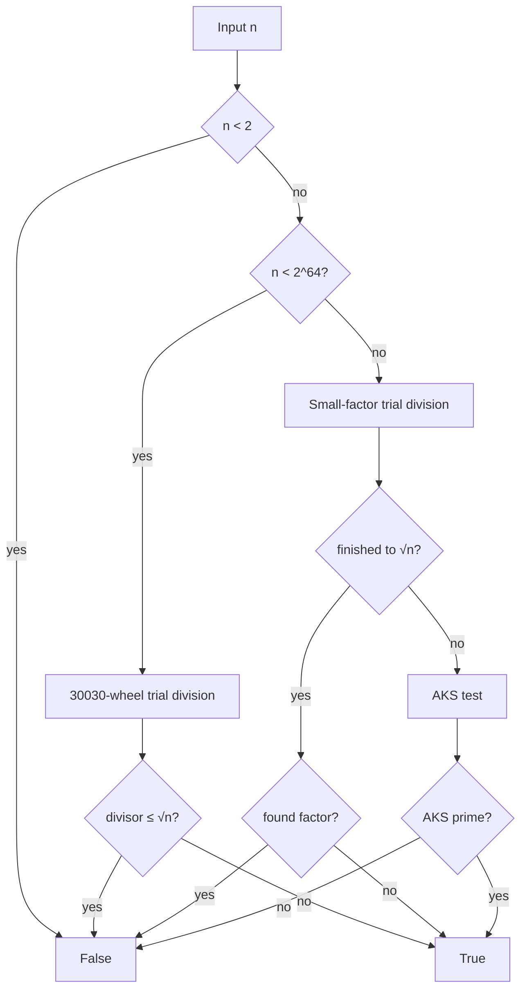

# Best-Prime-Number-Function

**Fully deterministic** primality testing for natural numbers — from tiny integers to 100+ digit values — with a high-performance path for 64-bit inputs powered by **Numba**.

```text
┌─────────────────────────────────────────────────────────────┐
│  is_prime(n)                                                │
│                                                             │
│   n < 2⁶⁴  ──►  30030-wheel trial division  (Numba + MT)    │
│   n ≥ 2⁶⁴  ──►  small-factor sieve → AKS if needed          │
│                                                             │
│   ✗  no Miller–Rabin (no random bases)                      │
│   ✗  no probabilistic / stochastic tests                    │
│   ✗  no prime sieving libraries (primesieve, …)             │
│   ✓  deterministic for every natural number                 │
└─────────────────────────────────────────────────────────────┘
```

[](https://www.python.org/downloads/)
[](LICENSE)
[](#design-restrictions)
[](https://numba.pydata.org/)

> **Private repository.** Fast trial division where it matters; unconditional determinism everywhere.

---

## Why this exists

Many “fast prime checks” quietly rely on **Miller–Rabin** with random witnesses. That is excellent engineering for cryptography-sized numbers when a tiny error probability is acceptable — but it is **not** a deterministic predicate for every natural number unless you restrict to proven finite witness sets (which only cover bounded ranges, e.g. 64-bit).

This project optimizes under **strict constraints**:

| Rule | Meaning |
|------|---------|
| **Deterministic** | Same input → same answer, always; no RNG |
| **No stochastic MR** | No “pick random bases” Miller–Rabin |
| **No prime libraries** | Algorithm implemented here (NumPy/Numba only for speed) |
| **All natural numbers** | API accepts big integers / decimal strings |

---

## Algorithm

### 1. Fast path — \(n < 2^{64}\)

Exact **trial division** up to \(\lfloor\sqrt{n}\rfloor\):

1. Reject \(n < 2\); accept \(2,3\); reject other evens.
2. Reject multiples of \(3,5,7,11,13\) (primes baked into the wheel modulus).
3. Compute \(\lfloor\sqrt{n}\rfloor\) with **hardware `sqrt`** plus exact integer correction (not a pure Newton loop).
4. Walk only candidates **coprime to \(30030 = 2\cdot3\cdot5\cdot7\cdot11\cdot13\)** using a **hardcoded wheel** of 5760 steps (table `W30030`), starting at \(17\).
5. For large limits, split the candidate range across threads with **Numba `prange`** (same idea as OpenMP contiguous chunks).

If no divisor appears by \(\sqrt{n}\), \(n\) is prime. This is the classical proof, just engineered for speed.

### 2. Large path — \(n \ge 2^{64}\)

1. Trial division by a list of small primes and odd integers up to a practical bound (or \(\sqrt{n}\) when smaller).
2. If that bound reaches \(\sqrt{n}\), the answer is exact.
3. Otherwise run the **AKS** primality test (unconditional, deterministic). AKS is correct for all \(n\) but can be **slow** for huge primes with no small factors — that is an inherent cost of this restriction set, not a bug in the API.



---

## Install

```bash
git clone https://github.com/BurakAhmet/Best-Prime-Number-Function.git
cd best-prime-number-function
python3 -m venv .venv
source .venv/bin/activate
pip install -r requirements.txt
```

Optional (tests):

```bash
pip install pytest
pytest -q
```

---

## Usage

```python
from is_prime import is_prime

is_prime(17)                       # True
is_prime(100)                      # False
is_prime(9223372036854775783)      # True  (64-bit fast path)
is_prime("9" * 100)                # False (100-digit composite)
is_prime(10**99)                   # False

# Serial trial division only (still deterministic)
is_prime(10**9 + 7, parallel=False)
```

### CLI

```bash
python is_prime.py
python is_prime.py 9223372036854775783

# Multi-threaded Numba (also reads OMP_NUM_THREADS)
NUMBA_NUM_THREADS=$(nproc) python is_prime.py 9223372036854775783
```

Example **CLI** output (illustrative timings; wall time depends on CPU and thread count):

```text
TEST:    9223372036854775783 (19 chars)
THREADS: 12
RESULT:  prime
TIME:    734124797 ns  (734.124797 ms)
```

That block is **not** the pytest suite. Automated tests are run with `pytest` and do not print `TEST` / `THREADS` / `RESULT` / `TIME` lines.

| CLI exit code | Meaning |
|---------------|---------|
| `0` | `n` is prime |
| `1` | `n` is not prime |

---

## Performance notes

| Regime | Method | Typical behaviour |
|--------|--------|-------------------|
| Small \(n\) | Wheel trial division (JIT) | Microseconds or less |
| Hard 64-bit primes near \(2^{63}\) | Full wheel to \(\sqrt{n}\), multi-threaded | Sub-second to ~1s on a modern multi-core CPU |
| Huge composites with a small factor | Tiny trial | Near-instant |
| Huge primes | AKS | May take a very long time |

The 64-bit path is optimized with:

- Hardcoded wheel tables (no runtime wheel generation)
- Hardware `sqrt` for \(\lfloor\sqrt{n}\rfloor\)
- Loop unrolling in the mod checks
- Optional multi-threading via Numba

---

## Design restrictions (non-negotiable)

1. **Determinism for every natural number** — the mathematical predicate is fixed; implementation may use threads but not randomness.
2. **No stochastic Miller–Rabin** — including “probably prime” APIs.
3. **No dedicated prime libraries** — e.g. `primesieve`, `sympy.isprime` as the engine (tests may use only pure Python references).
4. **Allowed** — NumPy / Numba for array storage and JIT/parallel speedups of *our* trial division.

Fixed-base Miller–Rabin below proven bounds *is* deterministic on those bounds, but it does **not** generalize to all naturals with a finite fixed witness list. This repo therefore uses **trial division** (and **AKS** for oversized integers) instead.

---

## Project layout

```text
Best-Prime-Number-Function/
├── README.md           # You are here
├── LICENSE             # MIT
├── requirements.txt
├── pyproject.toml
├── is_prime.py         # Implementation + CLI
└── tests/
    └── test_is_prime.py
```

---

## Testing

```bash
pytest -q
```

The suite includes:

- Exhaustive comparison to a slow reference on \(0 \ldots 4999\)
- Wheel table integrity (length, step sum, residue map)
- `_isqrt_u64` vs `math.isqrt` (including \(> 2^{53}\))
- Parallel vs serial agreement
- **Many large 64-bit primes**, including:
  - \(10^9+7\), \(10^9+9\)
  - Mersenne primes \(2^{31}-1\), \(2^{61}-1\)
  - \(999999999989\), \(1000000000039\), \(999999999999999989\)
  - \(9223372036854775783\) (near \(2^{63}\))
  - \(18446744073709551557\) (largest prime below \(2^{64}\))
- Matching large composites (neighbours, products, \(2^{63}-1\), …)
- 100-digit composites with small factors
- Carmichael numbers (must be composite under trial division)
- Small Mersenne primes / composites
- API validation (negatives, types, decimal strings)

---

## License

MIT — see [LICENSE](LICENSE).

