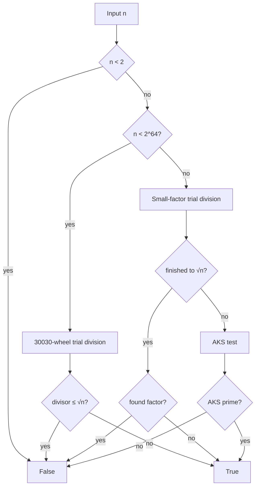

# Best-Prime-Number-Function

> [!WARNING]
> **This entire repository was created and designed by an AI agent**, including the implementation, tests, documentation, benchmarks, and repository structure. Treat it as **AI-generated work**: review the code, run the tests, and validate results for your own use cases before relying on it in production or research-critical settings. Human oversight is recommended.

**Fully deterministic** primality testing for natural numbers — from tiny integers to 100+ digit values — with a high-performance path for 64-bit inputs powered by **Numba**.

[](https://www.python.org/downloads/)
[](LICENSE)
[](#design-restrictions)
[](https://numba.pydata.org/)
[](https://github.com/BurakAhmet/Best-Prime-Number-Function/pkgs/container/best-prime-number-function)
[](https://github.com/BurakAhmet/Best-Prime-Number-Function/releases/tag/v1.0.0)
[](https://github.com/BurakAhmet/Best-Prime-Number-Function/actions/workflows/ci.yml)

---

## How this repository works

Think of the repo as **four layers**. Only the first layer is the product; the rest protect quality and run the project autonomously.

```text
+--------------------------------------------------------------------------+
|  1. CORE LIBRARY                                                         |
|     is_prime.py  ->  is_prime(n) / lab(n) / CLI                          |
|     n < 2^64: 30030-wheel trial division (Numba, optional threads)       |
|     n >= 2^64: small-factor trial -> AKS if needed                       |
|     Rules: deterministic, no stochastic Miller-Rabin, no prime libs      |
+--------------------------------------------------------------------------+
|  2. PROOF & SPEED (local + CI)                                           |
|     tests/          pytest + Hypothesis (reproducible)                   |
|     benchmarks/     speed vs primitive, regression, determinism checks   |
|     scripts/        restriction linter, CI attestation JSON              |
+--------------------------------------------------------------------------+
|  3. GITHUB ACTIONS (automation)                                          |
|     Quality gates: CI, Determinism, performance, restriction linter      |
|     Agents:        issue answers, PR briefing + auto-approve             |
|     Merge:         Auto-merge same-repo PRs when gates green             |
|     Ops:           labels/board, prime-of-the-day, wiki Pages, GHCR      |
+--------------------------------------------------------------------------+
|  4. DOCS & TRACKING                                                      |
|     This README, CONTRIBUTING, docs/wiki, GitHub Wiki/Pages              |
|     Labels + optional GitHub Project (kanban via status/* labels)        |
+--------------------------------------------------------------------------+
```

| If you want to… | Go here |
|-----------------|--------|
| **Use the prime checker** | [Install](#install) → [Usage](#usage) (`is_prime.py` only) |
| **Understand the algorithm** | [Algorithm](#algorithm) · [Design restrictions](#design-restrictions) |
| **Run tests / benchmarks** | [Testing & quality gates](#testing--quality-gates) · [`benchmarks/`](benchmarks/README.md) |
| **See what CI / bots do** | [Automation map](#automation-map-github-actions) |
| **Contribute or open a PR** | [Contributing](#contributing) · [CONTRIBUTING.md](CONTRIBUTING.md) |
| **Install a release / container** | [Releases & packages](#releases--packages) |
| **Board / labels / agents** | [Project board & labels](#project-board--labels) · [docs/PROJECT_BOARD.md](docs/PROJECT_BOARD.md) |

> Fast trial division where it matters; unconditional determinism everywhere.

---

## Why this exists

Many “fast prime checks” rely on **Miller–Rabin** with random witnesses. That is fine when a tiny error probability is acceptable — it is **not** a deterministic predicate for **every** natural number unless you stay inside proven finite witness sets (e.g. 64-bit only).

This project optimizes under **strict constraints**:

| Rule | Meaning |
|------|---------|
| **Deterministic** | Same input → same answer, always; no RNG |
| **No stochastic MR** | No “pick random bases” Miller–Rabin |
| **No prime libraries** | Algorithm implemented here (NumPy/Numba only for speed) |
| **All natural numbers** | API accepts big integers / decimal strings |

```text
  is_prime(n)
     n < 2⁶⁴  ──►  30030-wheel trial division  (Numba + optional MT)
     n ≥ 2⁶⁴  ──►  small-factor trial → AKS if needed
     ✗  no Miller–Rabin (random bases) · no probabilistic tests
     ✗  no prime sieving libraries (primesieve, …)
     ✓  deterministic for every natural number
```

---

## Algorithm

### 1. Fast path — $n < 2^{64}$

Exact **trial division** up to $\lfloor\sqrt{n}\rfloor$:

1. Reject $n < 2$; accept $2$ and $3$; reject other even numbers.
2. Reject multiples of $3, 5, 7, 11, 13$ (primes baked into the wheel modulus).
3. Compute $\lfloor\sqrt{n}\rfloor$ with **hardware `sqrt`** plus exact integer correction.
4. Walk only candidates **coprime to** $30030 = 2 \cdot 3 \cdot 5 \cdot 7 \cdot 11 \cdot 13$ using a **hardcoded wheel** of $5760$ steps (`W30030`), starting at $17$.
5. For large limits, split the candidate range across threads with **Numba `prange`**.

If no divisor appears by $\sqrt{n}$, then $n$ is prime.

### 2. Large path — $n \ge 2^{64}$

1. Trial division by small primes / odds up to a practical bound (or $\sqrt{n}$ when smaller).
2. If that bound reaches $\sqrt{n}$, the answer is exact.
3. Otherwise run **AKS** (unconditional, deterministic — can be **slow** for huge primes with no small factors).



### Performance notes

| Regime | Typical behaviour |
|--------|-------------------|
| Small $n$ | Microseconds or less (JIT) |
| Hard 64-bit primes near $2^{63}$ | Sub-second to ~1s multi-core |
| Huge composites with a small factor | Near-instant |
| Huge primes (AKS) | May take a very long time |

Indicative speedups vs a naive pure-Python odd trial (`benchmarks/`): ~20× on $10^9+7$, ~90–100× on a 12-digit prime; harder 64-bit primes are optimized-only in CI timings. See **[benchmarks/README.md](benchmarks/README.md)** and the wiki **[Hall of fame](docs/wiki/Hall-of-fame.md)**.

---

## Install

```bash
git clone https://github.com/BurakAhmet/Best-Prime-Number-Function.git
cd Best-Prime-Number-Function
python3 -m venv .venv
source .venv/bin/activate
pip install -r requirements.txt
```

For tests: `pip install pytest` (also listed in `requirements.txt` with Hypothesis).

---

## Usage

### Python API

```python
from is_prime import is_prime, lab

is_prime(17)                       # True
is_prime(100)                      # False
is_prime(9223372036854775783)      # True  (64-bit fast path)
is_prime("9" * 100)                # False (100-digit composite)
is_prime(10**9 + 7, parallel=False)  # serial, still deterministic

info = lab(97)   # path, isqrt, elapsed_ms, is_prime, …
```

### CLI

```bash
python3 is_prime.py                              # default large 64-bit prime
python3 is_prime.py 9223372036854775783
NUMBA_NUM_THREADS=$(nproc) python3 is_prime.py 9223372036854775783

# Diagnostics (which path, ⌊√n⌋, timing)
python3 is_prime.py --lab 9223372036854775783
python3 is_prime.py --lab --json 97
python3 is_prime.py --serial 100                 # force parallel=False
```

Example output (timings depend on CPU / threads):

```text
TEST:    9223372036854775783 (19 chars)
THREADS: 12
RESULT:  prime
TIME:    … ns  (… ms)
```

| Exit code | Meaning |
|-----------|---------|
| `0` | prime |
| `1` | not prime |

That CLI text is **not** the pytest suite (`pytest` does not print `TEST` / `THREADS` lines).

---

## Design restrictions

Non-negotiable (enforced by review + `scripts/check_restrictions.py` in CI):

1. **Determinism for every natural number** — threads OK; randomness not OK.
2. **No stochastic Miller–Rabin** / “probably prime” engines.
3. **No dedicated prime libraries** as the engine (e.g. primesieve, sympy.isprime).
4. **Allowed:** NumPy / Numba to accelerate *our* trial division.

Fixed-base MR can be deterministic on **bounded** ranges only; this repo uses **trial division** (+ **AKS** for oversized integers) so the API stays correct for all naturals under the restriction set.

---

## Project layout

```text
Best-Prime-Number-Function/
├── is_prime.py              # Core: is_prime, lab, CLI          ← the product
├── tests/                   # pytest + Hypothesis properties
├── benchmarks/              # Speed, regression, determinism scripts
├── scripts/
│   ├── check_restrictions.py    # Fail CI if forbidden engines appear
│   ├── write_attestation.py     # CI “certificate of correctness” JSON
│   └── design_github_project.py # Optional: configure Projects v2 via API
├── docs/
│   ├── PROJECT_BOARD.md     # Labels + Project kanban design
│   └── wiki/                # In-repo wiki (also published)
├── .github/workflows/       # All automation (see table below)
├── Dockerfile               # GHCR container image
├── pyproject.toml / requirements.txt
├── CONTRIBUTING.md
└── README.md                # You are here
```

---

## Testing & quality gates

### What we test

```bash
python3 scripts/check_restrictions.py   # no forbidden patterns in impl code
pytest -q -m "not slow"                 # default CI gate
pytest -q                               # includes @pytest.mark.slow 64-bit primes
NUMBA_NUM_THREADS=2 python3 benchmarks/check_determinism.py
```

Coverage highlights:

- Exhaustive vs slow reference on $0 \ldots 4999$
- Hypothesis properties (`tests/test_properties.py`, **`derandomize=True`** so CI is reproducible)
- Wheel / `isqrt` integrity, serial vs parallel agreement
- Large 64-bit primes and composites, Carmichael numbers, big-int strings, API errors

### What CI enforces on every push / PR to `main`

| Gate | Workflow | Role |
|------|----------|------|
| Restriction linter | **CI** | Bans MR / primesieve / random engines in implementation paths |
| Fast tests | **CI** | `pytest -m "not slow"` on Python **3.9 / 3.11 / 3.12** |
| Performance | **CI** | Candidate vs PR base (or previous commit); fail if optimized path regresses **>20%** on measurable cases |
| Attestation | **CI** | Re-runs lint + tests + determinism; uploads `attestation.json` artifact |
| Determinism | **Determinism** | Repeated serial/parallel trials must agree |

Local performance check against the committed snapshot:

```bash
NUMBA_NUM_THREADS=2 python3 benchmarks/compare_speed.py --json /tmp/cand.json
python3 benchmarks/check_regression.py \
  --baseline benchmarks/baseline.json --candidate /tmp/cand.json
```

---

## Automation map (GitHub Actions)

Everything under `.github/workflows/` is optional for **using** `is_prime`; it runs the repo for maintainers and agents.

### Quality & publish

| Workflow | Trigger | What it does |
|----------|---------|----------------|
| [**CI**](.github/workflows/ci.yml) | push / PR → `main` | Linter, pytest, performance, attestation artifact |
| [**Determinism**](.github/workflows/determinism.yml) | push / PR → `main` | Repeat trials + `check_determinism.py` |
| [**Auto-merge**](.github/workflows/auto-merge.yml) | PR / check_suite | Squash-merge **same-repo**, non-draft PRs when tests + determinism (+ perf) are green (not forks; avoids `workflow_run` “action_required” for bots like Copilot) |
| [**Publish package**](.github/workflows/publish-package.yml) | release / manual | Build & push **GHCR** container (Packages tab) |
| [**Publish wiki**](.github/workflows/publish-wiki.yml) | changes under `docs/wiki/` | GitHub Pages site from wiki markdown |

### Agents & board

| Workflow | Trigger | What it does |
|----------|---------|----------------|
| [**Issue agent**](.github/workflows/issue-agent.yml) | issue opened / reopened | Keyword answers (MR policy, install, CI, …) + restrictions briefing + labels |
| [**PR agent**](.github/workflows/pr-agent.yml) | PR open / sync | Briefing, best-effort Copilot review request, **auto-approve** same-repo PRs |
| [**Project autonomy**](.github/workflows/project-autonomy.yml) | issues / PRs | Moves **labels** (kanban + agent pipeline; no “Needs human” lane) |
| [**Project sync**](.github/workflows/project-sync.yml) | manual / optional | Re-seed GitHub Project **if** secret `PROJECT_TOKEN` has `project` scopes |
| [**Prime of the day**](.github/workflows/prime-of-the-day.yml) | daily 12:00 UTC / manual | Deterministic date → `n` → `lab()`; upserts issue labeled `prime-of-the-day` |

**Agent context files** (not workflows): [`.github/copilot-instructions.md`](.github/copilot-instructions.md), [`.github/AGENT_BRIEFING.md`](.github/AGENT_BRIEFING.md).

**Policy in one line:** same-repo PRs may be auto-approved and auto-merged after green **CI** + **Determinism**; **forks are never** auto-approved or auto-merged. Prefer branch protection requiring those checks.

```text
  Issue opened ──► Issue agent (answer + labels)
       │
  PR opened ──► PR agent (brief + approve if same-repo)
       │            Project autonomy (status/in-review, agent/waiting-ci)
       ▼
  CI + Determinism (+ performance) green
       │
       └──► Auto-merge (squash) ──► status/done, agent/done
```

---

## Project board & labels

Work is tracked with **labels** so Actions can move items without a human-only column. A GitHub **Project** can mirror the same Status if you configure it in the UI (or run `scripts/design_github_project.py` with `project` API scopes).

| Track | Labels / meaning |
|-------|------------------|
| **Kanban** | `status/backlog` → `ready` → `in-progress` → `in-review` → `done` |
| **Agent ops** | `agent/triaged` → `implementing` → `waiting-ci` → `done` |
| **Quality checklist** | `quality/checklist` + `todo` / `partial` / `done` |
| **Area / priority / size** | `area/*`, `priority/p0`…`p3`, `size/S|M|L` |
| **Restriction risk** | `restriction-risk/low` or `high` |

Full design: **[docs/PROJECT_BOARD.md](docs/PROJECT_BOARD.md)**.

> **Note:** Renaming Project columns and adding cards is a **GitHub Projects UI/API** action. Repo scripts and Copilot PRs only change **git** files unless something has `project` token scopes.

---

## Wiki & docs site

| Location | Role |
|----------|------|
| [docs/wiki/](docs/wiki/) | Source of truth in git |
| [GitHub Wiki](https://github.com/BurakAhmet/Best-Prime-Number-Function/wiki) | Same pages for browsing |
| [GitHub Pages](https://burakahmet.github.io/Best-Prime-Number-Function/) | HTML mirror (`publish-wiki` workflow) |

Useful pages: [Project restrictions](docs/wiki/Project-restrictions.md), [Algorithm overview](docs/wiki/Algorithm-overview.md), [CI and automation](docs/wiki/CI-and-automation.md), [Hall of fame](docs/wiki/Hall-of-fame.md), [Agent briefing](docs/wiki/Agent-briefing.md).

---

## Releases & packages

| Channel | How |
|---------|-----|
| **GitHub Release** (e.g. `v1.0.0`) | Source of version tags; attach wheels if built |
| **pip from git** | `pip install "git+https://github.com/BurakAhmet/Best-Prime-Number-Function.git@v1.0.0"` |
| **GHCR container** | Shows under repo **Packages**; published by **Publish package** |

GitHub’s legacy **PyPI** upload host for GitHub Packages has had SSL hostname issues, so we publish the **container** to **GHCR** (visible under Packages) and prefer **Release / git** for Python installs.

```bash
echo $GITHUB_TOKEN | docker login ghcr.io -u BurakAhmet --password-stdin
docker pull ghcr.io/burakahmet/best-prime-number-function:1.0.0
docker run --rm ghcr.io/burakahmet/best-prime-number-function:1.0.0 17
```

---

## Contributing

Contributions are welcome if they respect **[design restrictions](#design-restrictions)**. Details: **[CONTRIBUTING.md](CONTRIBUTING.md)**.

```bash
pip install -r requirements.txt
python3 scripts/check_restrictions.py
pytest -q -m "not slow"
NUMBA_NUM_THREADS=2 python3 benchmarks/check_determinism.py
python3 is_prime.py --lab 97
```

Open an issue before large designs if you are unsure about the restrictions.

---

## AI authorship

This repository — design, code, tests, benchmarks, docs, and automation — was **generated by an AI agent**. It is not presented as independently human-authored work. Review and verify before production use.

---

## License

MIT — see [LICENSE](LICENSE).
