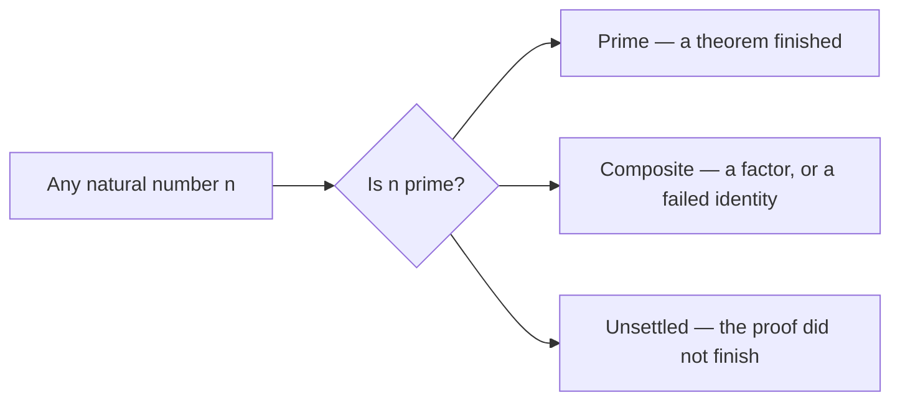
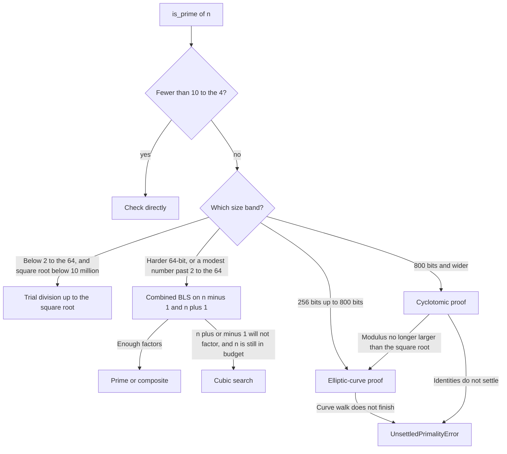
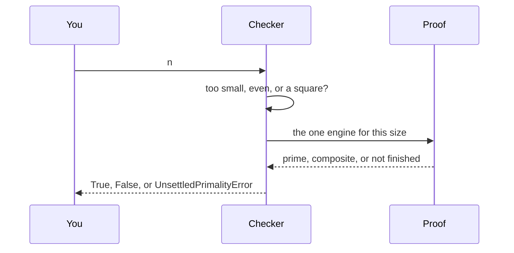

# Best-Prime-Number-Function

> [!WARNING]
> **This repository was created and designed by an AI agent**, including code, tests, docs, benchmarks, and automation. Treat it as **AI-generated work**: review, test, and validate before production or research-critical use.

**Ask whether a natural number is prime. Get a proof, or an honest “not settled.” Never a guess.**

[Try a number in the browser →](https://burakahmet.github.io/Best-Prime-Number-Function/) · [Library guide →](https://burakahmet.github.io/Best-Prime-Number-Function/guide/) · [API](https://burakahmet.github.io/Best-Prime-Number-Function/guide/api/)

<p align="center">
  <a href="https://burakahmet.github.io/Best-Prime-Number-Function/">
    
  </a>
</p>

[](https://www.python.org/downloads/)
[](LICENSE)
[](#what-prime-means-here)
[](https://github.com/BurakAhmet/Best-Prime-Number-Function/actions/workflows/ci.yml)
[](https://pypi.org/project/best-prime-number-function/)

The idea is small. The code is large because **one proof method is not fast at every size**, and this library refuses to fill the gap with “probably prime.”

---

## What you get



`is_prime(n)` is `True` only when a proof finished, and `False` only when compositeness is proved. If neither happens it raises `UnsettledPrimalityError`. It does not return “probably.”

That rules out three common shortcuts:

| Shortcut | Why it is not used |
|---|---|
| Stochastic Miller–Rabin | A fixed list of bases still accepts composites. Past $2^{64}$, SymPy’s `mr(n, [2, 3, 5, 7, 11, 13, 17, 19, 23, 29])` returns true for $1955097530374556503981$. That number is $31265776261 \times 62531552521$. `is_prime` proves it composite. Current `sympy.isprime` also rejects it: below $3317044064679887385961981$ the bases are a deterministic set, and above that it is Baillie–PSW, which has no known composite. |
| Prime-library sieves | Enumeration is not a proof engine for one arbitrary `n`. |
| AKS for every huge `n` | Correct, and far too slow here. **AKS is not in the library.** |

Same `n`, any machine, serial or parallel: the same answer. The number we time is end-to-end CLI `TIME` (`benchmarks/compare_e2e.py`), not a warm inner loop (`benchmarks/compare_speed.py` is the secondary check).

---

## Why there are several engines

Dividing by every prime up to $\lfloor\sqrt{n}\rfloor$ proves primality. It is the right tool while that square root is small. Near $2^{63}$ the square root is about three billion, so a full walk is the wrong tool even though the theorem is the same.

So the checker looks at the size and picks **one** proof that is still practical:



In symbols: below $10^{4}$ the check is direct. Below $2^{64}$ with $\lfloor\sqrt{n}\rfloor < 10^{7}$ it is trial division. From 256 bits it is an elliptic-curve proof, and from 800 bits a cyclotomic one.

| You are looking at | What actually runs | What “proved” feels like |
|---|---|---|
| A small integer | A short loop | Instant |
| Most 64-bit numbers with $\lfloor\sqrt{n}\rfloor < 10^7$ | Wheel trial, in OpenMP C when `wheel_core.so` is built, otherwise a 30030-wheel or a 9699690-wheel | Milliseconds |
| A hard 64-bit prime, or the 147-bit default | Combined BLS: factor $n-1$ or $n+1$ and check the witnesses | Milliseconds when the factors are kind |
| The same band when $n\pm 1$ is hostile | Cubic search, the complete fallback inside its budget | Still a proof, slower |
| About 100 digits (256–800 bits) | FastECPP: an elliptic curve whose order leads to a smaller prime, proved the same way | Seconds in the library |
| About 1000 digits (from 800 bits), while the cyclotomic modulus exceeds $\sqrt{n}$ | Jacobi sums. Any prime divisor is forced into a short list, then that list is checked | Minutes, not a guess |
| Wider than the engines cover | Stop | `UnsettledPrimalityError` |

NumPy / Numba speed the wheel when the OpenMP core is absent. They are not a second answer.

---

## What each proof is doing

**Trial.** Divide by the primes up to $\lfloor\sqrt{n}\rfloor$. No divisor means prime. The wheel skips multiples of 2, 3, 5, and further small primes so the loop does less work. OpenMP runs that loop in C.

**Combined BLS.** Fermat’s little theorem says a prime $p$ satisfies $a^{p-1}\equiv 1$. The converse is false. Brillhart–Lehmer–Selfridge repairs it: if you factor enough of $n-1$ (Pocklington) or $n+1$ (Lucas), and the witnesses check out, $n$ is prime. The library tries both sides. $9223372036854775783$, near $2^{63}$, is this proof, not a walk up to its square root.

**Cubic search.** When $n\pm 1$ does not factor, look for a factor of $n$ with a complete two-band search that is cheaper than trial, but only while $n$ is still inside the budget.

**Elliptic-curve proof.** Build a curve whose order splits as $c\cdot q$ with $q$ a smaller prime. A point on the curve, plus a proof of $q$, proves $n$. Repeat until the cofactor is small enough for trial or BLS. This is the 100-digit path. The in-browser lab uses the same idea; the Python library is the one that continues into the cyclotomic band.

**Cyclotomic proof.** For a wide $n$, pick a modulus $s>\sqrt{n}$ built from many small primes. Jacobi-sum identities in cyclotomic rings force every prime divisor of $n$ to equal $n^k \bmod s$ for some small $k$. Divide those few residues into $n$. That is how $10^{999}+7$ is proved, in minutes rather than by an elliptic-curve chain that only shrinks a few digits per step.



---

## Try it

```bash
pip install best-prime-number-function
```

Package name **`best-prime-number-function`**. Import **`best_prime`**. Extra `[fast]` adds NumPy / Numba. `bash scripts/compile_wheel_core.sh` builds the OpenMP core (Linux gcc, or macOS with `brew install libomp`). Without a compiler the stdlib wheel is still exact through $4\cdot 10^{12}$.

```python
from best_prime import is_prime, next_prime, prime_count

is_prime(17)                    # True
is_prime([17, 18, 19])          # [True, False, True]
next_prime(14, 3)               # 23
prime_count(10)                 # 4
is_prime(9223372036854775783)   # near 2^63 — n−1 proof
is_prime(18446744073709551557)  # largest prime under 2^64
is_prime(2305843009213693951)   # M61 = 2^61 − 1
```

`is-prime` with no argument checks the 147-bit default `100000000000000000000000000000000000000000031` and prints end-to-end `TIME`. Exit 0 = prime, 1 = not prime, 2 = bad input, 3 = unsettled.

| Also in the library | |
|---|---|
| `next_prime` / `prev_prime` / `nth_prime` / `primes` / `primerange` | Neighbours and lists. `prime_count(n)` stops at `PRIME_COUNT_MAX_N = 2⁶⁴−1`. |
| `prime_factors` / `factorint` | Trial, Fermat, cubic search, Brent, ECM, SIQS. |
| `primality_certificate` / `verify_certificate` | A checkable record of the same proof. |
| `totient`, `primorial`, `divisors`, `gcd`, `jacobi`, … | Exact arithmetic. Full list: [`docs/wiki/Library.md`](docs/wiki/Library.md). |
| `lab(n)` | Which path ran, and how long it took. |

---

## Where to read next

| | |
|---|---|
| [Exhibit](https://burakahmet.github.io/Best-Prime-Number-Function/) | Type a number in the browser |
| [Engines](https://burakahmet.github.io/Best-Prime-Number-Function/guide/engines/) | The same dispatch, with the inequalities |
| [Restrictions](https://burakahmet.github.io/Best-Prime-Number-Function/guide/restrictions/) | The rules, including the Miller–Rabin counterexample |
| [CONTRIBUTING.md](CONTRIBUTING.md) | How to change the code without breaking the contract |

Primary metric: end-to-end CLI `TIME`. `DEFAULT_N` stays the 147-bit prime above.
