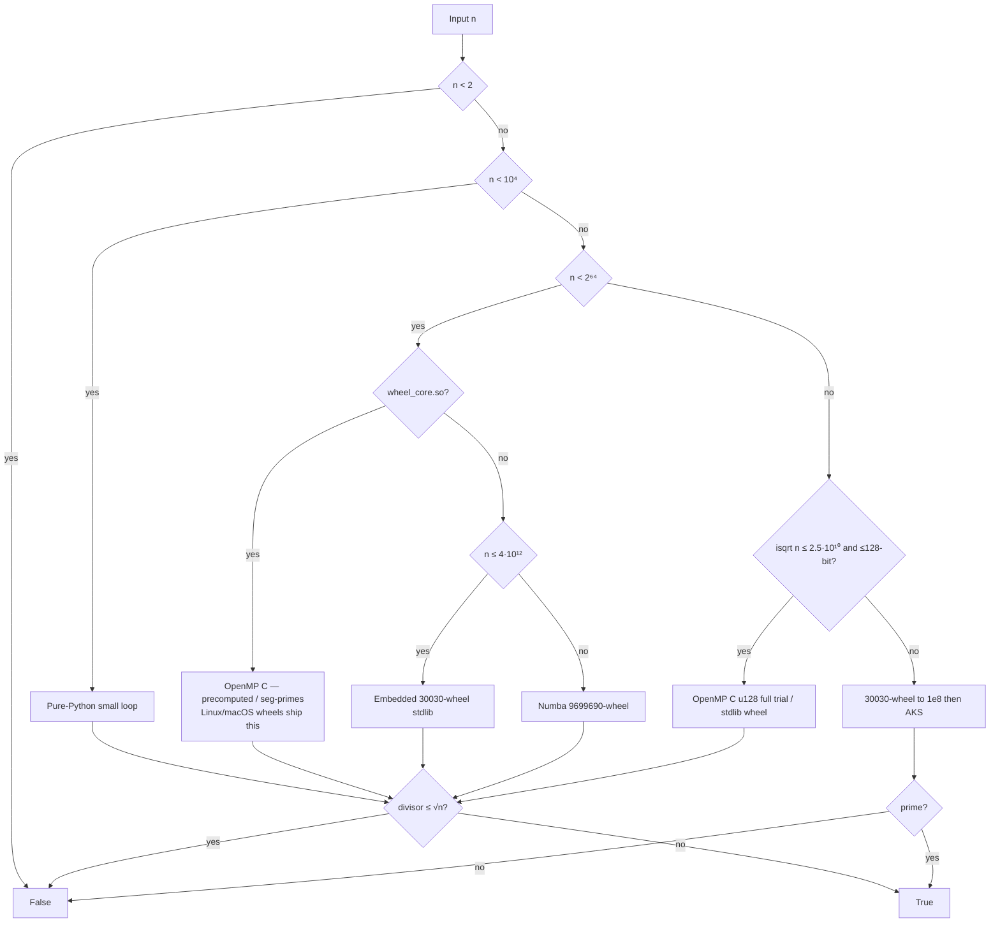

# Best-Prime-Number-Function

> [!WARNING]
> **This repository was created and designed by an AI agent**, including code, tests, docs, benchmarks, and automation. Treat it as **AI-generated work**: review, test, and validate before production or research-critical use.

**Exact `is_prime(n)` for every natural number** — audited wheel trial, then **AKS** only when √n is no longer practical. No stochastic Miller–Rabin. No prime libraries as the engine.

[Open the exhibit →](https://burakahmet.github.io/Best-Prime-Number-Function/) · [Library guide →](https://burakahmet.github.io/Best-Prime-Number-Function/guide/) · [API](https://burakahmet.github.io/Best-Prime-Number-Function/guide/api/) · [FAQ](https://burakahmet.github.io/Best-Prime-Number-Function/guide/faq/)

<p align="center">
  <a href="https://burakahmet.github.io/Best-Prime-Number-Function/">
    
  </a>
</p>

[](https://www.python.org/downloads/)
[](LICENSE)
[](#design-restrictions)
[](scripts/compile_wheel_core.sh)
[](https://numba.pydata.org/)
[](https://github.com/BurakAhmet/Best-Prime-Number-Function/actions/workflows/ci.yml)
[](https://burakahmet.github.io/Best-Prime-Number-Function/guide/)
[](https://pypi.org/project/best-prime-number-function/)
[](https://github.com/BurakAhmet/Best-Prime-Number-Function/pkgs/container/best-prime-number-function)

---

## Install

```bash
pip install best-prime-number-function          # PyPI (Trusted Publisher on first upload)
pip install "git+https://github.com/BurakAhmet/Best-Prime-Number-Function.git"
pip install -e ".[dev]"                         # clone + tests, ruff, mypy, Numba
bash scripts/compile_wheel_core.sh              # gcc+OpenMP (Linux) or clang+libomp (macOS)
```

Package name: **`best-prime-number-function`**. Import: **`best_prime`**. Extra `[fast]` adds NumPy / Numba. See [install](https://burakahmet.github.io/Best-Prime-Number-Function/guide/install/).

Native core: Linux CI builds `wheel_core.so`. macOS wants `brew install libomp`. Windows uses the stdlib / Numba fallback unless MinGW is present. A no-compiler install still covers $n \le 4\cdot10^{12}$ exactly.

---

## API

| Symbol | Role |
|--------|------|
| `is_prime(n, *, parallel=True)` | `True` iff prime. Also accepts a `list` / NumPy array. |
| `primality_certificate(n)` / `verify_certificate(c)` | Pratt certificate, or a factor if composite. |
| `next_prime` / `prev_prime` / `next_primes` / `prev_primes` | Neighbours; generators stream. Interval sieve while $\sqrt{\text{bound}}\le$ `NEXT_PRIME_SIEVE_ISQRT_MAX` ($2\cdot10^6$). |
| `nth_prime(k)` / `prime_count(n)` / `primes` / `primerange` | $p_k$, $\pi(n)$ (**hard ceiling** `PRIME_COUNT_MAX_N = 2⁶⁴−1`), lists. |
| `prime_factors` / `factorint` | Trial + Fermat + deterministic Brent + **ECM** + **SIQS**. |
| `totient` / `primorial` / `divisors` / `gcd` / `jacobi` / … | Exact arithmetic. Catalogue: [`docs/wiki/Library.md`](docs/wiki/Library.md). |
| `lab(n)` | Diagnostics (`path`, timings). |

```python
from best_prime import is_prime, next_prime, prime_count, primality_certificate

is_prime(17)                              # True
is_prime([17, 18, 19])                    # [True, False, True]
next_prime(14, 3)                         # 23
prime_count(10)                           # 4   — n > 2**64-1 raises ValueError
primality_certificate(17)["kind"]         # 'pratt'
is_prime(600000000000000000001)           # CLI default — 70-bit u128 trial
is_prime(18446744073709551557)            # largest prime < 2^64
is_prime(9223372036854775783)             # near 2^63
is_prime(2305843009213693951)             # M61 = 2^{61}-1
```

CLI after install: `is-prime`, `next-prime`, `next-primes`, `prime-count`, `primality-certificate`, … Exit 0 = prime, 1 = not prime, 2 = bad input. Default `is-prime` yardstick is `600000000000000000001` (70-bit, OpenMP u128 full trial). Printed `TIME` is **end-to-end** (import + check).

---

## vs other libraries

| | Engine | Deterministic for every $n$? | Typical use |
|--|--------|------------------------------|-------------|
| **best_prime** | Wheel / OpenMP trial, then **AKS** | **Yes** | Proof-grade boolean |
| `sympy.isprime` | BPSW + extras | No above proven bounds | CAS default |
| `gmpy2.is_prime` | Miller–Rabin | No | Fast probable-prime |
| `primesieve` | Sieve | N/A (enumeration) | **Forbidden** here as the engine |

A 3-base Miller–Rabin can lie: $n = 3943673813084040361$ is `mr([2,3,5])` “prime” and `is_prime` composite. Details below and in the [FAQ](https://burakahmet.github.io/Best-Prime-Number-Function/guide/faq/).

---

## Objective

Deliver one auditable predicate: `is_prime(n)` is true **if and only if** `n` is prime. The boolean must not depend on a random number generator, a witness drawn at runtime, a thread schedule, or a “probably prime” threshold. Same `n`, any machine, serial or parallel → same answer.

The engineering task is to keep that promise *usable*: full trial division through √n for the sizes people actually hit (everyday integers, hard 64-bit primes, values around $10^{20}$), and **AKS** only when walking up to √n is no longer realistic. The same contract covers $\pi(n)$, deterministic factoring, and Pratt certificates. Speed is a first-class metric (end-to-end CLI `TIME`). Luck is not an allowed ingredient.

## Mission

Most “is this prime?” code in the wild is **stochastic Miller–Rabin** or something adjacent: pick random bases, run a handful of modular exponentiations, and declare the number prime if none of them prove it composite. That is a superb *filter*. It is not a *proof*, and it is not a uniform function of `n` alone.

This repository exists to refuse that bargain — a public, deterministic primality **library** you can read, test, time, and reproduce, without outsourcing the answer to primesieve, `sympy.isprime`, or a dice roll.

### What stochastic algorithms give up

1. **They can be wrong.** A composite that slips every chosen witness is reported prime. The error probability can be made tiny; it is not zero.

   **n = 3,943,673,813,084,040,361 = 869,461 × 1,738,921 × 2,608,381**

   ```python
   from sympy.ntheory.primetest import mr, isprime
   from best_prime import is_prime

   n = 3943673813084040361            # 869461 × 1738921 × 2608381
   mr(n, [2, 3, 5])                   # True   ← SymPy MR: “prime”
   isprime(n)                         # False  ← SymPy’s full predicate
   is_prime(n)                        # False  ← exact trial
   n % 869461                         # 0      ← factor
   ```

   Hunt scripts: `benchmarks/find_sympy_discrepancy.py`, `benchmarks/find_large_sympy_liars.py`.
2. **Probably-prime is not a type.** Callers that mint a key, accept a certificate, or record a notable prime cannot tell *proved prime* from *survived a random quiz*.
3. **Runs are not replayable.** Random bases mean two calls can take different internal paths. CI cannot freeze *why* the answer was yes.
4. **“Deterministic MR” quietly shrinks the domain.** Fixed witness sets are deterministic only on **proven finite ranges** (for example a known base list for 64-bit integers). There is no small, uniform witness list that settles every natural number.
5. **Failures masquerade as rarity.** A bug in a probabilistic checker looks like a one-in-a-billion miss. Deterministic trial either finds a factor $\le\sqrt{n}$ or it does not.

### Why this project is important

Primality is treated as a fact in cryptography, computer algebra, teaching, and research tooling. A stack that is “almost always right” trains people to stop asking for a proof.

We optimize under a stricter question: *after you give up luck, what speed can you still engineer?* The library may lose to Miller–Rabin on wall-clock for a hard 64-bit prime; it may not shrug, guess, or silently restrict the domain. Tests, determinism CI, the restriction linter, the Pages exhibit, Pratt certificates, and downloadable trial certificates exist so that contract stays visible.

## Design restrictions

| Rule | Meaning |
|------|---------|
| **Deterministic** | Same input → same answer; no RNG |
| **No stochastic Miller–Rabin** | No “probably prime” engines |
| **No prime libraries as the engine** | No primesieve, `sympy.isprime`, … |
| **All natural numbers** | `int` or decimal `str`, including $>64$ bits |
| **Allowed accelerators** | NumPy / Numba, plus our OpenMP `wheel_core` |

## How the checker chooses a path

Linux/macOS **wheels** (v1.11.2+) ship `wheel_core.so`. A no-compiler or Windows install still falls back to stdlib / Numba. Same dispatch either way:

```text
is_prime(n)
  n < 10⁴              →  tiny pure-Python loop
  10⁴ ≤ n < 2⁶⁴
       ├─ wheel_core.so present  →  OpenMP C (precomputed primes / seg-primes + 2-adic trial)
       ├─ else n ≤ 4·10¹²        →  embedded 30030-wheel (stdlib only)
       └─ else                   →  lazy NumPy/Numba 9699690-wheel
  n ≥ 2⁶⁴
       ├─ isqrt(n) ≤ 2.5·10¹⁰ (e.g. ~10²⁰) and wheel_core.so
       │                      →  OpenMP C full trial (u128 limbs; no AKS)
       ├─ same size, no .so  →  stdlib 9699690-wheel full trial
       └─ larger still       →  30030-wheel to 1e8 → AKS (Kronecker) if needed

  ✗  stochastic Miller–Rabin · prime sieving libraries
  ✓  deterministic for every natural number
```



Exact **trial division** up to $\lfloor\sqrt{n}\rfloor$ on the 64-bit paths and on practical multi-limb sizes. Only still-larger inputs fall through to **AKS** (correct, but can be very slow).

`primality_certificate` / `factorint` sit on top of this predicate (Pratt; trial + Fermat + deterministic Brent + ECM + SIQS). They do not change the boolean contract.

Primary perf metric: e2e CLI `TIME` (`benchmarks/compare_e2e.py`). Secondary: warm hot-loop (`benchmarks/compare_speed.py`).

---

## Platforms and C bindings

| Platform | Native OpenMP core | Fallback |
|----------|--------------------|----------|
| **Linux x86_64** (CI, Docker) | Built in CI; `lab(n)["path"] == "u64_wheel_c"` | — |
| **macOS** | `brew install libomp` then `compile_wheel_core.sh` | 30030-wheel / Numba |
| **Windows** | MinGW `gcc` if present | 30030-wheel / Numba |
| **Pure Python** | Unavailable | Stdlib through $4\cdot10^{12}$ |

C API: [`include/best_prime.h`](include/best_prime.h) + [`native/Makefile`](native/Makefile) (`pkg-config best_prime`). Rust/Go notes: [bindings](https://burakahmet.github.io/Best-Prime-Number-Function/guide/bindings/).

---

## Develop

```bash
pip install -e ".[dev]"
bash scripts/compile_wheel_core.sh
python3 scripts/check_restrictions.py
python3 scripts/check_wiki_sync.py
ruff check best_prime tests
mypy
pytest -q -m "not slow"
OMP_NUM_THREADS=2 python3 benchmarks/check_determinism.py
```

Nightly Actions runs `@pytest.mark.slow`. Releases attach sdist/wheels and a GHCR image. Cite via [`CITATION.cff`](CITATION.cff).

Contributing: [CONTRIBUTING.md](CONTRIBUTING.md). Conduct: [CODE_OF_CONDUCT.md](CODE_OF_CONDUCT.md). Security: [SECURITY.md](SECURITY.md).
