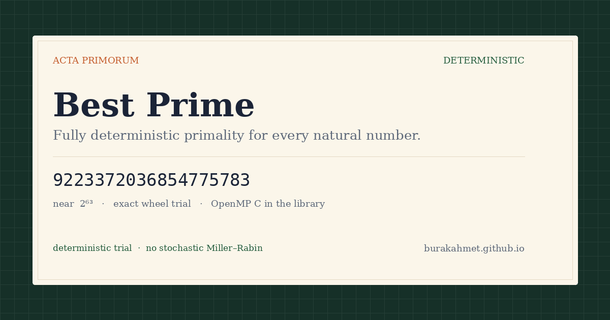
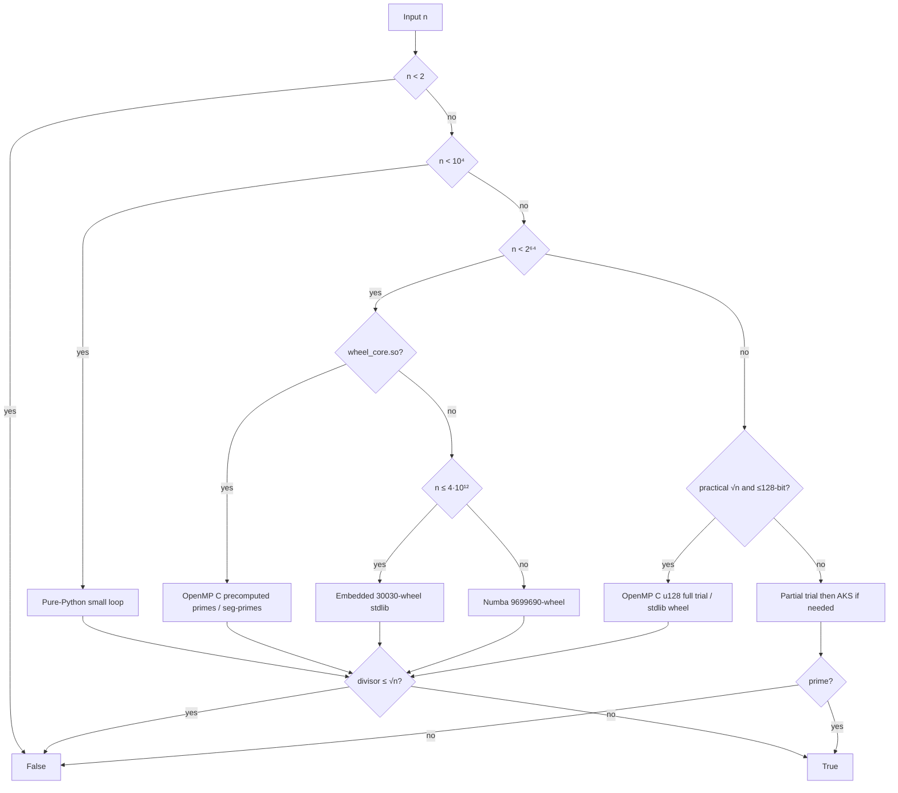

# Best-Prime-Number-Function

> [!WARNING]
> **This repository was created and designed by an AI agent**, including code, tests, docs, benchmarks, and automation. Treat it as **AI-generated work**: review, test, and validate before production or research-critical use.

**Exact `is_prime(n)` for every natural number** — audited wheel trial, then **AKS** only when √n is no longer practical. No stochastic Miller–Rabin.

[Open the exhibit →](https://burakahmet.github.io/Best-Prime-Number-Function/) daily CI specimen, 30-wheel orrery, downloadable trial certificate. This repo is the Python / OpenMP engine behind it.

<p align="center">
  <a href="https://burakahmet.github.io/Best-Prime-Number-Function/">
    
  </a>
</p>

[](https://www.python.org/downloads/)
[](LICENSE)
[](#design-restrictions)
[](scripts/compile_wheel_core.sh)
[](https://numba.pydata.org/)
[](https://github.com/BurakAhmet/Best-Prime-Number-Function/actions/workflows/ci.yml)
[](https://github.com/BurakAhmet/Best-Prime-Number-Function/pkgs/container/best-prime-number-function)

---

## Python library

### Install

```bash
# dependency from GitHub (no clone required)
pip install "git+https://github.com/BurakAhmet/Best-Prime-Number-Function.git"

# or editable install while hacking on this repo
git clone https://github.com/BurakAhmet/Best-Prime-Number-Function.git
cd Best-Prime-Number-Function
pip install -e .
```

Package name on disk: **`best-prime-number-function`**. Import the API as **`best_prime`** (or the implementation module `is_prime` — same functions).

If hard primes feel slow, ensure the OpenMP core built successfully (`gcc` + OpenMP). Re-run from a clone:

```bash
bash scripts/compile_wheel_core.sh
```

Then set threads for the heavy paths (optional; defaults to all CPUs when unset):

```bash
export OMP_NUM_THREADS=$(nproc)   # also read as NUMBA_NUM_THREADS on the Numba path
```

### API

| Symbol | Role |
|--------|------|
| `is_prime(n, *, parallel=True) -> bool` | `True` iff `n` is prime. Fully deterministic. |
| `next_prime(n, k=1, *, parallel=True) -> int` | The `k`-th prime **strictly greater than** `n`. |
| `prev_prime(n, k=1, *, parallel=True) -> int` | The `k`-th prime **strictly less than** `n` (errors if fewer than `k` exist). |
| `nth_prime(k) -> int` | The `k`-th prime (`nth_prime(1) == 2`). |
| `prime_count(n) -> int` | $\pi(n)$: number of primes $\le n$. |
| `primes(n) -> list[int]` | All primes $\le n$. |
| `primerange(a, b) -> list[int]` | Primes $p$ with $a \le p \lt b$. |
| `prime_factors(n) -> list[int]` | Prime factors with multiplicity, ascending. |
| `factorint(n) -> dict[int, int]` | Prime $\to$ exponent. |
| `is_perfect_power(n) -> bool` | $n=a^b$ with $a>1$, $b>1$. |
| `is_prime_power(n) -> bool` | $n=p^k$ for prime $p$, $k\ge 1$ (primes count). |
| `lab(n, *, parallel=True) -> dict` | Same check plus diagnostics (`path`, `isqrt`, timings, `note`). |
| `__version__` | Installed package version (`best_prime` only). |

**Accepted `n`:** non-negative `int`, or a decimal `str` (leading zeros / surrounding whitespace OK). Rejects negatives, non-decimal strings, and `bool` (use `int` explicitly if you must).

**`parallel`:** only affects multi-threaded OpenMP / Numba engines on large enough $\sqrt{n}$. Result never depends on it — serial and parallel must agree.

```python
from best_prime import (
    factorint, is_perfect_power, is_prime, is_prime_power, lab,
    next_prime, nth_prime, prev_prime, prime_count, prime_factors,
    primerange, primes,
)

is_prime(17)                              # True
is_prime(100)                             # False
next_prime(14)                            # 17
next_prime(14, 3)                         # 23
prev_prime(14)                            # 13
nth_prime(5)                              # 11
prime_count(10)                           # 4
primes(10)                                # [2, 3, 5, 7]
primerange(10, 20)                        # [11, 13, 17, 19]
prime_factors(360)                        # [2, 2, 2, 3, 3, 5]
factorint(360)                            # {2: 3, 3: 2, 5: 1}
is_perfect_power(36)                      # True
is_prime_power(36)                        # False
next_prime(10**9 + 7)                     # 1000000009
is_prime(18446744073709551557)            # True  (largest prime < 2^64; wants wheel_core.so)
is_prime(9223372036854775783)             # True  (hard 64-bit; wants wheel_core.so)
is_prime("100000000000000000039")         # True  (~10^20; u128 OpenMP path)
is_prime("9" * 100)                       # False (tiny factor / big-int path)
is_prime(10**9 + 7, parallel=False)       # True  (still deterministic)

info = lab(10**9 + 7)
# info["is_prime"], info["path"], info["isqrt"],
# info["elapsed_ms"] (check only), info["e2e_ms"] (since process start), info["note"]
```

Runnable sample: [`examples/basic_usage.py`](examples/basic_usage.py).

### What to expect for performance

| Input size (order of magnitude) | Typical engine (with `.so`) | Notes |
|---------------------------------|----------------------------|--------|
| Tiny / moderate | Python loop or stdlib wheel | Sub-ms to tens of ms |
| Hard 64-bit primes | OpenMP `u64_wheel_c` | Sub-second multi-core on a laptop |
| Up to about $10^{20}$ with practical $\sqrt{n}$ | OpenMP `u128_wheel_c` | Seconds, not AKS |
| Huge primes, no small factors | Partial trial → **AKS** | Correct but can be very slow |

Without `wheel_core.so`, the library still works via stdlib wheels and/or Numba; only the slowest 64-bit / multi-limb cases suffer most.

---

## CLI

After `pip install`, use the console scripts (same program as `python is_prime.py` from a clone):

```bash
is-prime 97
is-prime 18446744073709551557
best-prime --lab 1000000007    # alias of is-prime
is-prime --serial 10**9+7      # force single-threaded engines
next-prime 100                 # 101 (smallest prime > 100)
next-prime 14 3                # 23  (3rd prime after 14)
```

`is-prime` with no argument defaults to the largest prime $<2^{64}$: `18446744073709551557` (hardest 64-bit yardstick). Near $2^{63}$ (`9223372036854775783`) remains a documented mid-hard specimen. `next-prime` requires `n` (it does **not** default to that 64-bit prime — the successor is 65-bit).

| Exit code | Meaning |
|-----------|---------|
| `0` | prime |
| `1` | not prime |
| `2` | invalid input |

`TIME` on the CLI is **end-to-end** (import + tables/native load + check), not a warm hot-loop only.

```text
TEST:    18446744073709551557 (20 chars)
THREADS: 12
RESULT:  prime
TIME:    280800000 ns  (280.800000 ms)
```

Example for the mid-size 12-digit prime (precomputed-prime C path):

```text
TEST:    999999999989 (12 chars)
THREADS: 12
RESULT:  prime
TIME:    2422000 ns  (2.422000 ms)
```

### Developer loop

From a clone, checks matching CI:

```bash
pip install -e ".[dev]"
bash scripts/compile_wheel_core.sh   # if install skipped the native core
python3 scripts/check_restrictions.py
python3 scripts/check_wiki_sync.py
pytest -q -m "not slow"
OMP_NUM_THREADS=2 python3 benchmarks/check_determinism.py
OMP_NUM_THREADS=2 python3 benchmarks/compare_e2e.py --json /tmp/e2e.json
python3 scripts/check_e2e_regression.py \
  --baseline benchmarks/e2e_results.json --candidate /tmp/e2e.json
```

### Supported platforms

| Platform | `wheel_core.so` (OpenMP C) | Fallback |
|----------|----------------------------|----------|
| **Linux x86_64** (CI, Docker) | Built in CI via `scripts/compile_wheel_core.sh`; `lab(n)["path"] == "u64_wheel_c"` is asserted | — |
| **macOS / Windows / other** | Build locally if `gcc`/`clang` + OpenMP are available | Embedded 30030-wheel (stdlib) and/or **Numba** 9699690-wheel |
| **Pure Python env** (no compiler, no Numba wheels) | Unavailable | Stdlib paths only (`n ≤ 4·10¹²` fully covered; harder 64-bit needs Numba or a local `.so`) |

The committed `.so` is a Linux convenience artifact; **source of truth** is `is_prime_data/wheel_core.c` rebuilt in CI.

---

## Objective

Deliver one auditable predicate: `is_prime(n)` is true **if and only if** `n` is prime. The boolean must not depend on a random number generator, a witness drawn at runtime, a thread schedule, or a “probably prime” threshold. Same `n`, any machine, serial or parallel → same answer.

The engineering task is to keep that promise *usable*: full trial division through √n for the sizes people actually hit (everyday integers, hard 64-bit primes, values around 10²⁰), and **AKS** only when walking up to √n is no longer realistic. Speed is a first-class metric (end-to-end CLI `TIME`). Luck is not an allowed ingredient.

## Mission

Most “is this prime?” code in the wild is **stochastic Miller–Rabin** or something adjacent: pick random bases, run a handful of modular exponentiations, and declare the number prime if none of them prove it composite. That is a superb *filter*. It is not a *proof*, and it is not a uniform function of `n` alone.

This repository exists to refuse that bargain — to build and keep a public, deterministic primality engine that you can read, test, time, and reproduce, without outsourcing the answer to primesieve, `sympy.isprime`, or a dice roll.

### What stochastic algorithms give up

1. **They can be wrong.** A composite that slips every chosen witness is reported prime. The error probability can be made tiny; it is not zero, and “almost never” is not “never.”

   We looked for a disagreement in code on this machine (SymPy 1.14): products of our own primes, then Chernick Carmichael numbers `U(m) = (6m+1)(12m+1)(18m+1)` with all three factors prime — including values just below and just above `9223372036854775783`. Scripts: `benchmarks/find_sympy_discrepancy.py`, `benchmarks/find_large_sympy_liars.py`.

   `sympy.isprime` still matched exact trial on every `n` in those sweeps (it is not a random-base quiz below 2⁶⁴). The stochastic helper `sympy.ntheory.primetest.mr` did not.

   Best hit **below** `9223372036854775783` that failed three ordinary MR bases:

   **n = 3,943,673,813,084,040,361 = 869,461 × 1,738,921 × 2,608,381**

   ```python
   from sympy.ntheory.primetest import mr, isprime
   from best_prime import is_prime

   n = 3943673813084040361            # 869461 × 1738921 × 2608381
   mr(n, [2, 3, 5])                   # True   ← SymPy MR: “prime”
   isprime(n)                         # False  ← SymPy’s full predicate
   is_prime(n)                        # False  ← exact trial
   n % 869461                         # 0      ← factor
   ```

   Same Chernick sweep also produced `2525792614252920361 = 749461 × 1498921 × 2248381` (also `mr([2,3,5])` true, still below the near-2⁶³ prime) and, **above** it, `16492968133060009321 = 1400821 × 2801641 × 4202461`. Exact trial’s factor in the headline case is **869461**.
2. **Probably-prime is not a type.** Callers that mint a key, accept a certificate, or record a notable prime cannot tell *proved prime* from *survived a random quiz*. The API looks boolean; the contract is probabilistic.
3. **Runs are not replayable.** Random bases mean two calls can take different internal paths. CI cannot freeze a transcript of *why* the answer was yes. Even when the boolean matches, the justification does not.
4. **“Deterministic MR” quietly shrinks the domain.** Fixed witness sets are deterministic only on **proven finite ranges** (for example a known base list for 64-bit integers). There is no small, uniform witness list that settles every natural number. Using that engine as if it covered “all `n`” changes the specification without saying so.
5. **Failures masquerade as rarity.** A bug in a probabilistic checker looks like a one-in-a-billion miss, not a broken proof. Deterministic trial either finds a factor ≤ √n or it does not — the miss is a bug you can catch.

### Why this project is important

Primality is treated as a fact in cryptography, computer algebra, teaching, and research tooling. A stack that is “almost always right” trains people to stop asking for a proof, and it makes the 64-bit special case look like a solved general problem.

We optimize under a stricter question: *after you give up luck, what speed can you still engineer?* The library may lose to Miller–Rabin on wall-clock for a hard 64-bit prime; it may not shrug, guess, or silently restrict the domain. Tests, determinism CI, the restriction linter, the Pages exhibit, and downloadable trial certificates exist so that contract stays visible.

Harder rules we actually enforce:

| Rule | Meaning |
|------|---------|
| **Deterministic** | Same input → same answer; no RNG |
| **No stochastic MR** | No random-base Miller–Rabin / “probably prime” engines |
| **No prime libraries as the engine** | No primesieve, `sympy.isprime`, etc. |
| **All natural numbers** | `int` or decimal `str`, including values beyond 64 bits |
| **Allowed accelerators** | NumPy / Numba, plus an optional OpenMP C extension we compile ourselves |

---

## How the checker chooses a path

```text
is_prime(n)
  n < 10⁴              →  tiny pure-Python loop
  10⁴ ≤ n < 2⁶⁴
       ├─ wheel_core.so present  →  OpenMP C (precomputed primes / seg-primes + 2-adic trial)
       ├─ else n ≤ 4·10¹²        →  embedded 30030-wheel (stdlib only)
       └─ else                   →  lazy NumPy/Numba 9699690-wheel
  n ≥ 2⁶⁴
       ├─ isqrt(n) ≤ 2.5·10¹⁰ (e.g. ~10²⁰) and wheel_core.so
       │                      →  OpenMP C full trial (u128 limbs; no AKS)
       ├─ same size, no .so  →  stdlib 9699690-wheel full trial
       └─ larger still       →  30030-wheel to 1e8 → AKS (Kronecker) if needed

  ✗  stochastic Miller–Rabin · prime sieving libraries
  ✓  deterministic for every natural number
```



Exact **trial division** up to $\lfloor\sqrt{n}\rfloor$ on the 64-bit paths and on practical multi-limb sizes (candidates restricted by a primorial wheel / prime sieve segment). Only for still-larger inputs does unfinished trial fall through to **AKS** (correct, but can be very slow).

### Time complexity

Let $N = n$ when discussing bit size, and write $L = \lfloor\sqrt{n}\rfloor$. Arithmetic cost below is in **word operations** on $O(1)$- or $O(\log n)$-word integers as implemented (64-bit core; multi-limb mod for the u128 path).

| Path | Worst-case (prime / no small factor) | Notes |
|------|--------------------------------------|--------|
| Tiny loop / odd trial | $\Theta(L) = \Theta(\sqrt{n})$ | Constant-factor 6-wheel style steps |
| Primorial **wheel** trial (stdlib, Numba fallback) | $\Theta((\varphi(W)/W)\cdot L)=\Theta(\sqrt{n})$ | $W \in \{30030,\,9699690\}$; density $\varphi(W)/W \lt 1$ cuts the constant, **not** the asymptotic class |
| OpenMP precomputed-prime trial ($L \le 2^{20}$) | $\Theta(\pi(L))=\Theta(\sqrt{n}/\log n)$ | Exact wrap-mul divisibility; serial (OpenMP not worth it) |
| OpenMP seg-primes ($t$ threads, large $L$) | $\Theta(\sqrt{n}/t)$ wall-clock *ideally* | Same work, split across cores; 2-adic wrap-mul trial (no `DIV`) on 64-bit $n$ |
| Segmented sieve + prime-only trial (large $L$) | $\widetilde{O}(\sqrt{n})$ | Fewer candidates ($\sim \pi(L)$) plus sieving; 64-bit path uses wrap-mul, still $\Theta(\sqrt{n}/\log n)$ tests |
| Partial trial then **AKS** (huge $n$) | Poly in $\log n$ for AKS *in theory* | Wheel to $10^8$ first; Kronecker poly mul; still much slower than trial on moderate sizes |

**Composite early exit:** if the least prime factor is $p$, work is roughly $\Theta(p)$ (or $\Theta(\varphi(W)/W \cdot p)$ on a wheel), so smooth composites are much cheaper than the prime worst case.

**Contrast (not used in the library):** deterministic Miller–Rabin for a fixed 64-bit witness set is $\Theta(k \cdot M(\log n)\cdot\log n)$ for $k$ modular exponentiations — much faster for hard 64-bit primes, but that is a different correctness model than “full trial / AKS for every natural number.” See `benchmarks/compare_miller_rabin.py`.

### Build the optional C core

```bash
# requires gcc and OpenMP (libgomp)
bash scripts/compile_wheel_core.sh
```

CI builds this automatically on Linux. Without the `.so`, the library falls back to embedded stdlib wheels and/or Numba. Regenerate table assets with `python scripts/generate_wheel_data.py`.

---

## Performance snapshot

Indicative **end-to-end CLI `TIME`** on a dev machine (`benchmarks/compare_e2e.py`, best of several runs; wall times vary by CPU and whether `wheel_core.so` is present):

| Case | `n` | Typical e2e CLI `TIME` |
|------|-----:|-----------------------:|
| Small prime | 97 | ~0.4 ms |
| $10^9+7$ | 1000000007 | ~2–3 ms |
| 12-digit prime | 999999999989 | ~2–4 ms (sample: `2421823 ns` / `2.421823 ms`) |
| Near $2^{63}$ prime | 9223372036854775783 | ~0.19–0.22 s |
| Largest prime $<2^{64}$ | 18446744073709551557 | ~0.28–0.32 s (sample: `280800000 ns` / `280.800 ms`) |
| Mersenne M61 | $2^{61}-1$ | ~0.10–0.12 s |

In-process hot-loop comparisons (warm engines) live in [`benchmarks/compare_speed.py`](benchmarks/compare_speed.py). End-to-end CLI timing: [`benchmarks/compare_e2e.py`](benchmarks/compare_e2e.py). More context: [`benchmarks/README.md`](benchmarks/README.md), [Hall of fame](docs/wiki/Hall-of-fame.md).

| Regime | Behaviour |
|--------|-----------|
| Tiny / moderate $n$ | Sub-millisecond to tens of ms e2e; often no NumPy/Numba |
| Hard 64-bit primes | Sub-second multi-core with `wheel_core.so` |
| Huge composites with a small factor | Near-instant |
| Huge primes via AKS | May take a very long time |

---

## Repository map

Think of four layers. Only the first is the product.

```text
+--------------------------------------------------------------------------+
|  1. CORE                                                                 |
|     is_prime.py          is_prime() / lab() / CLI                        |
|     next_prime.py / prev_prime.py / prime_sieve.py                       |
|     prime_factors.py / prime_power.py                                    |
|     is_prime_data/       precomputed wheels + optional wheel_core.so     |
|     Rules: deterministic, no stochastic MR, no prime libs as engine      |
+--------------------------------------------------------------------------+
|  2. PROOF & SPEED                                                        |
|     tests/               pytest + Hypothesis (derandomized)              |
|     benchmarks/          in-process speed, e2e CLI TIME, determinism     |
|     scripts/             restriction linter, table/C generators, attest  |
+--------------------------------------------------------------------------+
|  3. GITHUB ACTIONS                                                       |
|     CI, Determinism, performance gate, auto-merge, agents, GHCR, wiki    |
+--------------------------------------------------------------------------+
|  4. DOCS & TRACKING                                                      |
|     README, CONTRIBUTING, docs/wiki, labels / optional Project board     |
+--------------------------------------------------------------------------+
```

| If you want to… | Go here |
|-----------------|--------|
| Use the checker | [Quick start](#quick-start) |
| Understand the math/engines | [How the checker chooses a path](#how-the-checker-chooses-a-path) · [restrictions](#design-restrictions) |
| Run tests / benchmarks | [Testing & quality gates](#testing--quality-gates) · [`benchmarks/`](benchmarks/README.md) |
| See automation | [Automation map](#automation-map) |
| Contribute | [Contributing](#contributing) · [CONTRIBUTING.md](CONTRIBUTING.md) · [Code of conduct](CODE_OF_CONDUCT.md) |
| Install a release / container | [Releases & packages](#releases--packages) |
| Board / labels | [Project board & labels](#project-board--labels) · [docs/PROJECT_BOARD.md](docs/PROJECT_BOARD.md) |

```text
Best-Prime-Number-Function/
├── is_prime.py                 # is_prime / lab + CLI
├── next_prime.py / prev_prime.py
├── prime_sieve.py              # π(n), nth_prime, primes, primerange
├── prime_factors.py / prime_power.py
├── is_prime_data/              # wheels, wheel_core.c / .so
├── tests/
├── benchmarks/                 # compare_speed, compare_e2e, determinism
├── scripts/
│   ├── check_restrictions.py
│   ├── compile_wheel_core.sh
│   ├── generate_wheel_data.py
│   ├── write_attestation.py
│   └── design_github_project.py
├── docs/wiki/
├── .github/workflows/
├── Dockerfile
├── pyproject.toml / requirements.txt
├── CONTRIBUTING.md
└── README.md
```

---

## Design restrictions

Enforced by review and `scripts/check_restrictions.py` in CI:

1. **Determinism for every natural number** — threads OK; randomness not OK.
2. **No stochastic Miller–Rabin** / “probably prime” engines.
3. **No dedicated prime libraries** as the implementation core (e.g. primesieve, `sympy.isprime`).
4. **Allowed:** NumPy / Numba, and our own compiled OpenMP helper, to accelerate *our* trial division.

Fixed-base MR is deterministic only on **proven finite ranges**. This repo uses **primorial-wheel trial division** (plus **AKS** for oversized integers) so the API stays correct for all naturals under the restriction set.

---

## Testing & quality gates

See the [Developer loop](#developer-loop) above. Full suite: `pytest -q` (includes `@pytest.mark.slow`).

**Two metrics (do not mix them up):**

| Metric | Script | CI role |
|--------|--------|---------|
| **E2E CLI `TIME`** (primary) | `compare_e2e.py` | Perf gate vs previous commit (`check_e2e_regression.py`, 25% threshold) |
| **In-process hot loop** (secondary) | `compare_speed.py` | Informational artifact only |

Coverage highlights: exhaustive checks on $0\ldots4999$; Hypothesis with `derandomize=True`; C-path serial==parallel and semiprime matrix (`tests/test_c_core.py`); Linux assertion `lab(n)["path"] == "u64_wheel_c"`; wiki sync (`scripts/check_wiki_sync.py`).

| Gate | Workflow | Role |
|------|----------|------|
| Restriction linter | **CI** | Bans MR / primesieve / random engines in implementation paths |
| Wiki sync | **CI** | Key README facts must appear in `docs/wiki/` |
| Fast tests | **CI** | `pytest -m "not slow"` on **3.9 / 3.11 / 3.12** (+ build `.so`, assert C path on Linux) |
| Performance | **CI** | **E2E** candidate vs previous commit / PR base; fail if `e2e_ms` regresses **>25%** on measurable cases |
| Attestation | **CI** | Re-runs lint + tests + determinism; uploads `attestation.json` |
| Determinism | **Determinism** | Repeated serial/parallel trials must agree |

---

## Automation map

Workflows under `.github/workflows/` are optional for *using* `is_prime`; they operate the repo for maintainers and agents.

### Quality & publish

| Workflow | Trigger | What it does |
|----------|---------|----------------|
| [**CI**](.github/workflows/ci.yml) | push / PR → `main` | Build C core, linter, pytest, performance, e2e smoke, attestation |
| [**Determinism**](.github/workflows/determinism.yml) | push / PR → `main` | Repeat trials + `check_determinism.py` |
| [**Auto-merge**](.github/workflows/auto-merge.yml) | PR / check_suite | Squash-merge **same-repo**, non-draft PRs when checks are green (not forks) |
| [**Publish package**](.github/workflows/publish-package.yml) | release / manual | Build & push **GHCR** container |
| [**Publish wiki**](.github/workflows/publish-wiki.yml) | `docs/wiki/**` changes | GitHub Pages from wiki markdown |

### Agents & board

| Workflow | Trigger | What it does |
|----------|---------|----------------|
| [**Issue agent**](.github/workflows/issue-agent.yml) | issue opened / reopened | Keyword answers + restrictions briefing + labels |
| [**PR agent**](.github/workflows/pr-agent.yml) | PR open / sync | Briefing, best-effort Copilot review request, **auto-approve** same-repo PRs |
| [**Project autonomy**](.github/workflows/project-autonomy.yml) | issues / PRs | Moves kanban / agent labels |
| [**Project sync**](.github/workflows/project-sync.yml) | manual / optional | Re-seed GitHub Project if `PROJECT_TOKEN` has `project` scopes |
| [**Prime of the day**](.github/workflows/prime-of-the-day.yml) | daily 12:00 UTC / manual | Deterministic date → `n` → `lab()`; upserts labeled issue |

Agent context: [`.github/copilot-instructions.md`](.github/copilot-instructions.md), [`.github/AGENT_BRIEFING.md`](.github/AGENT_BRIEFING.md).

**Policy:** same-repo PRs may be auto-approved and auto-merged after green **CI** + **Determinism**; **forks are never** auto-approved or auto-merged.

```text
Issue opened ──► Issue agent (answer + labels)
PR opened    ──► PR agent (brief + approve if same-repo)
                 Project autonomy (status/*, agent/*)
                      ▼
            CI + Determinism green
                      ▼
            Auto-merge (squash) ──► status/done
```

---

## Project board & labels

Work is tracked with **labels** so Actions can move items without a human-only column. A GitHub **Project** can mirror Status if configured in the UI (or via `scripts/design_github_project.py` with `project` scopes).

| Track | Labels |
|-------|--------|
| **Kanban** | `status/backlog` → `ready` → `in-progress` → `in-review` → `done` |
| **Agent ops** | `agent/triaged` → `implementing` → `waiting-ci` → `done` |
| **Quality** | `quality/checklist` + `todo` / `partial` / `done` |
| **Area / priority / size** | `area/*`, `priority/p0`…`p3`, `size/S|M|L` |
| **Restriction risk** | `restriction-risk/low` or `high` |

Details: [docs/PROJECT_BOARD.md](docs/PROJECT_BOARD.md).

---

## Wiki & docs site

| Location | Role |
|----------|------|
| [docs/wiki/](docs/wiki/) | Source in git |
| [GitHub Wiki](https://github.com/BurakAhmet/Best-Prime-Number-Function/wiki) | Browsable copy |
| [GitHub Pages](https://burakahmet.github.io/Best-Prime-Number-Function/) | Exhibit: daily specimen, 30-wheel orrery, trial certificate (64-bit $n$ ok) |

Start here: [Project restrictions](docs/wiki/Project-restrictions.md) · [Algorithm overview](docs/wiki/Algorithm-overview.md) · [**Algorithm history**](docs/ALGORITHM_HISTORY.md) · [CI and automation](docs/wiki/CI-and-automation.md) · [Hall of fame](docs/wiki/Hall-of-fame.md) · [Agent briefing](docs/wiki/Agent-briefing.md).

---

## Releases & packages

| Channel | How |
|---------|-----|
| **GitHub Release** | Version tags (e.g. `v1.0.0`) |
| **pip library** | See [Python library](#python-library) (`pip install git+https://…` or `pip install -e .`) |
| **GHCR container** | Repo **Packages** tab; published by **Publish package** |

```bash
echo $GITHUB_TOKEN | docker login ghcr.io -u USERNAME --password-stdin
docker pull ghcr.io/burakahmet/best-prime-number-function:1.4.1
docker run --rm ghcr.io/burakahmet/best-prime-number-function:1.4.1 17
```

---

## Contributing

Contributions are welcome when they respect the [design restrictions](#design-restrictions). See [CONTRIBUTING.md](CONTRIBUTING.md), the [Code of Conduct](CODE_OF_CONDUCT.md), and [SECURITY.md](SECURITY.md) for private vulnerability reports.

```bash
pip install -r requirements.txt
bash scripts/compile_wheel_core.sh
python3 scripts/check_restrictions.py
pytest -q -m "not slow"
OMP_NUM_THREADS=2 python3 benchmarks/check_determinism.py
python3 is_prime.py --lab 97
python3 next_prime.py 14
```

Open an issue before large designs if you are unsure about the restrictions.

---

## AI authorship

Design, code, tests, benchmarks, docs, and automation in this repository were **generated by an AI agent**. This is not presented as independently human-authored work. Review and verify before production use.

---

## License

MIT — see [LICENSE](LICENSE).
