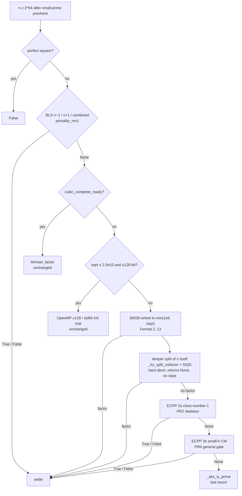
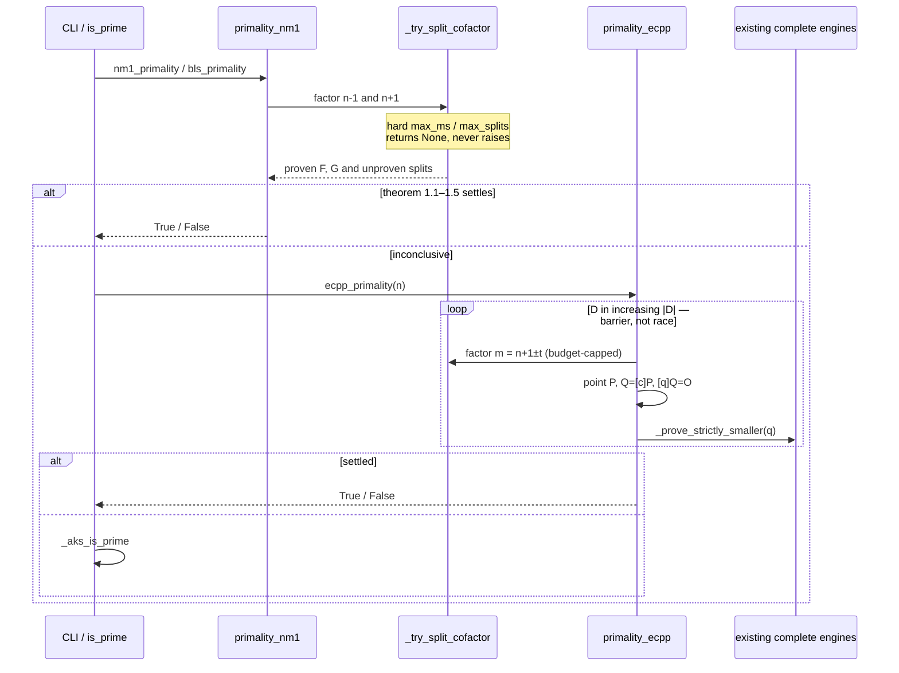

# Deterministic 100+ Digit Primality Engine

| | |
|--|--|
| **Author** | _TBD (Best-Prime-Number-Function maintainers)_ |
| **Date** | 2026-08-14 |
| **Status** | Shipped on `main` (rev. 9 — FastECPP M2/M3: $P_{300}$ proves; 147-bit `DEFAULT_N` kept) |
| **Package** | `best-prime-number-function` 1.12.0 + unreleased huge-n ladder |
| **Repository** | `/home/ahmet/Best-Prime-Number-Function` · [BurakAhmet/Best-Prime-Number-Function](https://github.com/BurakAhmet/Best-Prime-Number-Function) |
| **Primary metric** | End-to-end CLI `TIME` (`benchmarks/compare_e2e.py`) |
| **Secondary metric** | `lab(n)["elapsed_ms"]` |

This document designs the **huge-n** proving ladder. It is **not** a 64-bit micro-opt round: `TILE_BYTES`, `TILE_P_MAX`, wheel marking, and the OpenMP trial engines stay as they are.

**What “100-digit product path” means here.** Combined BLS and class-number-1 ECPP are real engines for *special form* and *CM-friendly* inputs. The **general** 100-digit prime (hostile `n±1`, no hand-picked `D`) is a **PR4** gate on small-`h` CM, after an in-tree prototype has proved one such number. Class-number-1 is a curve-construction convenience, not a random-100-digit completeness claim.

---

## Overview

Today the library is exact for every natural number, but the complete engines stop far short of 100 decimal digits. `_is_prime_big` (`best_prime/is_prime.py`) tries n−1 Pocklington (`nm1_primality`), then complete Lehman cubic when `4kn` fits in 128 bits (~28 decimal digits **with** `wheel_core.so`; ~21 digits without — `⌈n^{1/3}⌉ ≤ LEHMAN_COMPLETE_CUB_MAX_MP = 8e6`), then OpenMP u128 full trial when `isqrt(n) ≤ 2.5e10` and `n` is ≤128-bit (~21 digits). Anything larger gets a 30030-wheel to `min(1e8, isqrt)`, a Fermat filter on bases 2…13, a bounded split via `_try_split_cofactor`, and then **AKS**. Kronecker AKS is a teaching/CI engine: `_aks_is_prime(10007)` is already ~0.79 s (Era 13). For a 100-digit prime, the AKS modulus `r` is thousands and each `(X+a)^n mod (X^r−1, n)` is hopeless. The CLI default `DEFAULT_N = 100…00031` (147-bit, ~45 decimal digits) happens to settle via n−1; that is **not** a 100-digit engine.

The proposed path is a **three-layer huge-n proving ladder** — no product acronym:

1. **Combined Brillhart–Lehmer–Selfridge n±1** — extend `best_prime/primality_nm1.py` with Lucas n+1 and the **real** combined test `n < max(F²G/2, FG²/2)` (not `FG > √n`); wire `siqs_factor` into `_try_split_cofactor`. PR1 is special-form BLS + splitter plumbing. A 30-digit SIQS hit is an unproven split until ECPP (or a complete engine) can prove it prime.
2. **Deterministic Atkin–Morain ECPP** — new `best_prime/primality_ecpp.py`. **PR2 = class-number-1 skeleton** (13 explicit discriminants; modest primes + one hand-picked ~40-digit h=1-friendly single-step specimen). A single-step downrun to a complete-engine `q` cannot reach 100 digits (see §2a). **PR4 = small-h CM** (`h(D) ≤ 16`, embedded `H_D` table) and the **general** 100-digit gate.
3. **AKS** — unchanged last resort so the “every natural number” contract stays.

Standard ECPP writeups say “random curves” and “probable prime N′”. That control flow, and that wording in implementation identifiers, are forbidden. This design replaces both with fixed search orders and the same deterministic ladder already used for n−1 cofactors.

`is_prime` returns a boolean only. Certificates are a separate API that follows the same ladder and emits `bls` / `ecpp` / `pratt` / `axiom` according to which theorem settled — never “True ⇒ Pratt `n−1`”.

---

## Background & Motivation

### Current correctness model (must remain true below the new layer)

From `docs/wiki/Project-restrictions.md`, `docs/guide/restrictions.md`, `.github/copilot-instructions.md`:

| Size class | Engine today |
|------------|----------------|
| `n < 2^64` and `isqrt(n) < 1e7` | Exact trial (OpenMP precomputed primes / wheel-30, or 30030 / 9699690) |
| Harder 64-bit / cubic-budget multi-limb | n−1 Pocklington, else complete Lehman cubic (`lehman_factor_u128` when `4kn` fits in 128 bits) |
| `isqrt(n) ≤ 2.5e10` and ≤128-bit | Full trial (`is_prime_u128_core` or stdlib wheel) |
| Still larger | Partial trial, then **AKS** |

`cubic_complete_ready` (`best_prime/factor_lehman.py`) is true when the OpenMP C core can finish (`4·k·n` fits in 128 bits for every `k ≤ ⌈n^{1/3}⌉`) **or** when `⌈n^{1/3}⌉ ≤ LEHMAN_COMPLETE_CUB_MAX_MP` (8e6). The C gate is `n ≲ 2^{94.5} ≈ 2.5·10^{28}` — about **28 decimal digits**. **Without `.so`**, only the MP cap applies: `n ≲ 5.12·10^{20}` (~21 digits). `_MAX_FULL_TRIAL_ISQRT = 25_000_000_000` covers `n ≲ 6.25·10^{20}`. Raising either bound to 10^99 is infeasible (F3 in reverse).

### Current huge-n dispatch (verified)

`_is_prime_big` (`best_prime/is_prime.py:854`) for `n ≥ 2^64`:

1. Small-prime precheck `_PRECHECK_BIG` (2…271).
2. `nm1_primality` unless `skip_nm1=True` (lab re-entry after n−1 already ran).
3. If `cubic_complete_ready(n)`: `lehman_factor` — complete, ~≤28 digits with C, ~≤21 without.
4. If `isqrt(n) ≤ 2.5e10` and `bit_length ≤ 128`: `_is_prime_big_full_trial`.
5. Else: `_wheel_trial` 30030 to `min(_AKS_TRIAL_BOUND=1e8, isqrt)`; Fermat bases `(2,3,5,7,11,13)`; `_try_split_cofactor` (trial → Fermat → Brent `c=1..63` → Pollard p−1 `B1=1e5` → short cubic → `ecm_factor`); then `_aks_is_prime`.

The comment at `is_prime.py:891` still says “Fermat / cubic probe / Brent / ECM”. **PR1 must add SIQS** to that comment.

`lab` collapses everything past u128 trial into `bigint_trial_or_aks`. `DEFAULT_N` (147-bit) is `u128_nm1` — n−1 cooperated. That path is already highly optimized for *its* size class.

### Why AKS loses at 100 digits

100 decimal digits ≈ 332 bits, `n ≈ 10^{99}`. Trial to `√n` is ~10^{49} operations. Complete cubic is ~10^{33}. AKS is polynomial in `log n` with huge constants. Era 13: huge primes are “seconds to very long”; Kronecker is 100×+ vs schoolbook, not a century-digit engine. **AKS cannot be the 100-digit product path.** History Era 13 “Not taken: ECPP / APR-CL (different engine, large project)” is the work this document authorizes — as a **multi-PR program**, not as “13 curves and we are done”.

### Pain points in the existing n−1 stack at this scale

`primality_nm1.py` already has the right *shape*: Fermat filter on fixed bases `_BASES = (2,3,5,…,37)`, `_factor_enough` until `F > √n` or `n < 2F³`, `_pocklington`, `_bls_cubic_ok`. Tests already exercise a **97-digit** specimen: `10**96 + 127` in `test_bls_cubic_extra_10_96_plus_127`, with

```text
F = 2 * 55667 * 195376548589 * 323382331513450093
```

Largest prime factor is **18 digits**, already inside complete engines. That test does **not** demonstrate a 40-digit-cofactor story.

Missing pieces:

- **No Lucas n+1 and no combined BLS.** Combined BLS is a *cubic* criterion in the factored parts (`n < max(F²G/2, FG²/2)`), not `FG > √n`.
- **`_try_split_cofactor` does not call `siqs_factor`.** `prime_factors._split` already does ECM then SIQS for `bit_length ≥ 28`. The n−1 splitter stops at `ecm_factor`. Wiring SIQS is infrastructure for ECPP’s `m`-splitting (PR2+) and for special-form BLS. It does **not** let PR1 certify a 40-digit prime factor of `n−1`.
- **ECM/SIQS in this tree peel ~25–30 digit factors**, not p50. `factor_ecm._schedule` tops out at `(B1, B2, curves) = (50_000, 250_000, 80)` for `bits > 100`. `factor_siqs._bounds` tops out at `(fb, M, npoly) = (5_000, 120_000, 14)`. Those are the practical ceiling of *this* Python ECM/SIQS (`_gf2_nullspace` is dense bit-packed). This design does **not** pretend otherwise.
- **`_cofactor_is_prime` calls top-level `is_prime`.** A leftover outside cubic and u128 trial falls into AKS. Latent hang.
- **Certificates are Pratt only** (`certificate.py`, `kind ∈ {'pratt','axiom'}`). After PR2, `is_prime` can return True via ECPP while `primality_certificate` still does `prime_factors(n-1)` and hangs. That API contract is resolved in Key Decision 13.

### Hard constraints (non-negotiable)

These are product rules, not style. They appear in `docs/wiki/Project-restrictions.md`, `docs/guide/restrictions.md`, `.github/copilot-instructions.md`, `CONTRIBUTING.md`, and are enforced by `scripts/check_restrictions.py`:

1. **Fully deterministic.** Same input ⇒ same output always. Serial == parallel (boolean *and*, for certificates, canonical shape). No `random.randint`, no `numpy.random`.
2. **No stochastic Miller–Rabin as the engine, and no PRP control flow.** `check_restrictions.py` forbids `miller[_-]?rabin`, `millerrabin`, and the phrase “probable/probabilistic prime” in **non-comment, non-string** tokens (`code_only_text` blanks comments and string literals in `.py` files). Docs/guide paths are allowlisted. Identifiers such as `is_prp` / `bpsw` will **not** fail today’s linter — PR1 adds `\bbpsw\b` and `\bprp\b` to `FORBIDDEN`, and review still rejects a Lucas-PRP / BPSW *filter* on the huge-n path (F7 by another name). Use `candidate_cofactor` in identifiers, not just in comments.
3. **No external prime libraries as the engine.** Forbidden: primesieve, `sympy.isprime`, Primo, PARI `primecert`, FLINT APRCL, `gmpy2.is_prime`, Enge’s `cm` binary. We may *cite* them as prior art; we must reimplement.
4. **Allowed accelerators:** NumPy / Numba, in-tree OpenMP `wheel_core.so`, stdlib. New in-tree C is OK if generated/built like the existing core.
5. **One implementation of each module** under `best_prime/`. No root shims.
6. **Do not repeat ALGORITHM_HISTORY failures F1–F14**, especially:
   - **F1** (as written): “Optimize **warm Numba** only” — CLI felt slow because import/JIT dominate; gate on e2e `TIME`. Lazy-import of ECPP is a **separate** import-time rule (Key Decision 12), F1-adjacent in spirit, not what F1 records.
   - **F3** — do not run AKS too early; also do not pretend search scales to 10^{99}.
   - **F5 / F10 / F13** — do not regress the mid-size e2e suite for a huge-n win.
   - **F6** — do not flip `DEFAULT_N` without updating README, wiki, `ALGORITHM_HISTORY`, e2e lists, Pages demo, agent docs.
   - **F7** — no external prime libs / stochastic MR / PRP-as-engine.
   - **F8** — serial vs parallel must agree.
   - **F14** — CLI must not bypass `is_prime` / the library ladder.

---

## Goals & Non-Goals

### Goals

- Deterministic primality for **special-form** 100-digit integers (smooth-ish `n±1`) via BLS after PR1, without AKS.
- A **class-number-1 ECPP skeleton** after PR2 that proves modest primes and one recorded ~40-digit h=1-friendly single-step specimen (`P40_H1_FRIENDLY`).
- Deterministic primality for a **general** 100-digit prime after PR4 (small-h CM), once an in-tree prototype has proved one such number. Until that prototype exists, “general 100-digit in seconds” is **not** a ship gate.
- Reuse the existing splitter stack (trial, Fermat, Brent, p−1, cubic probe, ECM, SIQS) rather than inventing a fourth factorizer. Admit this tree peels **≤25–30 digit** factors of `m`, not p50.
- Produce **short, independently checkable certificates** (BLS witnesses and Atkin–Goldwasser–Kilian–Morain) that `verify_certificate` can check with no search. `is_prime` itself never builds a certificate tree.
- Keep mid-size 64-bit and the default e2e suite inside the 25% regression gate (`scripts/check_e2e_regression.py`).
- Leave AKS in place so every natural number still has a complete algorithm.
- Stay inside `check_restrictions.py` with a green linter.

### Non-goals (this program of work)

- Retuning `TILE_BYTES` / `TILE_P_MAX` / wheel marking / INV16 / L1 tiles.
- Raising `_MAX_FULL_TRIAL_ISQRT` or the 128-bit cubic budget to “cover” 100 digits.
- Full **FastECPP** (D_max ~ L², product-tree batch factoring of many `m`, MPI). Right engine for *thousands* of digits (Enge, arXiv:2404.05506 — citation, not a timing model for this tree). Overkill for a first ship.
- APR-CL as the first engine (principal alternative; see Alternatives).
- Optimizing Kronecker / NTT AKS as the 100-digit product path.
- Stochastic MR, BPSW, Lucas-PRP filter, GRH-conditional MR, Harvey `n^{1/5}`, Oznovich–Volk / Umans–Wang special-form tests.
- Calling Enge Cm, Pari `primecert`, FLINT `aprcl`, or Primo.
- Changing `DEFAULT_N` to a 100-digit prime (decided 2026-08-14: keep the 147-bit CLI default; F6).
- A new public acronym.
- Strengthening this tree’s ECM/SIQS to p40–p50 (that would be its own PR with its own e2e gate).
- Computing Hilbert class polynomials from `j(τ)` was a non-goal of the *PR4 table*. **Superseded by FastECPP M1:** `best_prime/classpoly.py` computes $H_D$ in-tree (stdlib `decimal`); that is the general 100-digit engine.
- **n+1 cubic extra** (BLS 1975 Theorems 13–18). BLS Theorem 11 is an **n−1** result (`N−1 = FR`; Dolotov arXiv:2605.18555 Theorem 3.1 cites “Theorem 5 and Theorem 11” as n−1). PR1 does not ship a guessed n+1 extra. Revisit only with a verbatim quote (number, page, inequalities) from the 1975 paper.

---

## Proposed Design

### Architecture



Hard 64-bit (`isqrt ≥ 1e7` and cubic budget) **does not change**: `_hard_path_prime` still does `nm1_primality` then `lehman_factor`. Combined BLS and SIQS *do* run there, because they live inside `nm1_primality` / `_try_split_cofactor`, but they must not make mid-size cases slower (F5/F10). Budgets for `bits ≤ 160` stay bit-identical to today’s `bits > 100` rows so `DEFAULT_N` leftovers do not silently get a 5× ECM.



### Named constants (implementer must type these, not invent them)

| Name | Value | Where |
|------|------:|-------|
| `POINT_X_MAX` | `4096` | ECPP point search |
| `TONELLI_Z_MAX` | `10_000` | composite-modulus Tonelli wrapper; also `α`/`β` twist search |
| `TWIST_NONRESIDUE_MAX` | `10_000` | same cap as `TONELLI_Z_MAX`; `D=−3`/`−4` twist-generator walk |
| `MAX_D_TRIALS_2A` | `13` | class-number-1 list length |
| `SPIKE40_A0` | `10**19` | PR2 h=1 fixture: `a` starts here (`n = a²+v²` ≈ 39–40 digits) |
| `SPIKE40_MAX_A_OFFSET` | `10_000` | `a ≤ SPIKE40_A0 + SPIKE40_MAX_A_OFFSET` |
| `SPIKE40_MAX_V` | `500` | inner `v` loop |
| `SPIKE_TRIAL_BOUND` | `200_000` | spike peel of `m`: trial only, this cap |
| `SPIKE_PEEL_MAX_MS` | `50` | per-`m` peel budget; trial+Fermat+Brent+p−1 only, **no ECM/SIQS** |
| `SPIKE_MAX_MS` | `600_000` | whole spike wall-clock safety cap (repro of the published fixture is seconds) |
| `H_CAP` | `16` | small-h CM |
| `D_TABLE_MAX` | `2000` | embedded `H_D` table, `\|D\|` cap |
| `SIQS_MIN_BITS` | `80` | do not SIQS 64-bit leftovers |
| `SIQS_MAX_BITS` | `200` | above this, this SIQS is not used |
| `P1_B1_SMALL` | `100_000` | Pollard p−1 for `bits ≤ 100` |
| `P1_B1_LARGE` | `100_000` | same constant for larger bits (do not silently 10× p−1 on DEFAULT_N-class leftovers) |

`MAX_D_TRIALS_2B` equals the number of table entries with `h(D) ≤ H_CAP` and `|D| ≤ D_TABLE_MAX` (determined by the generated table, not a second magic number).

### Layer 1 — Combined BLS n±1

**Home:** `best_prime/primality_nm1.py` (one module; do not fork a second Pocklington). Public entry stays `nm1_primality` for compatibility; add `bls_primality` as an alias that runs n−1, then n+1, then combined, sharing one factoring effort.

**Square rejection (huge-n path, before BLS or ECPP).** If `math.isqrt(n) ** 2 == n` and `n > 1`, return `False`. `_aks_is_prime` already rejects perfect powers; `_is_prime_big` / BLS do not. A square can sit on the `G = √n` edge of the n+1 theorem. One `isqrt` is cheap. Implement in `_is_prime_big` immediately after `_PRECHECK_BIG`, and again at the top of `bls_primality` / `ecpp_primality` for direct callers.

#### 1.1 n−1 Pocklington (already implemented) — BLS 1975 / Pocklington 1914

Let `n−1 = F · R` with `gcd(F, R) = 1` and `F` completely prime-factored.

**Condition (I)** (already `_pocklington`): for every prime `q | F` there is `a ∈ _BASES` such that

```text
a^{n−1} ≡ 1  (mod n)
gcd(a^{(n−1)/q} − 1, n) = 1
```

A failed Fermat (`a^{n−1} ≢ 1`) is **False** (composite proof), not a primality claim.

**Theorem (n−1, F > √n).** If (I) holds and `F > √n`, then `n` is prime. After square rejection, `F > isqrt(n)` is the implementable form (`F ≥ isqrt(n)+1`).

#### 1.2 n−1 cubic extra — BLS 1975 Theorem 5 (already `_bls_cubic_ok`)

Cite **Theorem 5**, not 8. Already in `primality_nm1._bls_cubic_ok`:

```text
n < 2 F³
R = (n−1)/F = r F + s,   0 < s < F
gcd(F, R) = 1
r is odd,  OR  s² − 4r is not a square
```

Do not change this predicate.

#### 1.3 Lucas n+1 — theorems in full

**Discriminant sequence (fixed, Selfridge order), used only to pick a BLS Lucas witness.**

```text
D ∈ 5, −7, 9, −11, 13, −15, …   # successive odd integers from 5, signs + − + −
```

`D = 9 = 3²`: `jacobi(9, n) = jacobi(3, n)² ∈ {0, 1}`, **never −1**. Harmless: the loop skips it. Use `best_prime.ntheory.jacobi` (one Jacobi). If `jacobi(D, n) == 0`, then `g = gcd(|D|, n)` is a proper factor unless `g = n`; return **False**.

**Explicit non-goal:** do **not** add a Lucas-PRP / extra-strong-Lucas / BPSW filter before factoring `n+1`. Selfridge’s sequence is the same parameter selection as those filters; using it as a “cheap composite screen that we treat as evidence of primality” is F7 under another name.

**Lucas state.** `P = 1`, `Q = (1 − D)/4` (Selfridge). Sequences:

```text
U_0 = 0,  U_1 = 1,  U_k = P U_{k−1} − Q U_{k−2}
V_0 = 2,  V_1 = P,  V_k = P V_{k−1} − Q V_{k−2}
```

BLS Theorem 3 / PrimePages Condition (II) / Theorem 4 use the **U** conditions. `V` and `Q^k` are ladder state, not an extra primality predicate. We do **not** require a `V_{n+1}` PRP congruence.

**`_lucas_uv(k, P, Q, n) -> tuple[int, int, int] | Factor`**

Returns `(U_k, V_k, Qk)` with `Qk ≡ Q^k (mod n)`, or a proper factor of `n`.

Numbered binary ladder. State is `(U, V, Qk)` for the current partial exponent. Discriminant used in add-one is computed inside the routine:

```text
D = P * P - 4 * Q     # not a free parameter; Selfridge: D_disc = P² − 4Q
```

1. If `n` is even, this routine is not used (huge-n `n` is odd after precheck). Compute `inv2 = pow(2, −1, n)`. If inversion fails, `g = gcd(2, n)` — should not happen for odd `n`.
2. Initialize for the most-significant bit of `k`: start from `(U, V, Qk) = (0, 2, 1)` (`k = 0`), then scan bits of `k` from MSB to LSB.
3. **Double** (always, once the first 1-bit has been seen):
   ```text
   U ← U · V                          (mod n)
   V ← V² − 2 · Qk                    (mod n)
   Qk ← Qk²                           (mod n)
   ```
4. **Add-one** when the bit is 1:
   ```text
   # (U, V) ← (U_{2m+1}, V_{2m+1}) from the just-doubled (U_{2m}, V_{2m})
   U' ← (P · U + V) · inv2            (mod n)
   V' ← (D · U + P · V) · inv2        (mod n)
   Qk ← Qk · Q                        (mod n)
   (U, V) ← (U', V')
   ```
   Equivalent addition formulas that keep `(U, V)` integral without `inv2` are acceptable if they compute the same residue classes; if used, document them. Any modular inverse failing yields `g = gcd(denominator, n)`: if `1 < g < n` return that factor (**False** up-stack); if `g = n` treat as “this discriminant does not work” (`None`).
5. After the last bit, return `(U, V, Qk)`.

Call `_lucas_uv(n + 1, P, Q, n)` and `_lucas_uv((n + 1) // q, P, Q, n)` per prime `q | G`. Do not invent a second Lucas implementation.

**Condition (II)** (PrimePages prove3_3; Morrison 1975; BLS / Lehmer 1930): let `(D | n) = −1`. For each prime `q | G` there is a Lucas sequence of discriminant `D` such that

```text
U_{n+1} ≡ 0  (mod n)
gcd(U_{(n+1)/q}, n) = 1
```

A gcd `1 < g < n` is a composite proof (**False**).

**Theorem (n+1, G > √n)** — BLS 1975 Theorem 3 / PrimePages Theorem 4 in partial-factor form (Lehmer 1930). Let `n > 1` be odd, `n+1 = G · S`, `gcd(G, S) = 1`, `G` even (automatic for odd `n`). If (II) holds and **`G > √n`**, then `n` is prime.

Perfect-square edge: if `n = k²`, `G = k = √n` does **not** suffice (a prime factor can be `k`). After the square rejection above, `G > isqrt(n)` ⇔ `G ≥ isqrt(n) + 1`. That is the implementable form. We do **not** use `G > √n + 1` as a separate looser/tighter bound; we use `G > √n` on non-squares.

**Theorem (n+1, complete factorization).** If `S = 1` (i.e. `G = n+1` is fully factored) and (II) holds for every prime dividing `n+1`, then `n` is prime with no separate size test (PrimePages Theorem 4). Implement this when the splitter finishes `n+1`.

**n+1 cubic extra — not in PR1.** BLS 1975 **Theorem 11 is an n−1 result** (`N−1 = FR`). Dolotov arXiv:2605.18555 Theorem 3.1 cites “[3, Theorem 5 and Theorem 11]” as the n−1 package; Cunningham-project restatements open Theorem 11 the same way. The n+1 extras are the following section of BLS 1975 (typically Theorems 13–18). This document does **not** guess their inequalities. There is no `_bls_np1_cubic_ok` in PR1. Do not clone `_bls_cubic_ok` with `G` for `F`. A later PR may add the extra only by quoting the 1975 paper verbatim (theorem number, page, `0 < s` vs `0 ≤ s`, size bound, parity/square escape). Until then, n+1 settles only via `G > √n` or complete factorization of `n+1`.

#### 1.4 Combined test — PrimePages Combined Theorem 1 (BLS 1975)

**`FG > √n` is not a theorem and must not be coded.** Counter-scale: `F ≈ G ≈ n^{1/4}` gives `FG ≈ √n` but `F²G/2 ≈ n^{3/4}/2 ≪ n`. The proof needs every prime factor `q` of `n` to satisfy `q ≡ 1 (mod F)` **and** `q ≡ ±1 (mod G)`, hence a cofactor `m ≡ 1 (mod FG/2)`. The resulting lower bound on a composite `n = q m` is **cubic** in the factored parts.

Let `n > 1` be odd. Write

```text
n − 1 = F · R,    gcd(F, R) = 1,   F completely factored
n + 1 = G · S,    gcd(G, S) = 1,   G completely factored
```

**Enforce `gcd(F, G) = 2`.** Both sides are even for odd `n`; if the splitter ever produces `gcd ≠ 2`, the combined theorem does not apply (return to n−1-only / n+1-only).

**Combined Theorem 1** (PrimePages prove3_3, citing BLS 1975; same proof as Morrison + Pocklington):

> Suppose `n`, `F`, `G`, `R`, `S` are as above and conditions (I) and (II) are satisfied. If
>
> ```text
> n < max(F² · G / 2,  F · G² / 2)
> ```
>
> then `n` is prime.

Proof sketch (PrimePages): `q ≡ 1 (mod F)` and `q ≡ ±1 (mod G)`; `m ≡ 1 (mod FG/2)`; a composite would exceed both `F²G/2` and `FG²/2`.

**Required test:** a composite with `FG > √n` but `n ≥ max(F²G/2, FG²/2)` must **not** be reported prime. Construct `F, G` even, `gcd(F,G)=2`, `FG > isqrt(n)`, and `n ≥ max(F²G/2, FG²/2)`, with (I)/(II) either vacuously unsatisfied (the test must still refuse on the inequality) or satisfied on a known composite. The assertion is on the **predicate**, not on finding a Fermat/Lucas liar.

#### 1.5 Combined Theorems 2–3 (optional in PR1, not “the extra quadratic conditions”)

When the unfactored parts have a trial bound `B` (every prime factor of `R` and of `S` exceeds `B` — true by construction of `_try_split_cofactor` after trial to `B`):

**Condition (III).** Some `a` with `a^{n−1} ≡ 1 (mod n)` and `gcd(a^{(n−1)/R} − 1, n) = 1`.

**Condition (IV).** Same `D` as (II); `U_{n+1} ≡ 0 (mod n)` and `gcd(U_{(n+1)/S}, n) = 1`.

**Combined Theorem 2** (PrimePages): (I)–(IV) hold. Define `r, s` by

```text
R = s · (G / 2) + r,    0 < r < G / 2
```

If

```text
n < max(B·F + 1,  B·G − 1) · (B² · F · G / 2 + 1)
```

then `n` is prime.

**Combined Theorem 3** (PrimePages): same setup and same `r`. If for some integer `m`

```text
n < (m · F · G + r · F + 1) · (B² · F · G / 2 + 1)
```

then either `n` is prime or `k·F·G + r·F + 1` divides `n` for some integer `0 ≤ k < m`. PR1 may skip Theorem 3 (the “or a factor” search). Theorem 2 is optional in PR1; if shipped, `B` is the trial bound actually used (`_adaptive_trial_bound`), written into the cert.

Pomerance’s later 3/10 reduction of the n−1 exponent is **not** v1.

**Evaluation order** (canonical, 1 thread or 12): n−1 (`F > √n`), n−1 cubic extra (Thm 5), n+1 (`G > √n`), n+1 complete, Combined Theorem 1, optionally Combined Theorem 2. First success wins. No n+1 cubic extra.

Factoring work is shared: `_factor_nm1_np1` peels **both** sides under the abort table until `done()` or the table is exhausted, then returns proven prime-power maps plus a list of **unproven split candidates**.

**`done()` for `_factor_nm1_np1`** — do **not** copy `_factor_enough`’s n−1-only stop (`F > √n` or `n < 2F³`). Combined Theorem 1 can fire with both `F` and `G` well below `√n` (e.g. `F ≈ G ≈ n^{1/3}`). Stop peeling only when any of these holds, or the abort table fires:

```text
def done(F, G) -> bool:
    # F, G are products of *proven* prime powers only.
    if F > isqrt(n):                    # n−1 Thm
        return True
    if n < 2 * F * F * F and _bls_cubic_ok(n, F):   # n−1 Thm 5
        return True
    if G > isqrt(n):                    # n+1 Thm (G > √n)
        return True
    if G == n + 1:                      # n+1 complete
        return True
    if gcd(F, G) == 2 and n < max(F*F*G // 2, F*G*G // 2):
        return True                     # Combined Theorem 1
    # optional Combined Theorem 2, if shipped:
    # if conditions III–IV hold and the B-inequality holds: return True
    return False
```

Peel whichever side is still short. If n−1 looks “done” for Thm 5, Combined Theorem 1 may already be satisfied — `done()` returns True. If only one side has a few small factors, **keep peeling the other side**. Unproven leftovers never enter `F`/`G` and never count toward `done()`.

#### 1.6 Upgrade `_try_split_cofactor`

Current order (`primality_nm1.py:114`):

```text
trial → Fermat → Brent(c=1..63) → Pollard p−1 B1=1e5 → short cubic → ecm_factor
```

New order:

```text
trial → Fermat → Brent(c=1..63) → Pollard p−1 (P1_B1_SMALL) → short cubic
     → ecm_factor (table below) → siqs_factor if SIQS_MIN_BITS ≤ bits ≤ SIQS_MAX_BITS
```

`siqs_factor` is already deterministic (fixed A-product schedule). Import it the same way `prime_factors._split` does.

**Abort semantics (hard).** Every ECM/SIQS call has `max_ms` and an operation cap. On budget exhaust, return `None`. **Do not raise.** `_is_prime_big`’s `except Exception` (`is_prime.py:893–904`) is a last-resort composite probe around the whole split attempt; it is **not** the SIQS failure path. SIQS/ECM must not throw `MemoryError` into that `except` as a normal abort — catch internally, return `None`.

#### 1.7 Factoring budgets — what *this* tree can run

Do **not** add p40–p50 ECM rows. 260 curves at B1=10⁷ is not a p50 schedule (GMP-ECM uses B1 ~ 3·10⁷–10⁸ and thousands of curves). The `else` row of today’s `_schedule` is `(50_000, 250_000, 80)` for every `bits > 100`. **Keep that triple for all `bits ≤ 160`** so a 121–147-bit leftover of `DEFAULT_N` (`147` bits; `tests/test_primality_nm1.py` observes trial+Brent today, which is **not** a lock) does not silently get a 5× ECM.

ECM (`factor_ecm._schedule`), plus `max_ms`:

| `bits` | B1 | B2 | max curves | `max_ms` | intent |
|--------|---:|---:|----------:|-------:|--------|
| ≤40 | 200 | 1_000 | 8 | 50 | unchanged |
| ≤64 | 2_000 | 25_000 | 24 | 200 | unchanged |
| ≤80 | 5_000 | 50_000 | 40 | 500 | unchanged |
| ≤100 | 11_000 | 100_000 | 60 | 2_000 | unchanged |
| ≤160 | 50_000 | 250_000 | 80 | 8_000 | **old `else`**, includes DEFAULT_N-class leftovers |
| ≥161 | 50_000 | 250_000 | 80 | 15_000 | same curves; wall-clock only |

Intent of every row above 100 bits: peel **≤25–30 digit** factors. Not p40, not p50.

SIQS (`factor_siqs._bounds`): **do not raise FB / M / npoly above the current `bits > 100` ceiling.** `_gf2_nullspace` is dense Python; `FB=40_000` is a memory/time bomb.

| `bits` | FB | M | npoly | `max_ms` |
|--------|--:|--:|------:|-------:|
| ≤36 … ≤100 | *unchanged existing rows* | | | existing behavior; add `max_ms=5_000` for `bits≤100` |
| 101–200 | 5_000 | 120_000 | 14 | 20_000 |
| else | *do not call SIQS* | | | |

`max_splits(bits)` — closed table, not “e.g.”:

| `bits` | `max_splits` |
|--------|-------------:|
| ≤64 | 48 |
| ≤160 | 48 |
| ≤250 | 64 |
| else | 80 |

#### 1.8 `_prove_strictly_smaller` — never AKS; unproven splits stay unproven

A leftover outside complete engines cannot be inserted into `F` / `G` until it is **proved** prime. In PR1, `allow_ecpp=False`, so a 30-digit prime SIQS hit that BLS cannot settle stays an **unproven split candidate**. `_factor_enough` must **not** immediately re-enter `_try_split_cofactor` on a leftover that just exhausted ECM+SIQS (that is the multi-minute prime-leftover hang). Control flow:

```python
def _prove_strictly_smaller(c: int, parent: int, *, parallel: bool, allow_ecpp: bool) -> Result:
    """True / False / None. c must be < parent. Never AKS. Never re-enter parent.
    Never calls primality_certificate or prime_factors on c for a Pratt tree.
    """
    assert 1 < c < parent
    if c < 10_000:
        return _is_prime_small(c)
    # Complete engines only. C-less install: cubic_complete_ready is cub ≤ 8e6
    # (~21 digits). 22–28 digit cofactors are NOT complete without wheel_core.so.
    if cubic_complete_ready(c) or (c < (1 << 64)) or (
        math.isqrt(c) <= _MAX_FULL_TRIAL_ISQRT and c.bit_length() <= 128
    ):
        return bool(is_prime(c, parallel=parallel))
    decided = bls_primality(c, parallel=parallel)
    if decided is not None:
        return decided
    if allow_ecpp:
        decided = ecpp_primality(c, parallel=parallel)
        if decided is not None:
            return decided
    return None
```

When this returns `None`, the caller **stores `c` as unproven** and does not SIQS it again in the same `_factor_enough` invocation. After PR2, a later pass may call `_prove_strictly_smaller(..., allow_ecpp=True)` on those candidates.

**C-less cubic wall.** `_prove_strictly_smaller` uses `cubic_complete_ready(c)`, which is already correct: without `.so`, 25-digit `c` is not cubic-ready and goes to BLS, not `is_prime`. Document this in `docs/guide/nm1-proof.md`.

#### 1.9 `lab` paths

Do **not** rename `u64_nm1` / `u128_nm1`.

| Condition | `lab` path |
|-----------|------------|
| n−1 settles, `n < 2^64` | `u64_nm1` (unchanged) |
| n−1 settles, `n ≥ 2^64` | `u128_nm1` (unchanged, including 147-bit `DEFAULT_N`) |
| n+1 or combined settles, and n−1 did not | `bigint_bls` |
| ECPP settles | `bigint_ecpp` |
| AKS actually ran | `bigint_trial_or_aks` |

`lab()` (`is_prime.py:1054–1067`) indexes `notes[path]` and a closed `parallel` set. **Required** new `notes` entries (omitting them is a `KeyError`):

```python
"bigint_bls": "BLS n+1 or combined n±1 proof (n−1 did not settle).",
"bigint_ecpp": "Deterministic Atkin–Morain ECPP.",
```

**`parallel` set:** do **not** add `bigint_bls` or `bigint_ecpp`. ECPP `parallel` is a **D-order barrier** (Key Decision 3): threads do not change which `(D, twist, point)` wins and do not reduce the number of `m` factored before the winning `D`. `lab()["parallel"]` is therefore `False` on those paths. The boolean and the certificate remain independent of thread count.

**Optional extra keys**, present only when `path in {"bigint_bls", "bigint_ecpp"}` (absent on mid-size paths so JSON snapshots stay stable):

```text
bls_side: "nm1" | "np1" | "combined" | None
ecpp_D: int | None
ecpp_steps: int
```

### Layer 2 — Deterministic Atkin–Morain ECPP

**Home:** new `best_prime/primality_ecpp.py`. Lazy-imported from `_is_prime_big` only after BLS, cubic, and u128 trial have all declined (Key Decision 12).

Public surface:

```python
def ecpp_primality(n: int, *, parallel: bool = True, max_h: int = 1) -> Optional[bool]:
    """True / False / None. Fully deterministic Atkin–Morain.
    Returns a boolean only — no certificate tree.

    max_h=1  → class-number-1 only (PR2 skeleton).
    max_h=16 → small-h CM (PR4).
    """
```

`parallel` may speed *internal* arithmetic on a small `q` already inside a complete engine (OpenMP trial). It **must not change which `(D, twist, point)` is chosen**. Search is a **prefix barrier**: `D = −3` must fully fail (including its factoring budget) before `D = −4` may be accepted. Workers may not publish a later-`D` success first. Thread count therefore does **not** reduce the number of `m` factored before the winner.

#### Goldwasser–Kilian criterion (the only ECPP primality claim)

Let `E: y² = x³ + a x + b` over `Z/nZ`, `m ∈ Z`, `q` prime, `q | m`, and `P ∈ E(Z/nZ)` such that:

1. `[m] P = O`
2. `[m/q] P` is defined and `≠ O`
3. `q > (n^{1/4} + 1)²`  (real inequality; integer form below)

Then `n` is prime (Goldwasser–Kilian 1986). For 100-digit `n`, `(n^{1/4}+1)² ≈ 10^{49.5}`. That bound is about how large `q` must be, **not** about how many CM discriminants you need.

**Integer GK test — one helper, used everywhere.** `q > (isqrt(isqrt(n))+1)²` is **strictly weaker** than the theorem: if `r = ⌊n^{1/4}⌋` and `x = n^{1/4}`, then `(r+1)² < (x+1)²`, so every `q` in `((r+1)², (x+1)²]` would be accepted and is **not** a Goldwasser–Kilian `q`. Width of that window is `Θ(n^{1/4})`.

```python
def gk_min_q(n: int) -> int:
    """Smallest integer q that is guaranteed to satisfy q > (n^{1/4}+1)²."""
    r = isqrt(isqrt(n))          # floor(n^{1/4})
    return (r + 2) ** 2          # (r+2)² > (x+1)² for all real x ∈ [r, r+1)
```

**Require `q >= gk_min_q(n)`** in `ecpp_primality`, `verify_certificate`, and `spike_h1`. Equivalently `q > (r+2)² − 1`. Do **not** use `(r+1)²`. Sufficiency matters more than tightness; a one-digit-larger `q` is acceptable. A tighter exact comparison (`(q-1)²` vs `n + 2(q-1)⌈n^{1/4}⌉`) is optional and must still never accept a `q` with `q ≤ (x+1)²`.

Required unit test: pick `n` with `{n^{1/4}}` close to 1 and a `q` in `((r+1)², (x+1)²]`; `q >= gk_min_q(n)` must be **False**. The PR2 fixture’s `P40_H1_Q` must satisfy `P40_H1_Q >= gk_min_q(P40_H1_FRIENDLY)`.

We never need Schoof point counting: CM gives `m = n + 1 ± t` from Cornacchia.

**Coordinate system (frozen):** affine Weierstrass, reuse `factor_ecm._add` / `_mul`. No Jacobian copy in PR2. A C/Jacobian port is allowed only after a measured need (not a v1 requirement).

**Success predicate** (same as the cert):

- `P` lies on `E(Z/nZ)`
- `Q = [c] P` is defined and `Q ≠ O`
- `[q] Q = O`  (equivalently `[m] P = O`)

If inversion fails at any add/double: `g = gcd(denominator, n)`; `1 < g < n` → **False** (composite). If `[m] P ≠ O` and inversions succeeded: this `(D, twist, sign)` has the **wrong group order** — try the next pair; do **not** declare `n` composite from that alone. If every twist/sign fails `[m]P = O` without a gcd, this `D` does not work.

#### Discriminant count / probability (why h=1 is not a random-100-digit engine)

`h(D) = 1` is sufficiency that `jacobi(D, n) = 1` plus local conditions ⇒ `4n = t² + |D| v²` (the principal form is the only class). It is **not** sufficiency that one of 26 values of `m` is `c · q` with `c` factorable in-budget and `q` prime above the GK bound.

This tree peels factors of `m` of at most **~25–30 digits** (Issue 8). For a random 100-digit `m ≈ 10^{99}`:

- If nothing peels, `P(remainder prime) ≈ 1 / ln(10^{99}) ≈ 1/228`.
- ~13 discriminants, ~half pass Jacobi, two signs: on the order of **15–20** usable `m`. Expected successes **≪ 1** (“usually cooperative” is false).
- A 7-step downrun (peeling ~25 digits per step from 100 → 28-digit cubic wall) compounds that miss probability.

Original Atkin–Morain at 100 digits walked `h(D)` well past 1; FastECPP uses thousands of `D`. **h=1 is a curve-construction convenience.** The general 100-digit gate sits on **PR4** (small-h, a few hundred `D` with `|D| ≤ D_TABLE_MAX`, raised in that PR if the prototype needs it).

#### Cornacchia — one routine

Solve `t² + |D| v² = 4n`. Cohen, *A Course in Computational Algebraic Number Theory*, Algorithms 1.5.2 / 1.5.3, adapted to modulus `4n`.

```text
function cornacchia(D, n) -> ("ok", t, v) | ("factor", g) | ("no", None)

Inputs:  D < 0 in the 13-list or the 2b table; n odd > 2
Output:  the pair (t, v) with **least t > 0** among all solutions of
         t² + |D| v² = 4n found from the lift list R; or a proper factor
         of n; or “this D does not work”.
         Certificate `t` is this same least t (KD3 / PR3). Do not return
         on first success: the Euclidean remainder is not monotone in r4.

1. d ← −D.
   g ← gcd(d, n). If 1 < g < n: return ("factor", g). If g = n: return ("no",).

2. If jacobi(D, n) ≠ 1: return ("no",).   # 0 already handled

3. r ← tonelli_mod_n(−d, n)     # wrapper below; never raw _tonelli(n)
   if r is ("factor", g): return that
   if r is None: return ("no",)

4. Lift r to a root r4 of X² ≡ −d (mod 4n).
   Candidates, in order: r, 4n−r, r+n, r+2n, r+3n, each reduced into (0, 4n).
   Keep those with r4² ≡ −d (mod 4n).
   Also try the four combinations that arise from ±r (the other square root).
   If none lift: return ("no",).
   Let R be the list of valid r4, sorted ascending (deduplicated).

5. hits ← empty list
   For each r4 in R:
     a ← 4n; b ← r4
     if b > 2n: b ← 4n − b
     while b*b > 4n:
         a, b ← b, a mod b
         if b = 0: break inner (this r4 fails)
     t ← abs(b)
     rem ← 4n − t*t
     if rem < 0 or rem % d ≠ 0: continue
     vv ← rem / d
     v ← isqrt(vv)
     if v*v ≠ vv: continue
     if t = 0: continue
     hits.append((t, v))
   if hits is empty: return ("no",)
   return ("ok", t, v) for the pair with minimum t
                    (break ties by minimum v)
```

**`tonelli_mod_n(a, n)`** — never call `factor_siqs._tonelli` as if `n` were prime:

```text
1. g ← gcd(a, n). If 1 < g < n: return ("factor", g).
2. If jacobi(a, n) ≠ 1: return None     # 0 handled
3. Find z = 2, 3, …, TONELLI_Z_MAX such that jacobi(z, n) = −1.
   If some gcd(z, n) is 1 < g < n: return ("factor", g).
   If no such z: return None            # composite-typical; this D/x fails
4. Run Tonelli–Shanks with that z. Every pow is mod n.
   Bound the inner “find i” loop by the usual s ≤ bit_length(n).
   If a step would increment z further, do not; return None.
5. Return the least root in 1 .. (n−1)/2.
```

#### Twist table (class-number-1)

`j` table (Cohen Table 7.1 / Silverman AEC App. A / Atkin–Morain 1993):

| D | j(D) | Model | Twists to try, in order | Stop |
|---|------|--------|-------------------------|------|
| −3 | 0 | `y² = x³ + B` | See **twist generators** below. Six classes `B = α^k`. | after distinct set size 6 |
| −4 | 1728 | `y² = x³ + A x` | See **twist generators** below. Four classes `A = β^k`. | after distinct set size 4 |
| −7 | −15³ | short Weierstrass from `j` | `r ∈ {0, 1}` × signs of `t` (below) | 2 × 2 pairs |
| −8 | 20³ | same | same | 2 × 2 |
| −11 | −32³ | same | same | 2 × 2 |
| −12 | 2·30³ | same | same | 2 × 2 |
| −16 | 66³ | same | same | 2 × 2 |
| −19 | −96³ | same | same | 2 × 2 |
| −27 | −3·160³ | same | same | 2 × 2 |
| −28 | 255³ | same | same | 2 × 2 |
| −43 | −960³ | same | same | 2 × 2 |
| −67 | −5280³ | same | same | 2 × 2 |
| −163 | −640320³ | same | same | 2 × 2 |

**Curve from `j` for `D ∉ {−3, −4}`:**

```text
g ← gcd(j − 1728, n)
if 1 < g < n: composite factor
if g = n: this is the D = −4 case (should not happen here)
k ← j · inv(j − 1728)  (mod n)     # inversion fail → gcd extract
c ← least integer in 2 .. TWIST_NONRESIDUE_MAX with jacobi(c, n) = −1
   # gcd extract if 1 < gcd(c,n) < n; if no such c: this D fails
E_r : y² = x³ − 3 k c^{2r} x + 2 k c^{3r},   r ∈ {0, 1}
```

**`(r, sign)` search, not a free match.** Try, in this order:

```text
(r=0, m=n+1−t), (r=0, m=n+1+t), (r=1, m=n+1−t), (r=1, m=n+1+t)
```

Two of the four have the wrong `#E`. Point search fails `[m]P = O`; move on. Do not claim `r=0` is `n+1−t`.

**Twist generators (`D = −3` / `−4`) — must generate the full `C_6` / `C_4`.**
`pow(α, (n−1)//gcd(6,n−1), n) ≠ 1` only excludes 6th powers; it does **not** force `α` to generate `(Z/nZ)*/(Z/nZ)*⁶ ≅ C_6`. The same hole exists for quartic twists (`β^{(n−1)/4} = −1` is a quadratic residue that is not a 4th power → only two of four classes). Ordinary `j`-invariants already use `jacobi(c,n) = −1`; the special cases must be at least as strong.

```text
function twist_gen_neg4(n) -> β | ("factor", g) | None
  # Least β ≥ 2 that is a quadratic nonresidue (generates C_4 once raised).
  for β in 2 .. TWIST_NONRESIDUE_MAX:
    g ← gcd(β, n)
    if 1 < g < n: return ("factor", g)
    if jacobi(β, n) = −1:
      Aset ← { pow(β, k, n) for k in 0..3 }
      if |Aset| = 4: return β
      # else keep searching — this β did not give four classes
  return None                         # this D fails

function twist_gen_neg3(n) -> α | ("factor", g) | None
  # Least α ≥ 2 that is a quadratic nonresidue AND (when 3 | n−1)
  # a cubic nonresidue: generates C_6.
  for α in 2 .. TWIST_NONRESIDUE_MAX:
    g ← gcd(α, n)
    if 1 < g < n: return ("factor", g)
    if jacobi(α, n) ≠ −1: continue
    if (n − 1) % 3 == 0 and pow(α, (n − 1)//3, n) == 1: continue
    Bset ← { pow(α, k, n) for k in 0..5 }
    if |Bset| = 6: return α
  return None
```

Then `A = β^k mod n` for `k = 0..3` (`D = −4`) and `B = α^k mod n` for `k = 0..5` (`D = −3`). Deduplicate; if the generated set is smaller than 4 (resp. 6), the generator loop already continued. Try each surviving twist with `m = n+1−t` first, then `n+1+t`, before the next twist. The PR2 specimen is a `D = −4` number (`n = a²+v²`); a `β` that only hits two classes can make `ecpp_primality` return `None` on a spike hit.

#### Point search

```text
for x in 1, 2, …, POINT_X_MAX:          # POINT_X_MAX = 4096
    rhs ← (x³ + a x + b) mod n
    j ← jacobi(rhs, n)
    if j = 0: g ← gcd(rhs, n); 1<g<n → False
    if j = −1: continue
    y ← tonelli_mod_n(rhs, n)
    if y is factor: False
    if y is None: continue
    P ← (x, y)                           # least y in 1..(n−1)/2
    Q ← [c] P                            # affine _mul
    if inversion fails: factor → False
    if Q = O: continue                   # P in the c-torsion; next x
    R ← [q] Q
    if inversion fails: factor → False
    if R = O: success                    # and [m]P = O automatically
    # R ≠ O: wrong order or composite; next x
return “this twist/sign does not work”
```

If `n` is prime and `#E = m = c q`, a random point satisfies the predicate with probability `1 − 1/q ≈ 1`. `POINT_X_MAX = 4096` is a quadratic-residue hunt, not a 1/`c` hunt.

#### Recursion

`q` is strictly smaller than `n` (`c ≥ 2`). Prove `q` with `_prove_strictly_smaller(q, n, allow_ecpp=True)` (PR2+). Prefer the **smallest** admissible `q` (largest peeled `c`) among proven prime factors of `m` that still satisfy `q >= gk_min_q(n)`. Unproven SIQS hits of `m` cannot be used as `q` until proved.

Depth bound: `n.bit_length()`. `MAX_D_TRIALS_2A = 13`. Point search capped by `POINT_X_MAX`.

**Re-entrancy:**

- Never call `is_prime(n)` from inside `ecpp_primality(n)`.
- Never call `ecpp_primality` on an integer `≥` the current `n`.
- Never call `primality_certificate` / `prime_factors` on the boolean path.
- Pass `parent`; require `c < parent`.

#### 2a. Class-number-1 ECPP (PR2) — skeleton, not the general gate

```text
D ∈ (−3, −4, −7, −8, −11, −12, −16, −19, −27, −28, −43, −67, −163)
```

Fixed order: increasing `|D|` as written. `MAX_D_TRIALS_2A = 13`. If none works, return `None` (fall through to 2b or AKS).

**Why PR2 is ~40 digits, not 100.** A *single-step* Goldwasser–Kilian downrun requires both:

```text
q >= gk_min_q(n)          # integer GK; never weaker than q > (n^{1/4}+1)²
q ≲ 10^{28}               # complete engine (cubic C; ~21 digits without .so)
```

Those cannot hold together for 100-digit `n`: GK forces `q ≳ 10^{49.5}`, and no complete engine in this tree proves a 50-digit prime. The same two inequalities imply `n ≲ 10^{56}` (~56 digits) in the best case (C present, `q` just under 28 digits). A 100-digit single-step box with `allow_ecpp=False` and a complete-engine `q` is **identically empty** — not “maybe unlucky”. Multi-step ECPP on a still-large `q` is a PR4 (small-h) problem, or a later spike; it is not the PR2 gate.

**PR2 gate (not “path ≠ AKS on a random 100-digit prime”):**

1. Default CI: modest primes (20–40 digits) that hit h=1, plus existing n−1 tests still green.
2. One **hand-picked ~40-digit h=1-friendly** specimen (`P40_H1_FRIENDLY`). **The integers are published below** — PR2 transcribes them; merge is not blocked on a hunt. Default CI, not `@slow`. Do not point any PR2 test at `nextprime(10**99)` / `P100_DIGIT`. There is **no** 100-digit PR2 spike.

**Published fixture (transcribe into `tests/numbers.py`).** Constructed as `n = a² + v²` (`D = −4`), `t = 2a`, `m = n+1+t = c·q`. Found by the cheap `spike_h1` below in ~1.3 s (`da = 50`, `v = 23`). Identities checked: `4n = t² + 4v²`, `m = (a+1)² + v² = c·q`. `q` is in a complete engine (`cubic_complete_ready(q)` is True; `nm1_primality(q) is True`, `lab(q)["path"] == "u128_nm1"`). `n` itself is prime (`nm1_primality(n) is True` on the current tree — n−1 has a Brent-visible factor beyond the trial peel).

```python
P40_H1_A = 10**19 + 50                    # 10000000000000000050
P40_H1_V = 23
P40_H1_T = 2 * P40_H1_A                   # 20000000000000000100
P40_H1_D = -4
P40_H1_FRIENDLY = P40_H1_A**2 + P40_H1_V**2
# 100000000000000001000000000000000003029   (39 digits, 127-bit)
P40_H1_C = 2865377017242656090
# 2 * 5 * 29 * 613 * 12289 * 25609 * 51217
P40_H1_Q = 34899421401875313457           # 20 digits, 65-bit
# m = n + 1 + t = P40_H1_C * P40_H1_Q
# gk_min_q(n) = 10000000011584186244;  q > gk_min_q(n)
```

`is_prime(P40_H1_FRIENDLY)` may settle on `u128_nm1` because BLS/n−1 cooperates. That is not a PR2 failure. Assert `ecpp_primality(n) is True` and that the recorded `(D, t, c, q)` downrun verifies; do **not** require `lab(n)["path"] == "bigint_ecpp"`. AKS must not run.

**Spike algorithm — cheap filter, not the product abort table.** Repro / extra specimens only. Never call `is_prime` / `_aks_is_prime` on a rejected candidate. Cornacchia for `D = −4` is free: `n = a² + v²`, `t = 2a`, `m₋ = (a−1)² + v²`, `m₊ = (a+1)² + v²`. The product ECM/SIQS `max_ms` (8 s + 20 s on a 126-bit `m`) is **forbidden** inside this loop.

```text
function spike_h1(a0, max_a_offset, max_v, spike_max_ms) -> record | None
  t_start ← now()
  for da in 1 .. max_a_offset:
    if now() − t_start > spike_max_ms: break
    a ← a0 + da
    for v in 1 .. max_v:
      n ← a*a + v*v
      if n % 2 == 0: continue
      if n divisible by any prime ≤ 97: continue
      # Fermat 2..13 as composite reject only. Never is_prime(n). Never AKS.
      if any pow(b, n-1, n) ≠ 1 for b in (2,3,5,7,11,13): continue
      for m in ((a-1)*(a-1) + v*v,  (a+1)*(a+1) + v*v):
        # Spike-local peel: trial to SPIKE_TRIAL_BOUND, then optional
        # Fermat / Brent / p−1, all inside SPIKE_PEEL_MAX_MS (50 ms).
        # Do NOT call _try_split_cofactor. Do NOT run ECM or SIQS.
        fac, rem ← trial_peel(m, bound=SPIKE_TRIAL_BOUND)
        if rem is None or rem ≤ 1 or rem ≥ m: continue
        if now() in this peel > SPIKE_PEEL_MAX_MS: continue
        if not (cubic_complete_ready(rem) or rem < (1<<64)
                or (isqrt(rem) ≤ _MAX_FULL_TRIAL_ISQRT and rem.bit_length() ≤ 128)):
          continue          # leftover not in a complete engine — skip
        if rem < gk_min_q(n): continue
        c ← m // rem
        if c < 2: continue
        if any prime in fac ≥ SPIKE_TRIAL_BOUND: continue
        # Prove q only (complete engine / BLS). Still never is_prime(n).
        if _prove_strictly_smaller(rem, n, allow_ecpp=False) is not True:
          continue
        # Only now run ECPP on n — one recorded hit.
        if ecpp_primality(n) is True:
          return {n, D: −4, t: 2*a, v, c, q: rem, m}
  return None

# Optional repro (should re-find P40_H1_FRIENDLY at da=50, v=23 in seconds):
# spike_h1(SPIKE40_A0, SPIKE40_MAX_A_OFFSET, SPIKE40_MAX_V, SPIKE_MAX_MS)
# Do not widen SPIKE40_* inside CI. Do not call is_prime on misses.
# Do not search a ≈ 10^49 — that box cannot satisfy GK and complete-engine q.
```

`ecpp_primality` on a hit still walks canonical `D` order. The specimen is *chosen* so `D = −4` works; the prover still starts at `D = −3` and will skip it quickly (Jacobi or Cornacchia fail / `m` uncooperative) then hit `−4`. That is one prefix barrier, not 13×AKS.

#### 2b. Small class-number CM (PR4) — general 100-digit gate

**Pick embedded `H_D` table — a transcription, not a computation.** Do not compute `j(τ)` at runtime **or** in a generator. Hilbert class polynomials are not a Jacobi calculation. `scripts/generate_classpoly.py` (if it exists) is a **packer**: it reads a cited coefficient listing and emits `best_prime/_classpoly_h16.py`. It must not call PARI/Sage/cm and must not evaluate `j(τ)`.

- Fundamental `D < 0`, increasing `|D|`, `h(D) ≤ H_CAP` (`16`), `|D| ≤ D_TABLE_MAX` (`2000`).
- Store coefficients in `best_prime/_classpoly_h16.py` (lazy module).
- **Source of the integers** (cite in the module header and in `docs/guide/ecpp-proof.md`):
  1. Class-number-1: `H_D(X) = X − j(D)` with `j(D)` from Cohen, *A Course in Computational Algebraic Number Theory*, Table 7.1 (same table already in §2a).
  2. Small `h > 1`: Cohen ibid. Table 7.6 / §7.3.3 for `D ∈ {−15, −20, −23, −24, −31, −35, −39, −40, …}` as far as that table goes; then Sutherland’s published Hilbert class polynomial tables (explicitly “prior art for the integers,” not a runtime engine) for the remaining `D` with `|D| ≤ 2000` and `h(D) ≤ 16`.
- **Checksums** (tests, not prose): `H_D` for the 13 class-number-1 discriminants equals `X − j(D)`; Cohen’s `D = −15, −20, −23` match the published coefficient lists (include those triples as literals in `tests/test_primality_ecpp.py`).
- If a needed `D` is not in the cited tables, **omit it** from `_classpoly_h16.py` rather than inventing coefficients. Raise `D_TABLE_MAX` only when a larger *published* listing is transcribed.

If the PR4 prototype cannot prove `P100_DIGIT` with the transcribed `|D| ≤ 2000` set, **transcribe more published `D`** in that same PR rather than inventing a runtime `j(τ)` path.

**Class number:** count reduced positive-definite forms `(A, B, C)` of discriminant `D = B² − 4AC` (`|B| ≤ A ≤ C`, and `B ≥ 0` if `A = C` or `A = |B|`).

**Root of `H_D` mod `n` — Cantor–Zassenhaus, numbered.**

Let `H(X) = H_D(X) ∈ (Z/nZ)[X]`, monic, degree `h = h(D)`. If `n` is prime and `D` splits, `H` is a product of `h` distinct linear factors.

1. Reduce coefficients of `H` mod `n`. If any `gcd(coeff, n)` is `1 < g < n`, return factor.
2. Make square-free: `U ← gcd(H, H')` in `(Z/nZ)[X]` via Euclid. Any non-invertible leading coefficient → gcd extract. If `U` is non-constant, replace `H ← H / U` (we only need one linear factor). If Euclid dies, `n` is composite (factor or `None`).
3. **Distinct-degree:** we only need a linear factor. Compute `X^n − X` mod `H` by repeated squaring in `(Z/nZ)[X]/(H)`. `gcd(X^n − X, H)` should be `H` if `H` splits into distinct linears. If the gcd is 1, this `D` does not split (`None`). If a coefficient is non-invertible, factor.
4. **Equal-degree (degree 1), deterministic “random” polynomials `X + 1, X + 2, …`:**
   - For `s = 1, 2, …, 256`:
     - `A(X) ← (X + s)^{(n−1)/2} − 1  (mod H)`
     - `G ← gcd(A, H)`
     - If a leading coefficient is non-invertible: factor of `n`.
     - If `1 ≤ deg G < deg H`: replace `H ← G` (or `H/G`, whichever is smaller of positive degree) and restart step 4 on the smaller factor.
     - If `deg G = 0` or `deg G = deg H`: next `s`.
   - If `H` is linear `X − j`: return root `j`.
5. If `s` exhausts 256: this `D` fails (`None`).

Then the same curve-from-`j` / point / recurse as 2a.

#### 2c. Full FastECPP — non-goal for this program

`D_max ~ L²`, batch discriminants, product trees, MPI. Post-PR4 era, not this ship.

### Layer 3 — AKS

Unchanged last resort. After PR4 a **general** 100-digit prime must not reach AKS on the measured path. After PR2, assert `ecpp_primality(P40_H1_FRIENDLY) is True` and that AKS did not run; `lab` may be `u128_nm1` if BLS settles first. `P100_DIGIT` (smallest 100-digit prime) is a **PR4** `@slow` test, not PR2.

### Dispatch changes

`_is_prime_big` after the existing small-factor / Fermat reject:

```text
reject squares
nm1 / BLS combined                          # real Combined Theorem 1
  → settle
else if cubic_complete_ready: lehman        # unchanged
else if practical u128 full trial: unchanged
else:
  deeper factor of n itself (SIQS+ECM, hard abort, no raise)
  ECPP (2a; 2b when present)
  AKS
```

CLI already calls `_is_prime_big` outside the cubic budget (F14). No ECPP-only shortcut. Lazy import ECPP only in the “still larger” branch.

`_ECPP_MAX_H` is `1` after PR2 and `16` after PR4. Not an env var that changes the mathematical path in CI.

### Certificates — OQ3 resolved

**Key Decision 13.**

- `is_prime` / `_prove_strictly_smaller` / `ecpp_primality` / `bls_primality` return `Optional[bool]` only. They never call `primality_certificate` or build a Pratt tree. They never call `prime_factors` on `n` itself to assemble `n−1`.
- `primality_certificate(n, kind=None)` follows the **same ladder** as `is_prime` and emits `kind` equal to **which theorem settled**: `bls` / `ecpp` / `pratt` / `axiom` (or a composite factor record). It never means “`is_prime` was True ⇒ Pratt `n−1`”.
- Explicit `kind='pratt'` on a 100-digit hostile `n` is allowed to return `None` or `{"prime": True, "kind": "pratt", "error": "n-1_unfactored"}` (verifier returns False). It must **not** hang in `prime_factors(n-1)`.
- **Between PR2 and PR3:** `primality_certificate` on `n ≥ 2^{64}` outside `cubic_complete_ready` is **unsupported**. Implementation: if `n ≥ 2^{64}` and not `cubic_complete_ready(n)`, return `{"n": n, "kind": "unsupported"}` **without** calling `is_prime`, `_pratt`, ECPP, or AKS. Do not fill `prime`. The stub’s job is to refuse the API, not to run the huge-n ladder (`is_prime(P100_DIGIT)` after PR2 is BLS miss → h=1 miss → AKS hang). Existing Pratt tests (`n < 2^{64}` / small primes) stay green. After PR3 the same `n` goes through the real cert ladder (BLS/ECPP emission, still no Pratt hang).

Verifier is arithmetic, no search. Layouts below are the PR3 contract.

**BLS cert (`kind='bls'`):**

```python
{
  "n": n,
  "prime": True,
  "kind": "bls",
  "side": "nm1" | "np1" | "combined",  # which theorem fired
  "F": {q: e, ...},                   # omitted if side == "np1"
  "G": {q: e, ...},                   # omitted if side == "nm1"
  "inequality": "F>sqrt" | "G>sqrt" | "combined_thm1",
  # combined_thm1 records the two cubic products (not FG > √n):
  "F2G_over_2": int | None,           # F²·G/2 when side == "combined"
  "FG2_over_2": int | None,           # F·G²/2 when side == "combined"
  "witnesses": [{"q": q, "a": a}, ...],          # n−1 bases (Condition I)
  "lucas": {"D": D, "P": 1, "Q": Q, "qs": [...]}, # n+1; omitted if side == "nm1"
  "factors": [recursive certs for primes of F and G],
}
```

Verifier: check `F | (n−1)`, `G | (n+1)`, `gcd(F,G)=2` when combined, the stated inequality (`F > √n` or `G > √n` or `n < max(F²G/2, FG²/2)`), Conditions (I)/(II), and recurse. **No search.**

**ECPP cert (`kind='ecpp'`):**

```python
{
  "n": n,
  "prime": True,
  "kind": "ecpp",
  "D": D,
  "t": t,                            # Cornacchia min t > 0 (KD19)
  "v": v,
  "j": j,                            # optional; required for h>1
  "curve": {"a": a, "b": b},
  "m": m,                            # n+1−t or n+1+t
  "c": c,
  "point": {"x": x, "y": y},         # P
  "q_cert": { ... },                 # recursive: ecpp / bls / pratt / axiom
}
```

Verifier:

1. `t² + |D| v² == 4 n`
2. `m in {n+1−t, n+1+t}` and `m == c * q_cert["n"]`
3. `q = q_cert["n"]` satisfies **`q >= gk_min_q(n)`** and `c ≥ 2`
4. `P` lies on `E(Z/nZ)`
5. `[c]P ≠ O` and `[m]P = O` (equivalently `[q]([c]P) = O`)
6. `verify_certificate(q_cert)`

**Unsupported (PR2–PR3 only):**

```python
{"n": n, "kind": "unsupported"}      # no "prime" field; verifier returns False
```

**Pratt / axiom / composite** stay as in `certificate.py` today (`kind='pratt'|'axiom'`, or `{prime: False, factor: d}`).

### DEFAULT_N / F6

`DEFAULT_N = 100_000_000_000_000_000_000_000_000_000_000_000_000_000_031` (147-bit) **stays**. Decided 2026-08-14 (Key Decision 24): do not move the CLI default to a 100-digit prime in this program of work. `benchmarks/check_determinism.py` asserts the literal. `P100_DIGIT = 10**99 + 289` is tests-only (`tests/numbers.py`, PR4 `@slow`), not the CLI default. PR5 does not touch `DEFAULT_N` (no F6 sweep).

**Yardsticks** in `tests/numbers.py`:

```python
# Smallest 100-digit prime = A003617(100) = nextprime(10^99).
# Source: https://oeis.org/A003617/b003617.txt line "100 1000…0289"
# PR4 general / hostile-enough gate — NOT a PR2 test.
P100_DIGIT = 10**99 + 289
# 1000000000000000000000000000000000000000000000000000000000000000000000000000000000000000000000000289

# Hand-picked 39-digit h=1-friendly prime. Published; PR2 transcribes, does not hunt.
# D = −4, n = a²+v², t = 2a, m = n+1+t = c·q. Single-step GK + complete-engine q.
P40_H1_A = 10**19 + 50
P40_H1_V = 23
P40_H1_T = 2 * P40_H1_A                          # 20000000000000000100
P40_H1_D = -4
P40_H1_FRIENDLY = P40_H1_A**2 + 23**2
# 100000000000000001000000000000000003029
P40_H1_C = 2 * 5 * 29 * 613 * 12289 * 25609 * 51217  # 2865377017242656090
P40_H1_Q = 34899421401875313457                  # cubic_complete_ready / u128_nm1

# Existing in-tree 97-digit BLS cubic extra (18-digit largest prime factor):
# 10**96 + 127
```

Do not generate fixtures with `sympy.isprime` (F7). Do not call `next_prime(10**99)` inside PR2 tests (each miss is an AKS hang).

---

## API / Interface Changes

No new required public imports in `__init__.py` for PR1–PR2.

| Surface | Before | After |
|---------|--------|--------|
| `is_prime(n)` | huge-n → AKS | huge-n → BLS → ECPP → AKS; returns bool only |
| `lab(n)["path"]` | `bigint_trial_or_aks` | also `bigint_bls`, `bigint_ecpp` + notes entries |
| `nm1_primality` | n−1 only | n−1, then n+1, then Combined Theorem 1 |
| `primality_certificate` | Pratt after `is_prime` | same ladder as `is_prime`; emit `bls`/`ecpp`/`pratt`; PR2–PR3: `kind='unsupported'` for `n≥2^64` outside cubic **without** calling `is_prime` |
| `_try_split_cofactor` | ends at ECM | ends at SIQS; returns None on abort; no raise |
| `factor_ecm._schedule` | `else` at `bits>100` | same triple through `bits≤160` + `max_ms` |
| `factor_siqs._bounds` | cap `(5e3, 1.2e5, 14)` | **unchanged** ceiling + `max_ms` |
| `DEFAULT_N` | 147-bit | **unchanged** (KD24) |

CLI: no new flags. Do not add `--ecpp` that bypasses the ladder (F14).

---

## Data Model Changes

- Optional new source data: Hilbert class polynomials for `h(D) ≤ 16`, `|D| ≤ 2000`, as `best_prime/_classpoly_h16.py` — a **transcription** of cited published coefficients. `scripts/generate_classpoly.py` is a packer only (no `j(τ)`, no PARI).
- Certificates are JSON-able `dict`s. Old Pratt certs keep verifying.
- `_primes_cache` stays capped at `_TRIAL_PRIME_CACHE_MAX = 5_000_000`. Deeper trial for large `m` uses a **local** sieve; do not replace the 5e6 singleton on the hot path.

---

## Alternatives Considered

### 1. APR-CL instead of ECPP

Naturally deterministic, no short certificate, new cyclotomic stack, less reuse of ECM/SIQS/Pocklington. **Principal alternative**, not the first engine. Still reimplemented if we ever switch; not FLINT.

### 2. BLS-only + deeper factoring

PR1 is this, honestly scoped: special-form / smooth `n±1` only. A random 100-digit prime has a ~100-digit cofactor of `n−1`; this tree’s ECM+SIQS will not finish Combined Theorem 1. Necessary infrastructure for ECPP’s `m`-splitting, not a general 100-digit BLS engine.

### 3. Full FastECPP first

Correct long-term. Too large for a first ship. Overkill at 100 digits once small-h exists.

### 4. Keep AKS and only optimize Kronecker / NTT

Still not 100-digit viable. Rejected as the product path.

### 5. GRH-conditional or fixed-base Miller–Rabin

Forbidden (F7, linter).

### Recommendation

**BLS (special-form) + class-number-1 ECPP skeleton first, small-h CM + general 100-digit gate second, FastECPP later.**

---

## Security & Privacy Considerations

Wrong primality is the threat (SECURITY.md).

| Severity | Risk | Mitigation |
|----------|------|------------|
| **Critical** | False prime from `FG > √n` | Combined Theorem 1 only; test that `FG > √n` alone is not enough |
| **Critical** | False prime from a guessed n+1 extra | **No n+1 cubic extra in PR1.** BLS Thm 11 is n−1. |
| **High** | Restriction bypass / PRP filter | Linter + `bpsw`/`prp` tokens; no Lucas-PRP control flow |
| **High** | Nondeterministic certs | Canonical D order; barrier; first-in-order wins |
| **High** | Hang on prime leftover / composite Tonelli / Pratt `n−1` | Abort table; `tonelli_mod_n`; certificate contract |
| **Medium** | Composite `n` loops | Caps: `MAX_D_TRIALS_2A=13`, `POINT_X_MAX=4096`, `TONELLI_Z_MAX=10000`, `max_ms` |
| **Medium** | Re-entrant proof on `n` | `c < parent`; no `is_prime(n)` inside ECPP |
| **Low** | Import-time tax (F1-adjacent) | Lazy import ECPP and class-poly tables |
| **Info** | No PII / no network | Certificates are public math |

---

## Observability

`lab(n)` is the diagnostic. New path notes and optional extras are specified in §1.9. No extra prints on the fast CLI path.

### Metrics (targets you can fail in CI without AKS)

On a laptop-class 8–16 thread machine. **Thread count will not move the 100-digit ECPP number** (D-order barrier).

| Case | Target | When it becomes a gate |
|------|--------|------------------------|
| 100-digit composite, factor ≤ 1e8 | milliseconds (already) | every PR |
| Special-form 100-digit prime (smooth n±1, including `10**96+127`) | **< 5 s** via BLS | PR1 |
| h=1-friendly 39-digit (`P40_H1_FRIENDLY`, integers published) | `ecpp_primality` True in default CI; lab may be `u128_nm1` | PR2 default CI |
| General / hostile 100-digit (`P100_DIGIT`) | **stretch after a PR4 prototype has proved one number** — not a first-ship gate | PR4 `@slow` |
| Mid-size e2e suite | no >25% regression | every PR |
| AKS on `P40_H1_FRIENDLY` | must not run | PR2 |
| AKS on `P100_DIGIT` | must not be the path | PR4 |

Drop “general 100-digit integers in seconds” as a program-level goal until PR4’s prototype exists. Enge / Cm / R109297 timings are citations, not evidence for this Python tree.

---

## Rollout Plan

No env var that changes the mathematical path in CI.

| Stage | What ships | Gate |
|-------|------------|------|
| PR1 | Correct BLS n+1 + Combined Theorem 1 + SIQS plumbing + never-AKS cofactor proof | special-form tests; `DEFAULT_N` still `u128_nm1`; mid-size ≤25% |
| PR2 | Class-number-1 ECPP skeleton | modest primes; `P40_H1_FRIENDLY` (~40-digit single-step) with `D,t,m` written down; **not** `P100_DIGIT` |
| PR3 | Certificates under Key Decision 13 | Pratt still green; ECPP/BLS round-trip on specimens that already prove |
| PR4 | small-h CM + general 100-digit | `P100_DIGIT` `@slow`; prototype first |
| PR5 | Docs / wiki / restrictions only | `check_wiki_sync.py` |

**Rollback:** each PR is independently revertible. Reverting PR2 restores AKS after BLS.

---

## Testing

New: `tests/test_primality_bls.py`, `tests/test_primality_ecpp.py`.  
Extend: `tests/test_primality_nm1.py`, `tests/test_certificate.py`, `tests/numbers.py`, `tests/test_lab.py`, `tests/test_determinism.py`.

| Constant | Role | PR |
|----------|------|----|
| `SMOOTH_NM1_PRIME`, `DEFAULT_CLI_N` | unchanged | all |
| `10**96 + 127` | BLS n−1 cubic extra (18-digit factors) | PR1 |
| Constructed n+1-smooth prime | Lucas path, **fast** | PR1 |
| Composite with `FG > √n` but `n ≥ max(F²G/2, FG²/2)` | must **not** be prime | PR1 |
| `P40_H1_FRIENDLY` + published `D,t,v,c,q` | h=1 ECPP via `ecpp_primality`; 39-digit single-step (default CI); `q >= gk_min_q(n)` | PR2 |
| `gk_min_q` window | `q` in `((r+1)², (x+1)²]` must be **rejected** | PR2 |
| `P100_DIGIT = 10**99 + 289` | general 100-digit `@slow` | PR4 |
| `CARMICHAEL`, `POULET`, `MR_LIAR` | never True | all |
| `P20 * Q80` 100-digit semiprime | ECM-visible factor; False via split | PR2+ |
| Balanced `P50 * Q50` | **not a CI oracle** — this SIQS will not split it; do not hang AKS on it | — |
| `int("9"*100)`, `10**99` | already composite | all |

Other cases: certificate round-trip (after PR3); tampered ECPP cert; serial vs parallel same boolean **and** same cert shape; re-entrancy; restriction linter; `lab(10**9+7)["path"] == "u64_wheel_c"` on Linux with `.so`; C-less 25-digit cofactor goes to BLS not `is_prime`.

---

## Documentation plan

| File | Change |
|------|--------|
| `docs/ALGORITHM_HISTORY.md` | New era; h=1 is not completeness; F1 quoted as written |
| `CHANGELOG.md` | per PR |
| `README.md` | Dispatch mermaid |
| `docs/wiki/Algorithm-overview.md` | BLS then ECPP then AKS; general 100-digit = small-h |
| `docs/wiki/Project-restrictions.md` / `docs/guide/restrictions.md` | Correctness-model bullet |
| `docs/guide/engines.md` | Ladder |
| `docs/guide/nm1-proof.md` | Combined Theorem 1; n+1 is `G > √n` / complete only; no guessed extra; C-less cubic wall |
| `docs/guide/ecpp-proof.md` | **New.** Cornacchia, twist table, GK, determinism, “why not random points”, discriminant-count paragraph |
| `.github/copilot-instructions.md` | still-larger n: BLS then deterministic ECPP then AKS |
| `mkdocs.yml` | Register `ecpp-proof.md` |
| `scripts/check_restrictions.py` | add `\bbpsw\b`, `\bprp\b` in PR1 |

---

## Risks

| Severity | Risk | Mitigation |
|----------|------|------------|
| **High** | Re-entrancy | `c < parent`; no `is_prime(n)` inside ECPP |
| **High** | Composite loops | numbered caps |
| **High** | Parallel D-race | prefix barrier |
| **High** | AKS hang on leftover | never AKS from `_prove_strictly_smaller`; do not re-SIQS a just-failed leftover |
| **High** | Pratt hang after ECPP True | Key Decision 13; unsupported between PR2 and PR3 |
| **Medium** | Class polynomial wrong | embedded table + published-coefficient tests |
| **Medium** | This SIQS/ECM cannot peel p50 of `m` | admitted; PR4 uses many `D` instead |
| **Medium** | F1-adjacent import tax | lazy import |
| **Low** | SIQS on 64-bit leftovers | `SIQS_MIN_BITS = 80` |
| **Low** | F6 | no DEFAULT_N change in this program (KD24) |

---

## Open Questions

None remaining.

1. **CLI `DEFAULT_N`** — **decided** 2026-08-14 (Key Decision 24): keep the current 147-bit `DEFAULT_N = 100…00031`. Do not move the CLI default to a 100-digit prime in this program of work. `P100_DIGIT = 10**99+289` lives in `tests/numbers.py` as a PR4 `@slow` yardstick only. No F6 sweep.

~~2. First ECPP depth~~ — **decided** (Key Decision 4 / 14): PR2 = h=1 skeleton; PR4 = small-h + general 100-digit gate.

~~3. Certificate UX~~ — **decided** (Key Decision 13): `is_prime` is bool-only; `primality_certificate` follows the same ladder and emits the theorem that settled.

---

## Key Decisions

1. **Three-layer ladder, no product acronym.** BLS n±1 → deterministic Atkin–Morain ECPP → AKS.
2. **ECPP over APR-CL as the first general 100-digit complete engine** (PR4). Reuses ECM/SIQS/Jacobi/Tonelli/Pocklington; produces short certificates. APR-CL remains the documented principal alternative.
3. **Determinism is a search-order problem.** Fixed D order (increasing `|D|`), fixed twist table, fixed `x = 1,2,…,POINT_X_MAX`, fixed Tonelli `z` cap, fixed ECM sigma, fixed SIQS A-products. First *in that order* wins. **`parallel` is a D-order barrier**, not a race; thread count does not reduce the number of `m` tried before the winner.
4. **h=1 is a curve-construction convenience, not a random-100-digit engine.** PR2 ships the 13-D skeleton + a hand-picked **~40-digit** h=1-friendly single-step specimen. A single-step downrun to a complete-engine `q` requires `q >= gk_min_q(n)` and `q ≲ 10^{28}`, hence `n ≲ 56` digits; the 100-digit single-step box is identically empty. PR4 ships small-h CM and the general 100-digit gate.
5. **PR1 is special-form BLS + splitter plumbing.** Wiring `siqs_factor` into `_try_split_cofactor` is real and necessary (ECPP `m`-splitting, special-form n±1). A SIQS hit of 30+ digits is an **unproven split candidate**; it becomes a BLS prime only after `_prove_strictly_smaller` succeeds (complete engine, recursive BLS, or ECPP in PR2+). PR1 does **not** pay for the user’s general 100-digit goal except on special forms. The in-tree `10**96+127` specimen has an 18-digit largest factor — it does not demonstrate a 40-digit story.
6. **Never AKS from a cofactor proof.** `_prove_strictly_smaller` bottoms out in complete engines, BLS, and (PR2+) ECPP. AKS is only the top-level last resort.
7. **Do not rename `u64_nm1` / `u128_nm1`.** Add `bigint_bls` / `bigint_ecpp` with `notes[]` entries. Leave both new paths **out** of the `lab` `parallel` set.
8. **Do not change `DEFAULT_N` in the engine PRs.** F6. A 100-digit yardstick lives in `tests/numbers.py`. Superseded for the *whole* program by KD24.
9. **No PRP control flow and no `probable prime` / `bpsw` / `prp` identifiers in implementation.** A failed Fermat/Lucas is a composite proof; an unsettled cofactor is `None`.
10. **FastECPP / MPI / product trees are out of this program.** Right tool for thousands of digits.
11. **CLI and library share the ladder (F14).** No ECPP-only shortcut in `_main_simple`.
12. **Lazy-import ECPP** (import-time / F1-adjacent, not F1 as written). Tiny `n` and the 147-bit default must not load class polynomials.
13. **`is_prime` is boolean-only. `primality_certificate(kind=None)` emits whichever theorem settled (`bls` / `ecpp` / `pratt` / `axiom`).** Never “True ⇒ Pratt `n−1`”. Explicit `kind='pratt'` on hostile 100-digit `n` may fail instead of hang. Between PR2 and PR3, `primality_certificate` on `n ≥ 2^{64}` outside cubic returns `{"n", "kind": "unsupported"}` **without** calling `is_prime` / AKS / Pratt.
14. **OQ2 resolved:** PR2 = class-number-1 skeleton; PR4 = small-h + general 100-digit gate. Do not merge 2a+2b into one review.
15. **This tree’s ECM/SIQS peels ≤25–30 digit factors of `m`.** Keep the old `bits>100` ECM triple through `bits≤160`. Do not raise SIQS above `(5000, 120000, 14)`. p40–p50 is a separate strengthening PR or it does not ship.
16. **Combined BLS is Combined Theorem 1:** `n < max(F²G/2, FG²/2)` with `gcd(F,G)=2` and conditions (I), (II). `FG > √n` is a false-prime hole and is forbidden.
17. **Affine Weierstrass + `factor_ecm._add/_mul` in PR2.** `POINT_X_MAX = 4096`. Embedded `H_D` table for 2b is a **cited transcription** (`D_TABLE_MAX = 2000`, `H_CAP = 16`). No runtime `j(τ)` and no generator that computes `H_D`.
18. **No n+1 cubic extra in this program until BLS 1975 Theorems 13–18 are quoted verbatim.** Theorem 11 is n−1. PR1 n+1 is `G > √n` or complete factorization only.
19. **Cornacchia certificate `t` is `min t > 0` over all hits from the lift list `R`.** Not first-success. Ties broken by minimum `v`.
20. **`_factor_nm1_np1.done()` includes Combined Theorem 1.** Do not copy the n−1-only `_factor_enough` stop.
21. **PR2 h=1 fixture is ~40 digits, single-step only.** Do not search `a ≈ 10^{49}`. 100-digit ECPP needs a multi-step downrun (PR4). Integers are **published** (`P40_H1_FRIENDLY = 10^{19}+50` squared plus `23²`); the spike is a cheap repro, not a merge hunt.
22. **One integer GK helper.** `gk_min_q(n) = (isqrt(isqrt(n))+2)²`. Prover, verifier, and `spike_h1` all require `q >= gk_min_q(n)`. Never `(isqrt(isqrt(n))+1)²`.
23. **`spike_h1` is a cheap filter.** Trial-to-`SPIKE_TRIAL_BOUND` plus Fermat composite reject; `SPIKE_PEEL_MAX_MS = 50`; no ECM/SIQS; no `is_prime` on rejected `n`. The product abort table is not the spike inner loop.
24. **`DEFAULT_N` stays `100…00031` (147-bit).** Decided 2026-08-14. Do not move the CLI default to a 100-digit prime in this program of work. No F6 sweep. `P100_DIGIT = 10**99+289` is tests-only (`tests/numbers.py`, PR4 `@slow`). PR5 is docs/restrictions/wiki only.

---

## References

### In-tree

- `best_prime/is_prime.py` — dispatch, `_is_prime_big` (comment at 891 must mention SIQS after PR1), `_aks_is_prime`, `lab`, `DEFAULT_N`
- `best_prime/primality_nm1.py` — `nm1_primality`, `_try_split_cofactor`, `_pocklington`, `_bls_cubic_ok` (BLS Thm 5)
- `best_prime/factor_ecm.py` — `ecm_factor`, `_schedule`, Weierstrass `sigma = 6,7,8,…`
- `best_prime/factor_siqs.py` — `siqs_factor`, `_tonelli` (prime modulus only), `_bounds`
- `best_prime/factor_lehman.py` — `cubic_complete_ready`, `LEHMAN_COMPLETE_CUB_MAX_MP = 8e6`
- `best_prime/certificate.py` — Pratt today
- `best_prime/ntheory.py` — `jacobi`
- `best_prime/prime_factors.py` — `_brent`, `_fermat_split`, `_split` (already ECM+SIQS)
- `docs/ALGORITHM_HISTORY.md` — F1 is “Optimize warm Numba only”; Era 13; F3, F5–F8, F10, F13, F14
- `scripts/check_restrictions.py` — `code_only_text` blanks comments/strings
- `tests/test_primality_nm1.py` — `10**96+127` 18-digit factors

### Literature

- J. Brillhart, D. H. Lehmer, J. L. Selfridge, “New Primality Criteria and Factorizations of \(2^m \pm 1\)”, *Math. Comp.* 29 (1975). Theorem 3 (n+1, `G > √n`); Theorem 5 (n−1 cubic extra, already `_bls_cubic_ok`); Theorem 11 (**n−1**, not n+1); combined tests as restated on PrimePages prove3_3. n+1 extras (Thms 13–18) are **not** used until quoted.
- PrimePages, “Combined Tests” (prove3_3.html): Combined Theorems 1–3, Conditions I–IV. [t5k.org/prove/prove3_3.html](https://t5k.org/prove/prove3_3.html)
- PrimePages, “n+1 tests” (prove3_2.html): Theorem 4, Lucas doubling identities.
- M. Morrison, “A note on primality testing using Lucas sequences”, *Math. Comp.* 29 (1975).
- H. C. Pocklington, 1914; D. H. Lehmer, 1930.
- H. C. Williams, *Édouard Lucas and Primality Testing*, 1998.
- S. Goldwasser, J. Kilian, STOC 1986.
- A. O. L. Atkin, F. Morain, “Elliptic curves and primality proving”, *Math. Comp.* 61 (1993).
- H. Cohen, *A Course in Computational Algebraic Number Theory*, Algorithms 1.5.2–1.5.3 (Cornacchia), Table 7.1 (j-invariants).
- J. H. Silverman, *The Arithmetic of Elliptic Curves*, Appendix A.
- OEIS A003617: smallest n-digit prime; `a(100) = 10^{99}+289`.
- A. Enge, arXiv:2404.05506 — **citation only**, not a 30 s model for this tree.
- A. Dolotov et al., arXiv:2605.18555 — BLS still used for special-form 100+ digit numbers; **citation**, not a timing model.
- Explicitly **not** taken: Harvey \(n^{1/5}\), Harvey–Hittmeir, Hales–Hiary 2024, Oznovich–Volk / Umans–Wang 2025, Bach GRH-conditional MR.

---

## PR Plan

Each PR is independently reviewable and mergeable. **No PR changes `DEFAULT_N`** (KD24). The **general 100-digit predicate** is a PR4 gate, not PR2.

### PR1 — Combined BLS n±1 (correct theorems) and SIQS plumbing

- **Title:** `feat: BLS n+1 + Combined Theorem 1; SIQS in _try_split_cofactor`
- **Files / components:**
  - `best_prime/primality_nm1.py` — numbered Lucas ladder, Combined Theorem 1 (`n < max(F²G/2, FG²/2)`, `gcd(F,G)=2`), optional Combined Theorem 2, `_factor_nm1_np1` with Combined-Theorem-1 `done()`, `_prove_strictly_smaller` (`allow_ecpp=False`), unproven-split list, SIQS call with abort, `max_splits` table. **No** `_bls_np1_cubic_ok`.
  - `best_prime/factor_ecm.py` — add `max_ms`; keep old `bits>100` triple through `bits≤160`
  - `best_prime/factor_siqs.py` — add `max_ms`; do **not** raise FB/M/npoly
  - `best_prime/is_prime.py` — square reject; `lab` path `bigint_bls` **and** `notes` entry; comment at line 891 mentions SIQS; `except Exception` documented as last-resort probe
  - `scripts/check_restrictions.py` — `\bbpsw\b`, `\bprp\b`
  - `tests/test_primality_bls.py` — new, including the `FG > √n` is-not-enough composite
  - `tests/test_primality_nm1.py` — existing n−1 cases still pass
  - `tests/numbers.py` — fast n+1-smooth specimen only
  - `CHANGELOG.md`
- **Dependencies:** none
- **Description:** Keep Pocklington and `_bls_cubic_ok` (Thm 5). Add Lucas n+1 (`G > √n` / complete factorization only — **no n+1 cubic extra**) and Combined Theorem 1. Wire `siqs_factor` after ECM for `80 ≤ bits ≤ 200`. Cofactor proofs never enter AKS; 30+ digit SIQS hits stay unproven. **Success metric: special-form / smooth n±1**, including `10**96+127` and a constructed n+1-smooth prime — **not** general 100-digit primes. No ECPP. No `DEFAULT_N` change. No Lucas-PRP filter.

### PR2 — Class-number-1 ECPP skeleton

- **Title:** `feat: class-number-1 Atkin–Morain ECPP (skeleton)`
- **Files / components:**
  - `best_prime/primality_ecpp.py` — **new**: Cornacchia as specified, `tonelli_mod_n`, `gk_min_q`, 13 D, twist generators (`jacobi=−1` + cubic for `D=−3`), affine `_add/_mul`, recurse via `_prove_strictly_smaller(..., allow_ecpp=True)`
  - `best_prime/is_prime.py` — after BLS / cubic / u128 / split, call `ecpp_primality`; `lab` path `bigint_ecpp` + notes; lazy import
  - `best_prime/primality_nm1.py` — `allow_ecpp=True` for ECPP downrun cofactors only
  - `best_prime/certificate.py` — if touched: mark `n ≥ 2^{64}` outside cubic as `kind='unsupported'` **without** calling `is_prime`
  - `tests/test_primality_ecpp.py` — modest 20–40 digit primes in default CI including `P40_H1_FRIENDLY` (not `@slow`, not 100-digit)
  - `tests/numbers.py` — transcribe the **published** `P40_H1_*` integers (no hunt)
  - `tests/test_lab.py` — notes keys present
  - `CHANGELOG.md`
- **Dependencies:** PR1
- **Description:** Only the 13 class-number-1 discriminants. Canonical Cornacchia (`min t > 0` over all hits) + full `C_4`/`C_6` twist generators + `POINT_X_MAX=4096`. **Not** a general 100-digit engine. Gate: modest primes + the **published** 39-digit fixture `P40_H1_FRIENDLY = (10^{19}+50)²+23²` with `D=−4`, `t=2a`, `c=2865377017242656090`, `q=34899421401875313457`. Assert `ecpp_primality(n) is True` and `q >= gk_min_q(n)`; lab path may be `u128_nm1`. Optional `spike_h1` is a cheap Fermat+trial repro (no ECM/SIQS). Unit test: `gk_min_q` rejects the `(r+1)²` window. There is no 100-digit PR2 search. Do **not** assert `lab(P100_DIGIT)["path"] != "bigint_trial_or_aks"`. Serial/parallel same boolean. Restriction linter green.

### PR3 — BLS and ECPP certificates

- **Title:** `feat: BLS and Atkin–GKM certificates + verifier`
- **Files / components:**
  - `best_prime/certificate.py` — Key Decision 13; `kind='bls'|'ecpp'|'unsupported'`; verifier arithmetic; `kind='pratt'` may fail on hostile huge n
  - `best_prime/primality_ecpp.py` / `primality_nm1.py` — witness export for the cert API only
  - `tests/test_certificate.py` — round-trip, tamper, no Pratt hang on a hostile 40-digit prime
  - `CHANGELOG.md`
- **Dependencies:** PR2
- **Description:** Verifier is a short loop: no discriminant search, no factoring. Implement the `kind='bls'` / `kind='ecpp'` / `unsupported` dict layouts in the Certificates section. Combined certs store Combined Theorem 1’s inequality. ECPP verifier uses `q >= gk_min_q(n)`, not `(n^{1/4}+1)²` in floating point and not `(r+1)²`. Pratt remains for small primes and as the bottom of an ECPP/BLS tree when those primes are small. OQ3 is already decided in this document.

### PR4 — Small class-number CM and the general 100-digit gate

- **Title:** `feat: small-h CM ECPP (h(D) ≤ 16) + general 100-digit gate`
- **Files / components:**
  - `best_prime/primality_ecpp.py` — form enumeration, numbered CZ, `max_h=16`
  - `best_prime/_classpoly_h16.py` — **transcribed** table, `|D| ≤ 2000`, cited sources in the module header
  - `scripts/generate_classpoly.py` — packer only (reads cited listings; no `j(τ)`, no PARI)
  - `best_prime/is_prime.py` — `_ECPP_MAX_H = 16`
  - `tests/test_primality_ecpp.py` — `H_D` coefficient checks; `@slow` `P100_DIGIT = 10**99 + 289`
  - `tests/numbers.py` — `P100_DIGIT` decimal
  - `CHANGELOG.md`
- **Dependencies:** PR2 (PR3 if certs must carry `j`)
- **Description:** First layer that is allowed to claim a *general* 100-digit prime. `_classpoly_h16.py` is a cited transcription (Cohen Table 7.1 / 7.6 + Sutherland listings); the packer does not compute `H_D`. Prototype must prove `P100_DIGIT` once before this is a CI gate. Stretch wall-clock after that measurement — not a 5 s / 30 s invention. Still no FastECPP. Omit any `D` not in the cited tables.

### PR5 — Docs, restrictions model, wiki sync

- **Title:** `docs: huge-n BLS/ECPP ladder; restrictions + wiki sync`
- **Files / components:**
  - `docs/ALGORITHM_HISTORY.md`, `docs/guide/engines.md`, `docs/guide/nm1-proof.md`, **new** `docs/guide/ecpp-proof.md`
  - `docs/guide/restrictions.md`, `docs/wiki/Project-restrictions.md`, `docs/wiki/Algorithm-overview.md`
  - `README.md` mermaid
  - `.github/copilot-instructions.md`, `.github/AGENT_BRIEFING.md`
  - `mkdocs.yml`, `CHANGELOG.md`
- **Dependencies:** PR2 at minimum; PR4 if small-h has merged
- **Description:** Correctness-model bullet: still-larger `n` uses combined BLS, then deterministic Atkin–Morain ECPP, then AKS. General 100-digit completeness is the small-h layer. `check_wiki_sync.py` green. **Does not change `DEFAULT_N`** (KD24).
