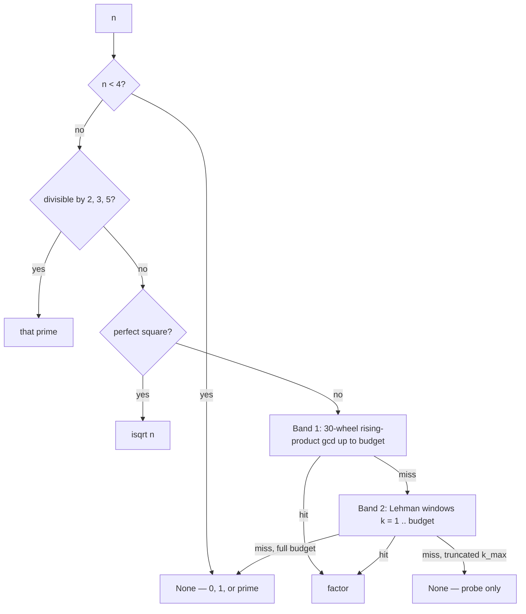

# Two-band cubic search

A deterministic way to look for a factor of $n$ **without walking every integer up to** $\sqrt{n}$. On the hard path, `is_prime` tries an [n−1 Pocklington](nm1-proof.md) proof first; **cubic search is the complete fallback** when $n-1$ is hostile (and the splitter used by `factorint`). Mid-size 64-bit $n$ stay on wheel trial.

!!! warning "Restrictions first"
    For $n < 2^{64}$, `is_prime(n)` remains **exact trial division** through $\lfloor\sqrt{n}\rfloor$ (OpenMP precomputed / segmented primes, or a primorial wheel). This page does not change that contract. No stochastic Miller–Rabin. No external prime library.

## The question

Trial division asks: does any $d \le \sqrt{n}$ divide $n$? That is a complete proof, and this repository's 64-bit predicate is built on it. The cost is $\Theta(\sqrt{n})$ candidate tests (or $\Theta(\sqrt{n}/\log n)$ after sieving primes).

The research question here is narrower: **can the same interval be searched by a different schedule**, so that small factors and balanced factors are found by two short bands whose total length is $O(n^{1/3})$, not $O(n^{1/2})$?

Yes. That reorganization is classical. What this module adds is a practical, integer-only, restriction-safe assembly of it.

## What the last few years actually say

Nothing reputable claims a new elementary test that beats “search up to $\sqrt{n}$” *and* stays a uniform deterministic proof for every $n$ with Miller–Rabin constants. The live line of work is **deterministic factoring exponents** and **special-form** theorems:

| Year | Result | Use here |
|------|--------|----------|
| 1974 | Lehman: $O(n^{1/3})$ deterministic factor / prime proof via short Fermat windows on $kn$ | **Band 2** |
| 1974 / 1977 | Pollard–Strassen: $O(n^{1/4+o(1)})$ by gcd of products of consecutive integers (product / remainder trees) | **Band 1** idea |
| 2020 | Harvey, [arXiv:2010.05450](https://arxiv.org/abs/2010.05450): deterministic $n^{1/5+o(1)}$ | Theoretical; huge constants, not shipped |
| 2021 | Harvey–Hittmeir, [arXiv:2105.11105](https://arxiv.org/abs/2105.11105): log-log tightening of the $n^{1/5}$ bound | Same |
| 2024 | Hales–Hiary, *Ramanujan J.* ([arXiv:2209.15586](https://arxiv.org/abs/2209.15586)): Lehman generalized to $r$-power divisors | Confirms Lehman is still the practical cubic engine |
| 2025 | Oznovich–Volk, [arXiv:2506.07668](https://arxiv.org/abs/2506.07668): high-order elements modulo a composite | Subroutine for $n^{1/5}$ algorithms |
| 2025 | Gao–Feng–Hu–Pan, [arXiv:2512.19076](https://arxiv.org/abs/2512.19076): rank-3 lattices, slightly better logs on special $N$ | Not a library engine |
| 2025 | Umans–Wang, [arXiv:2511.10851](https://arxiv.org/abs/2511.10851): a conjecture that would drop the exponent from $1/5$ to $1/6$ | Open |

Spectral “prime radars,” random-base quizzes, and range-limited witness lists are out of product policy (see [restrictions](restrictions.md)).

The honest engineering conclusion for the **search** line: Lehman's cubic split (with a Pollard–Strassen-style product for the small band) is still the practical complete fallback. The orthogonal **n−1 proof** line often wins when $n-1$ factors — see [n−1 Pocklington](nm1-proof.md). The $n^{1/5}$ papers remain theoretical for this library.

## The two bands

Write $c = \lceil n^{1/3}\rceil$.

```text
[ 2 ........ c ][ c .............. √n ]
   Band 1            Band 2
   rising-product    Lehman windows on kn
   30-wheel gcd      k = 1 .. c
```

**Band 1.** If $n$ has a prime factor $p \le c$, a 30-wheel rising product finds it. Candidates coprime to $30$ are gathered in batches of $128$. One `gcd(math.prod(batch), n)` is $1$ if and only if the whole block is coprime to $n$. That is the sense in which we do **not** search the numbers one-by-one: a single gcd dismisses a block. If the gcd is $n$, a prefix scan recovers a proper factor. This is the practical (no-FFT) form of the Pollard–Strassen product.

**Band 2.** If every prime factor exceeds $c$, then $n$ is either prime or a product of two integers in $(c, n^{2/3}]$. Lehman's theorem supplies a $k \le c$ such that $4kn = a^2 - b^2$ with $a$ in a window of length about $n^{1/6}/(4\sqrt{k})$ above $\lceil\sqrt{4kn}\rceil$. Summing those window lengths is $O(n^{1/3})$. Finding a square $a^2 - 4kn$ yields $\gcd(a \pm b, n)$.

Together the two bands are a complete deterministic split for every $n$ whose cube root is at most the complete budget: pure Python `LEHMAN_COMPLETE_CUB_MAX` ($3\cdot 10^6$, all 64-bit $n$), or OpenMP C `LEHMAN_COMPLETE_CUB_MAX_C` ($2^{63}-1$ (sentinel; clamp is $4kn$), about $n\le 8\cdot 10^{27}$ when $4kn$ fits in 128 bits). Larger $n$ can pass an explicit `k_max` and get a bounded probe, not a proof.

Integer arithmetic only: $\lceil n^{1/3}\rceil$ by Newton, window length by an *overestimate* of $n^{1/6}/(4\sqrt{k})$ so a floored extra never misses the existence interval.



## What is ours

Not a new complexity exponent. A synthesis that this repository can actually ship:

1. Rising-product **30-wheel** batches instead of sequential `%` on Band 1.
2. Integer-safe Lehman windows that **never undershoot** the Crandall–Pomerance interval.
3. Wired into `factorint` *after* Fermat and *before* Brent / ECM / SIQS, so close factors stay on the cheap Fermat path and 64-bit composites get a complete cubic split.
4. **Not** wired into `is_prime`. Replacing 64-bit trial with Lehman would change the documented correctness model. Guidelines forbid that.

On this machine class, a 63-bit balanced semiprime (Mersenne $2^{31}-1$ times the next odd) splits in well under $0.1\,\mathrm{s}$ in pure Python. The OpenMP C core (`lehman_factor_u128`) is the hard-path **fallback** after n−1; smooth $n-1$ specimens settle via Pocklington in milliseconds, while the current 84-bit CLI default usually runs the full cubic proof (~0.3 s class).

## API

```python
from best_prime import lehman_factor, is_prime

lehman_factor(91)          # 7 or 13
lehman_factor(97)          # None  (prime; complete budget)
lehman_factor(100003 * 1000033)

# Bounded probe — not a primality proof
lehman_factor(n, k_max=10_000)
```

`factorint` / `prime_factors` call this automatically. Confirming that a factor is prime still uses `is_prime` (trial / AKS), not this search.

## Related

- [Restrictions](restrictions.md) — why this is not the 64-bit `is_prime` engine
- [Engines](engines.md) — dispatch ladder
- [API](api.md) — `lehman_factor`, `prime_factors`, `factorint`
- [`docs/ALGORITHM_HISTORY.md`](https://github.com/BurakAhmet/Best-Prime-Number-Function/blob/main/docs/ALGORITHM_HISTORY.md)
