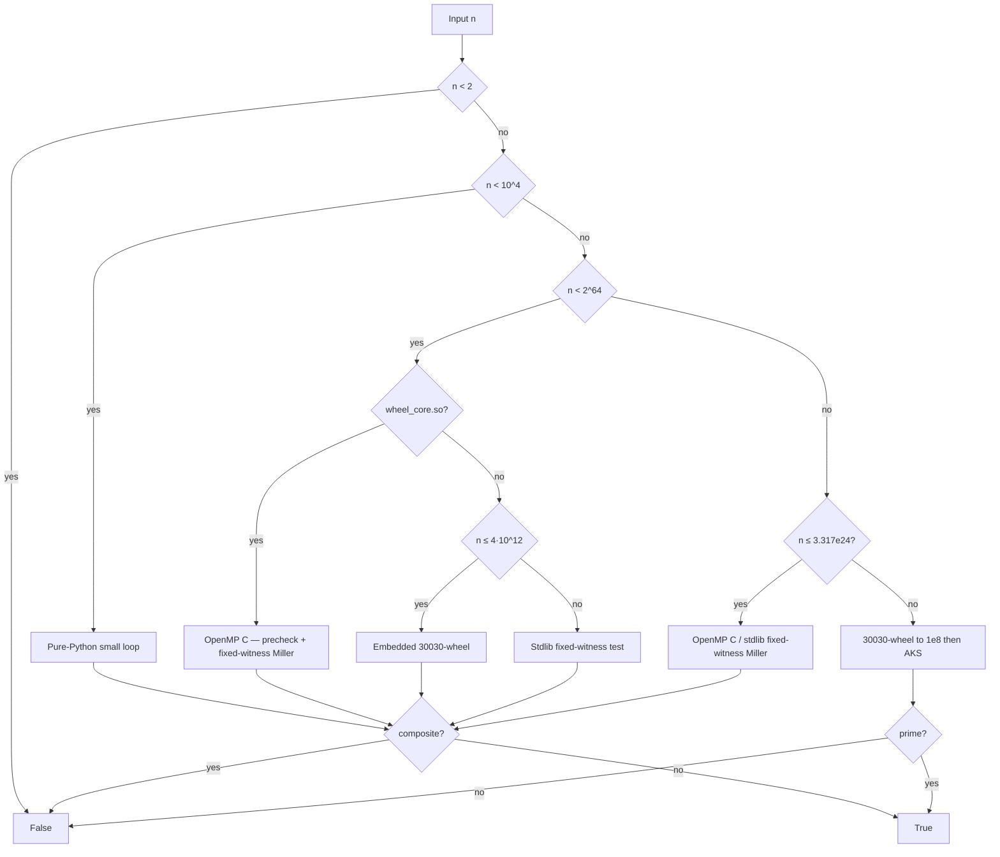

# Engines

CLI **`TIME` is end-to-end** (import → answer). Dispatch is tiered to minimize that total while keeping every answer exact.

## `is_prime`

```text
is_prime(n)
    ├─ n < 10⁴         → pure-Python small loop
    ├─ n < 2⁶⁴
    │    ├─ wheel_core.so → OpenMP C precheck + fixed-witness Miller
    │    │                 (complete for every 64-bit n)
    │    ├─ n ≤ 4·10¹²    → embedded 30030-wheel (stdlib)
    │    └─ else          → stdlib fixed-witness test
    └─ n ≥ 2⁶⁴
         ├─ n ≤ 3.317e24  → OpenMP C / stdlib fixed-witness Miller
         │                  (Sorenson–Webster complete set)
         └─ larger still  → 30030-wheel to 1e8 → AKS if needed
```



### Fast path — $n \lt 2^{64}$

1. $n \lt 10^4$: tiny pure-Python loop (no NumPy/Numba).
2. If `is_prime_data/wheel_core.so` is present: **OpenMP C** small-prime precheck, then a **deterministic Miller test** with witnesses $2,3,5,7,11,13,23$ (complete for every 64-bit $n$).
3. Else if $n \le 4\cdot10^{12}$: **embedded 30030-wheel** (stdlib only).
4. Else: stdlib fixed-witness test (same complete set).

### Large path — $n \ge 2^{64}$

1. If $n \le 3\,317\,044\,064\,679\,887\,385\,961\,981$: deterministic Miller test with witnesses $2,3,5,7,11,13,17,19,23,29,31,37$ (Sorenson–Webster; OpenMP C when the core is built).
2. Still larger: 30030-wheel trial up to $\min(10^8,\lfloor\sqrt{n}\rfloor)$, then **AKS** if needed (Kronecker poly mul).

Inspect the live path with [`lab(n)`](api.md).

## Counting, listing, factors

All of these reuse **our** sieves / `is_prime`. No external prime engine.

| API | How |
|-----|-----|
| `next_prime` / `prev_prime` | Table / interval sieve / 30030-wheel + `is_prime` |
| `nth_prime(k)` | Sieve while $p_k$ is moderate; else $\log p_k$ `prime_count` probes |
| `prime_count(n)` | Sieve for $n\le 2\cdot10^7$; Lucy–Hedgehog up to $n\le 2.5\cdot10^{15}$; **Meissel–Lehmer** through $2^{64}-1$ |
| `primes` / `primerange` | Cached odds-only Eratosthenes; **`primerange` yields** (256 KiB windows) |
| `totient` / `primorial` / `divisors` | From `factorint`; `totient_range` is a linear sieve; primorial is a product tree |
| `prime_factors` / `factorint` | 30-wheel trial, Fermat, deterministic Brent–Pollard ($c=1,2,\ldots$), then `is_prime` |
| `is_perfect_power` / `is_prime_power` | Newton $k$-th roots; prime exponents only |

## Complexity (word operations)

Let $L = \lfloor\sqrt{n}\rfloor$.

| Path | Worst-case (prime / no small factor) |
|------|--------------------------------------|
| Tiny loop / odd trial | $\Theta(L)=\Theta(\sqrt{n})$ |
| Primorial wheel (stdlib / Numba) | $\Theta((\varphi(W)/W)\cdot L)=\Theta(\sqrt{n})$, $W\in\{30030,9699690\}$ |
| OpenMP precomputed-prime ($L\le 2^{20}$) | $\Theta(\pi(L))=\Theta(\sqrt{n}/\log n)$ |
| OpenMP seg-primes ($t$ threads, large $L$) | $\Theta(\sqrt{n}/t)$ wall-clock *ideally* |
| Partial trial then AKS | Poly in $\log n$ *in theory*; still slow in practice |

Composite early exit is roughly $\Theta(p)$ for least prime factor $p$.

## Building the C core

```bash
bash scripts/compile_wheel_core.sh
```

Regenerate C from the generator (do not hand-edit the `.c` as source of truth):

```bash
python scripts/generate_wheel_core_c.py
```

Full era-by-era notes and **failures not to repeat**: [`docs/ALGORITHM_HISTORY.md`](https://github.com/BurakAhmet/Best-Prime-Number-Function/blob/main/docs/ALGORITHM_HISTORY.md).
