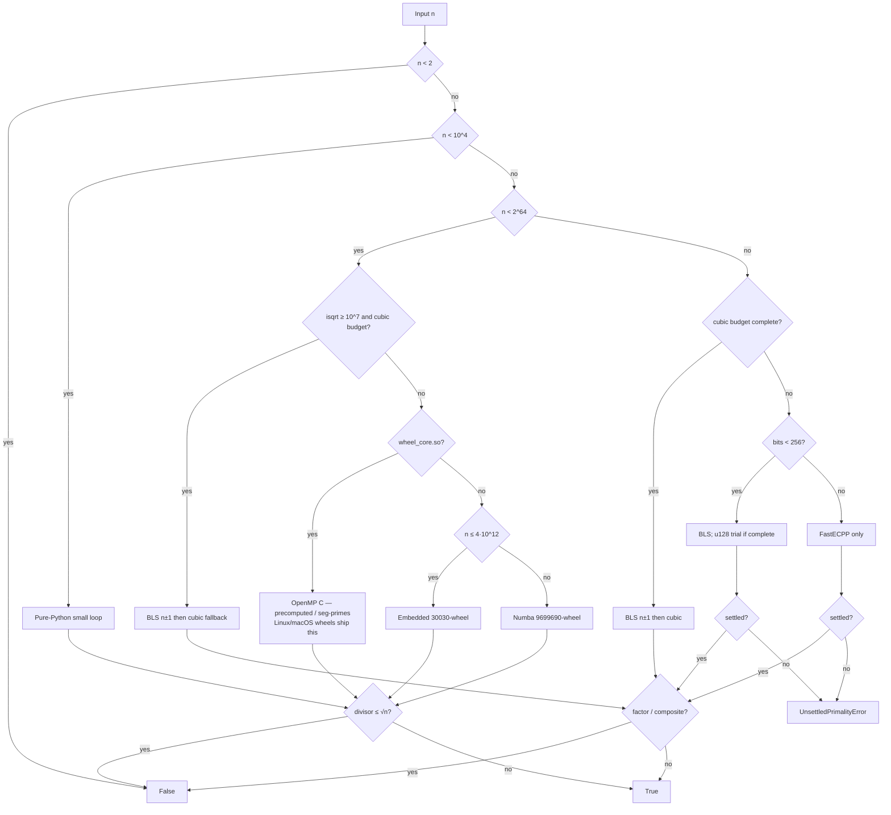

# Engines

CLI **`TIME` is end-to-end** (import → answer). Dispatch is tiered to minimize that total while keeping every answer exact.

## `is_prime`

```text
is_prime(n)
    ├─ n < 10⁴         → pure-Python small loop
    ├─ n < 2⁶⁴
    │    ├─ isqrt ≥ 10⁷ and cubic budget
    │    │              → BLS n±1, else lehman_factor_u128
    │    ├─ wheel_core.so → OpenMP C precomputed primes / seg-primes
    │    │                 (Linux/macOS wheels ship this; else compile locally)
    │    ├─ n ≤ 4·10¹²    → embedded 30030-wheel (stdlib)
    │    └─ else          → Numba 9699690-wheel
    └─ n ≥ 2⁶⁴
         ├─ cubic budget (4·k·n fits in 128 bits)
         │              → BLS n±1, else lehman_factor_u128
         ├─ bits < 256  → BLS (CLI default: 147-bit n−1); else u128 trial if complete
         └─ bits ≥ 256  → FastECPP only (h=1 inside it). Miss → UnsettledPrimalityError
                          (no BLS / transcribed-ECPP / AKS fallback)
```



### Fast path — $n \lt 2^{64}$

1. $n \lt 10^4$: tiny pure-Python loop (no NumPy/Numba).
2. If `is_prime_data/wheel_core.so` is present: **OpenMP C**
    - small-prime precheck
    - **precomputed odd primes** $\le 2^{20}$ and exact **2-adic inverse** trial when $\lfloor\sqrt{n}\rfloor \le 1\,048\,576$ (wrap-mul; no wheel `DIV`)
    - **wheel-30 segmented sieve** + memcpy presieve $7\cdot11\cdot13\cdot17$ + OR presieve $19\cdot23\cdot29$ + persisted uint32 marks + **16 KiB L1 tiles for $p<4096$** + `DELTA[64]` extract + 4+4 INV16 wrap-mul when $\sqrt{n}$ is larger (OpenMP when $\lfloor\sqrt{n}\rfloor \ge 10^7$; 128 KiB segments)
3. Else if $n \le 4\cdot10^{12}$: **embedded 30030-wheel** (stdlib only).
4. Else: lazy **Numba** `9699690`-wheel.

### Hard path — cubic budget (hard 64-bit and many $n \ge 2^{64}$)

1. **Combined BLS** ([guide](nm1-proof.md)): n−1 Pocklington / Theorem 5, Lucas n+1 ($G>\sqrt{n}$ or complete), Combined Theorem 1 ($n < \max(F^{2}G/2,\,FG^{2}/2)$, **not** $FG>\sqrt{n}$). `lab` paths `u64_nm1` / `u128_nm1` (n−1) or `bigint_bls`.
2. Else **OpenMP cubic search** (`lehman_factor_u128`): complete $O(n^{1/3})$ fallback. Paths `u64_lehman_c` / `u128_lehman_c`.

### Large path — $n \ge 2^{64}$ outside cubic budget

One engine per band. No BLS → ECPP → FastECPP → AKS chain.

1. **bits $< 256$:** combined BLS only (the 147-bit CLI default is `u128_nm1`). If BLS misses and $\lfloor\sqrt{n}\rfloor \le 2.5\cdot10^{10}$ on a 128-bit $n$: OpenMP **`is_prime_u128_core`**. Else `UnsettledPrimalityError`.
2. **bits $\ge 256$:** **FastECPP only** ([guide](ecpp-proof.md)) — class-number-1 $D$ first, then computed $H_D$, path `bigint_fastecpp`. A Fermat miss is a composite proof. No BLS peel, no second transcribed-ECPP pass, no AKS. Cap 15 s above ~1000 digits, then unsettled.

Inspect the live path with [`lab(n)`](api.md).

## Counting, listing, factors

All of these reuse **our** sieves / `is_prime`. No external prime engine.

| API | How |
|-----|-----|
| `next_prime` / `prev_prime` | Table / interval sieve / 30030-wheel + `is_prime` |
| `nth_prime(k)` | Sieve while $p_k$ is moderate; else $\log p_k$ `prime_count` probes |
| `prime_count(n)` | Sieve for $n\le 2\cdot10^7$; Lucy–Hedgehog up to $n\le 2.5\cdot10^{15}$; **Meissel–Lehmer** through $2^{64}-1$ |
| `primes` / `primerange` | Cached odds-only Eratosthenes; **`primerange` yields** (256 KiB windows) |
| `totient` / `primorial` / `divisors` | From `factorint`; `totient_range` is a linear sieve; primorial is a product tree |
| `prime_factors` / `factorint` | 30-wheel trial, Fermat, **two-band cubic search**, deterministic Brent–Pollard ($c=1,2,\ldots$), ECM, SIQS; each prime confirmed with `is_prime` |
| `lehman_factor` | Rising-product 30-wheel to the cube-root budget, then integer-safe Lehman windows. Also the hard-path **fallback** after combined BLS. [Cubic search](cubic-search.md) · [n−1 / BLS](nm1-proof.md) |
| `is_perfect_power` / `is_prime_power` | Newton $k$-th roots; prime exponents only |

## Complexity (word operations)

Let $L = \lfloor\sqrt{n}\rfloor$.

| Path | Worst-case (prime / no small factor) |
|------|--------------------------------------|
| Tiny loop / odd trial | $\Theta(L)=\Theta(\sqrt{n})$ |
| Primorial wheel (stdlib / Numba) | $\Theta((\varphi(W)/W)\cdot L)=\Theta(\sqrt{n})$, $W\in\{30030,9699690\}$ |
| OpenMP precomputed-prime ($L\le 2^{20}$) | $\Theta(\pi(L))=\Theta(\sqrt{n}/\log n)$ |
| OpenMP seg-primes ($t$ threads, large $L$) | $\Theta(\sqrt{n}/t)$ wall-clock *ideally* |
| Combined BLS (special-form $n\pm 1$) | Factor $n\pm 1$ + $O(\log n)$ exponentiations / Lucas |
| Deterministic ECPP (small-$h$) | Poly in $\log n$ with CM search; transcribed $H_D$ |
| FastECPP (computed $H_D$) | General 100-digit gate ($10^{99}+289$); not 10k-digit yet |
| Partial trial then AKS | Poly in $\log n$ *in theory*; last resort for huge primes |

Composite early exit is roughly $\Theta(p)$ for least prime factor $p$.

## Building the C core

```bash
bash scripts/compile_wheel_core.sh
```

Regenerate C from the generator (do not hand-edit the `.c` as source of truth):

```bash
python scripts/generate_wheel_core_c.py
```

Full era-by-era notes and **failures not to repeat**: [`docs/ALGORITHM_HISTORY.md`](https://github.com/BurakAhmet/Best-Prime-Number-Function/blob/main/docs/ALGORITHM_HISTORY.md).
